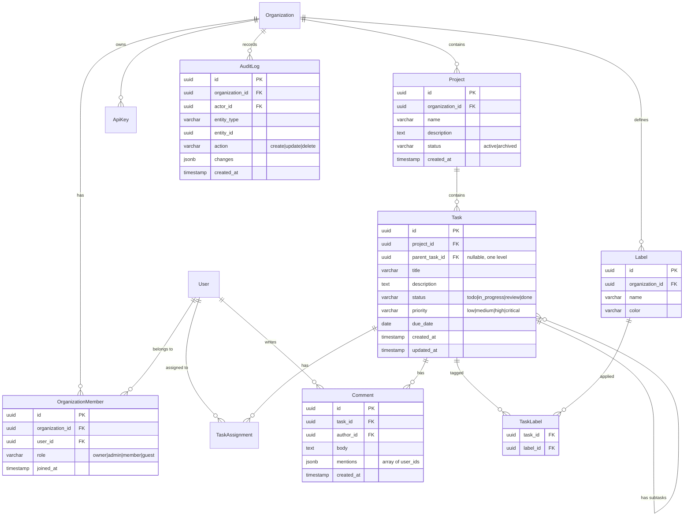

<!--
  CHAPTER: 14
  TITLE: AI-Powered Engineering Workflows
  PART: III — Tooling & Practice
  PREREQS: None
  KEY_TOPICS: AI project planning, ERD design with LLMs, AI code review, AI debugging, Claude Code, Copilot, Cursor, prompt engineering
  DIFFICULTY: Beginner → Intermediate
  UPDATED: 2026-03-24
-->

# Chapter 14: AI-Powered Engineering Workflows

> **Part III — Tooling & Practice** | Prerequisites: None | Difficulty: Beginner to Intermediate

Using AI as an engineering multiplier — from project planning and database design to code review, debugging, and the tools that make AI-assisted development practical.

### In This Chapter
- AI for Project Planning
- AI for Database & ERD Design
- AI for Code Review & Analysis
- AI for Debugging & Investigation
- AI Tools for Engineers
- Key Takeaways

### Related Chapters
- Chapter 17 — Claude Code mastery
- Chapter 10 — AI-native engineering paradigms
- Chapter 2 — database/ERD design

---

## 1. AI FOR PROJECT PLANNING

### 1.1 Using LLMs to Decompose Large Projects

**What it is:** Using large language models as a thinking partner to break down ambiguous requirements into structured, actionable engineering work. This is not about replacing human judgment -- it is about accelerating the decomposition process and catching blind spots.

**The core workflow:**

1. Feed the LLM a high-level requirement or PRD
2. Ask it to decompose into epics, tasks, and subtasks
3. Critically review the output for missing edge cases, incorrect assumptions, and ordering errors
4. Iterate with follow-up prompts to refine

**Prompt patterns for project breakdown:**

```
System prompt:
You are a senior staff engineer with 15 years of experience building production
systems. You think in terms of failure modes, edge cases, and operational
concerns -- not just happy paths.

User prompt:
We need to add multi-tenant billing to our SaaS platform. Current state:
- Single-tenant billing via Stripe
- PostgreSQL database, Next.js frontend, Node.js API
- ~500 active organizations

Decompose this into implementation phases. For each phase, list:
1. Specific engineering tasks (backend, frontend, data migration)
2. Dependencies between tasks
3. Risks and unknowns that need spike/investigation
4. Definition of done for each task
```

**What good decomposition output looks like:**

The LLM should produce something like:

```
Phase 1: Data Model & Migration (Week 1-2)
├── Task 1.1: Design tenant-aware billing schema
│   ├── Add organization_id FK to invoices, subscriptions, payment_methods
│   ├── Create billing_plans table with per-tenant overrides
│   └── Risk: Existing invoices lack org association -- need backfill strategy
├── Task 1.2: Write migration scripts
│   ├── Forward migration with zero-downtime (add columns nullable first)
│   ├── Backfill script for historical data
│   └── Rollback migration
├── Task 1.3: Spike -- Stripe Connect vs. single-account multi-tenant
│   └── Timebox: 2 days. Decision criteria: ...

Phase 2: API Layer (Week 2-3)
├── Task 2.1: Tenant-scoped billing endpoints
│   ├── GET /api/orgs/:orgId/billing (dashboard data)
│   ...
```

**Critical review checklist (what the LLM often misses):**

- **Data migration risks:** The LLM will propose schema changes but often underestimates migration complexity on live data
- **Backward compatibility:** API changes that break existing clients
- **Observability:** Logging, metrics, and alerting for new features
- **Security implications:** New authorization boundaries, audit logging
- **Rollback strategy:** What happens if Phase 2 fails and you need to revert Phase 1

### 1.2 Generating User Stories and Acceptance Criteria

**Prompt pattern:**

```
Given this feature requirement:
"Users should be able to invite team members to their organization with
role-based permissions (admin, editor, viewer)."

Generate user stories in the format:
As a [role], I want to [action], so that [benefit].

For each story, include:
- Acceptance criteria (Given/When/Then format)
- Edge cases
- Non-functional requirements (performance, security)
```

**Example output you should expect:**

```
Story 1: Invite team member by email
As an organization admin, I want to invite users by email address,
so that I can grow my team.

Acceptance Criteria:
- Given I am an admin, when I enter a valid email and select a role,
  then an invitation email is sent within 30 seconds
- Given the invitee already has an account, when they accept,
  then they are added to the organization with the specified role
- Given the invitee does NOT have an account, when they accept,
  then they are guided through signup and auto-added to the org

Edge Cases:
- Inviting an email that is already a member (show error, don't re-invite)
- Inviting an email that has a pending invitation (option to resend)
- Self-invitation (prevent admin from inviting themselves)
- Rate limiting (max 50 invitations per hour per org)
```

**Where the LLM adds genuine value:** Generating the initial set of stories from a paragraph of requirements saves 30-60 minutes of grooming time. It also tends to surface edge cases that teams miss in verbal discussions.

**Where you must add human judgment:** Prioritization, business context, technical feasibility given your specific stack, and political/organizational constraints that the LLM cannot know.

### 1.3 AI-Assisted Estimation and Risk Identification

**Prompt for complexity estimation:**

```
Here is a list of engineering tasks for our billing migration:

1. Add tenant_id column to invoices table (PostgreSQL, 2M rows)
2. Build Stripe webhook handler for multi-tenant events
3. Create billing dashboard UI (React, 5 views)
4. Implement usage-based metering pipeline
5. Write E2E tests for billing flows

For each task, estimate:
- T-shirt size (S/M/L/XL) with justification
- Key risks that could blow up the estimate
- Dependencies on other tasks or external teams
- Suggest if any task should be split further
```

**Important caveat:** LLM estimates are directional, not precise. They are useful for identifying which tasks are likely complex (and why), not for committing to delivery dates. Always calibrate against your team's historical velocity.

### 1.4 AI-Assisted Sprint Planning

**Practical workflow:**

1. Export your backlog (from Linear, Jira, etc.) as a structured list
2. Prompt the LLM with team capacity, velocity, and current sprint goals
3. Ask it to suggest a sprint plan with rationale

```
Team capacity: 3 engineers, 2-week sprint, ~30 story points total
Current priorities: Ship billing V2, reduce P1 bug count

Backlog (with estimates):
- BILL-101: Tenant billing schema migration (8 pts)
- BILL-102: Stripe webhook handler (5 pts)
- BILL-103: Billing dashboard UI (8 pts)
- BUG-440: Memory leak in WebSocket handler (3 pts, P1)
- BUG-441: Race condition in checkout flow (5 pts, P1)
- TECH-201: Upgrade Node.js 18 → 20 (3 pts)

Suggest a sprint plan. Explain trade-offs if everything doesn't fit.
```

The LLM will typically produce a reasonable grouping with dependency ordering and surface conflicts ("BILL-103 depends on BILL-101 completing first, so assign them to different engineers or stagger them").

---

## 2. AI FOR DATABASE & ERD DESIGN

### 2.1 Generating Entity-Relationship Diagrams from Natural Language

**The workflow:**

1. Describe your domain in plain English
2. Ask the LLM to generate a Mermaid or PlantUML ERD
3. Review for normalization, missing relationships, and index opportunities
4. Iterate

**Example prompt:**

```
Design a database schema for a multi-tenant SaaS project management tool with
these requirements:

- Organizations have members with roles (owner, admin, member, guest)
- Organizations contain projects
- Projects contain tasks with assignees, due dates, priorities, and statuses
- Tasks can have subtasks (one level deep)
- Tasks have comments with mentions (@user)
- Projects have labels (user-defined, per-org)
- Tasks can have multiple labels
- Audit log for all mutations
- Support for API keys per organization

Generate:
1. A Mermaid ERD with all entities, relationships, and key columns
2. Recommended indexes
3. Any denormalization decisions with justification
```

**Expected Mermaid output:**



### 2.2 AI Review of Schema Designs

**Prompt for schema review:**

```
Review this PostgreSQL schema for a project management SaaS. Check for:

1. Normalization issues (is anything in 1NF/2NF/3NF that shouldn't be?)
2. Missing indexes (based on likely query patterns)
3. N+1 query risks
4. Multi-tenancy isolation gaps (can a user in org A see org B's data?)
5. Scalability concerns (what breaks at 1M orgs? 100M tasks?)
6. Missing constraints (foreign keys, check constraints, unique constraints)

[paste your schema DDL here]
```

**Common issues the LLM will catch:**

- Missing composite indexes for multi-tenant queries (`WHERE organization_id = ? AND status = ?`)
- Lack of `ON DELETE CASCADE` or `ON DELETE SET NULL` on foreign keys
- Missing `unique` constraints (e.g., `UNIQUE(organization_id, name)` on labels to prevent duplicates within an org)
- N+1 patterns: "If you query tasks with comments, you'll need an index on `comments.task_id` and should use a JOIN or batch fetch"
- Audit log table growing unbounded without partitioning strategy

### 2.3 Generating ORM Models from Descriptions

**Prisma example:**

```
Given the ERD above, generate Prisma schema models with:
- Appropriate field types and constraints
- Relations with onDelete behavior
- Indexes (@@index) for common query patterns
- Enums for status/role/priority fields
```

**Expected output:**

```prisma
generator client {
  provider = "prisma-client-js"
}

datasource db {
  provider = "postgresql"
  url      = env("DATABASE_URL")
}

enum OrgRole {
  OWNER
  ADMIN
  MEMBER
  GUEST
}

enum TaskStatus {
  TODO
  IN_PROGRESS
  REVIEW
  DONE
}

enum TaskPriority {
  LOW
  MEDIUM
  HIGH
  CRITICAL
}

model Organization {
  id        String   @id @default(uuid())
  name      String
  slug      String   @unique
  createdAt DateTime @default(now()) @map("created_at")

  members  OrganizationMember[]
  projects Project[]
  labels   Label[]
  apiKeys  ApiKey[]
  auditLog AuditLog[]

  @@map("organizations")
}

model OrganizationMember {
  id             String       @id @default(uuid())
  organizationId String       @map("organization_id")
  userId         String       @map("user_id")
  role           OrgRole      @default(MEMBER)
  joinedAt       DateTime     @default(now()) @map("joined_at")

  organization Organization @relation(fields: [organizationId], references: [id], onDelete: Cascade)
  user         User         @relation(fields: [userId], references: [id], onDelete: Cascade)

  @@unique([organizationId, userId])
  @@index([organizationId])
  @@index([userId])
  @@map("organization_members")
}

model Task {
  id           String       @id @default(uuid())
  projectId    String       @map("project_id")
  parentTaskId String?      @map("parent_task_id")
  title        String
  description  String?
  status       TaskStatus   @default(TODO)
  priority     TaskPriority @default(MEDIUM)
  dueDate      DateTime?    @map("due_date")
  createdAt    DateTime     @default(now()) @map("created_at")
  updatedAt    DateTime     @updatedAt @map("updated_at")

  project    Project          @relation(fields: [projectId], references: [id], onDelete: Cascade)
  parentTask Task?            @relation("Subtasks", fields: [parentTaskId], references: [id], onDelete: Cascade)
  subtasks   Task[]           @relation("Subtasks")
  assignees  TaskAssignment[]
  comments   Comment[]
  labels     TaskLabel[]

  @@index([projectId, status])
  @@index([projectId, priority])
  @@index([parentTaskId])
  @@index([dueDate])
  @@map("tasks")
}
```

### 2.4 Generating Migration Scripts

**Prompt pattern:**

```
I need to add a "time tracking" feature to the task management schema above.
Requirements:
- Users can log time entries against tasks
- Each entry has: duration (minutes), description, date
- Organizations can set hourly rates per member for billing

Generate:
1. The new Prisma models
2. A SQL migration script (PostgreSQL)
3. Consider the migration on a live database with existing data
```

The LLM will generate the migration with appropriate `CREATE TABLE` statements, foreign keys, and if needed, backfill scripts. Always review for:

- Whether the migration can run without locking tables (avoid `ALTER TABLE ... ADD COLUMN ... NOT NULL` without a default on large tables)
- Whether it needs to be split into multiple deployments (add column nullable -> backfill -> add constraint)

---

## 3. AI FOR CODE REVIEW & ANALYSIS

### 3.1 Using AI to Review Pull Requests

**What works well:**

- **Bug detection in logic:** Paste a diff and ask "identify any logic bugs, off-by-one errors, or race conditions"
- **Security review:** "Review this code for OWASP Top 10 vulnerabilities, injection risks, and authentication bypasses"
- **Performance review:** "Identify N+1 queries, unnecessary re-renders, missing indexes, or O(n^2) algorithms"

**Practical prompt for PR review:**

```
Review this pull request diff. Act as a senior engineer performing a thorough
code review. For each issue found, provide:

1. Severity: critical / warning / nit
2. The specific line(s) affected
3. What the problem is
4. A suggested fix

Focus on:
- Correctness (logic errors, edge cases, error handling)
- Security (injection, auth bypass, data exposure)
- Performance (query patterns, algorithmic complexity)
- Maintainability (naming, abstraction level, test coverage)

Do NOT comment on style/formatting (our linter handles that).

[paste diff here]
```

**Example: the LLM catching a real bug:**

Given this code:

```typescript
async function transferFunds(fromId: string, toId: string, amount: number) {
  const from = await db.account.findUnique({ where: { id: fromId } });
  const to = await db.account.findUnique({ where: { id: toId } });

  if (from.balance < amount) {
    throw new Error("Insufficient funds");
  }

  await db.account.update({
    where: { id: fromId },
    data: { balance: from.balance - amount },
  });

  await db.account.update({
    where: { id: toId },
    data: { balance: to.balance + amount },
  });
}
```

A good LLM review will flag:

```
CRITICAL: Race condition in transferFunds

The balance check and updates are not atomic. Two concurrent transfers
from the same account can both pass the balance check before either
update executes, resulting in a negative balance.

Fix: Use a database transaction with row-level locking:

  await db.$transaction(async (tx) => {
    const from = await tx.account.findUnique({
      where: { id: fromId },
      // FOR UPDATE lock in raw SQL, or use Prisma's
      // interactive transaction with serializable isolation
    });
    // ... rest inside transaction
  });

Also: No null check on `from` or `to` -- will throw unclear error
if account not found.
```

### 3.2 Generating Tests from Implementation Code

**Prompt pattern:**

```
Generate comprehensive unit tests for this function. Use Jest/Vitest.
Cover:
- Happy path
- Edge cases (empty input, null, boundary values)
- Error cases (what should throw/reject)
- If async, test both resolved and rejected paths

[paste function]
```

**Example: generating tests for a pagination utility:**

Given:

```typescript
function paginate<T>(items: T[], page: number, pageSize: number): {
  data: T[];
  total: number;
  page: number;
  totalPages: number;
} {
  const total = items.length;
  const totalPages = Math.ceil(total / pageSize);
  const start = (page - 1) * pageSize;
  const data = items.slice(start, start + pageSize);
  return { data, total, page, totalPages };
}
```

The LLM should generate:

```typescript
describe("paginate", () => {
  const items = [1, 2, 3, 4, 5, 6, 7, 8, 9, 10];

  it("returns correct first page", () => {
    const result = paginate(items, 1, 3);
    expect(result).toEqual({
      data: [1, 2, 3],
      total: 10,
      page: 1,
      totalPages: 4,
    });
  });

  it("returns correct last page with partial results", () => {
    const result = paginate(items, 4, 3);
    expect(result).toEqual({
      data: [10],
      total: 10,
      page: 4,
      totalPages: 4,
    });
  });

  it("returns empty data for page beyond range", () => {
    const result = paginate(items, 5, 3);
    expect(result.data).toEqual([]);
  });

  it("handles empty array", () => {
    const result = paginate([], 1, 10);
    expect(result).toEqual({
      data: [],
      total: 0,
      page: 1,
      totalPages: 0,
    });
  });

  it("handles page size larger than array", () => {
    const result = paginate(items, 1, 100);
    expect(result.data).toEqual(items);
    expect(result.totalPages).toBe(1);
  });

  it("handles page size of 1", () => {
    const result = paginate(items, 5, 1);
    expect(result.data).toEqual([5]);
    expect(result.totalPages).toBe(10);
  });

  // Edge case the LLM should flag: what about page 0 or negative?
  it("handles page 0 (potential bug)", () => {
    // Current implementation: page 0 gives slice(-3, 0) = []
    // This is likely a bug -- should either throw or default to page 1
    const result = paginate(items, 0, 3);
    expect(result.data).toEqual([]); // documents current behavior
  });
});
```

**Key value:** The LLM often generates edge-case tests that engineers skip (page 0, negative values, empty input). These tests frequently reveal actual bugs.

### 3.3 AI-Assisted Refactoring

**Prompt for identifying code smells:**

```
Analyze this module for code smells and refactoring opportunities.
Categorize findings as:

1. Extract Method: duplicated logic that should be a shared function
2. Simplify Conditional: nested if/else that could be a guard clause or strategy pattern
3. Remove Dead Code: unreachable paths, unused variables
4. Improve Naming: vague names that obscure intent
5. Reduce Coupling: tight dependencies that could be inverted

For each finding, show the current code and the refactored version.

[paste module]
```

### 3.4 Generating Documentation from Code

**Prompt pattern:**

```
Generate API documentation for this Express/Fastify/Next.js route handler.
Include:
- Endpoint (method, path)
- Request body/query params with types
- Response schema (success and error cases)
- Authentication requirements
- Example curl command
- Rate limiting (if applicable)

[paste route handler]
```

### 3.5 Limitations and Risks

**Hallucinations in code suggestions:** LLMs will confidently suggest API calls that do not exist, use deprecated methods, or invent library features. Always verify suggestions against official documentation.

**Specific patterns to watch for:**

- Suggesting `prisma.account.lock()` (does not exist)
- Using outdated React patterns (`componentDidMount` when you use hooks)
- Importing from non-existent package paths
- Generating SQL that works on MySQL but not PostgreSQL (or vice versa)

**Security of sending code to AI providers:**

- Never paste credentials, API keys, or secrets into prompts
- Review your organization's policy on sending proprietary code to third-party LLMs
- Consider self-hosted models (Ollama + Code Llama, Llama 3) for sensitive codebases
- Use `.gitignore`-aware tools that automatically exclude secrets

**The fundamental rule:** AI code review supplements human review. It does not replace it. Use AI to catch the mechanical issues (off-by-one, null checks, missing awaits) so human reviewers can focus on architecture, design, and business logic correctness.

---

## 4. AI FOR DEBUGGING & INVESTIGATION

### 4.1 Root Cause Analysis from Error Logs

**Prompt pattern for stack traces:**

```
I'm getting this error in production. Analyze the stack trace and:
1. Identify the root cause (not just the symptom)
2. Explain why this is happening
3. Suggest a fix
4. Suggest what to add to prevent this class of error in the future

Error:
TypeError: Cannot read properties of undefined (reading 'id')
    at getOrganization (/app/src/services/org.ts:42:18)
    at async handler (/app/src/api/orgs/[orgId]/route.ts:15:20)
    at async /app/node_modules/next/dist/server/...

Context:
- This happens intermittently, ~5% of requests
- Started after deploying commit abc123 which added caching
```

**What the LLM typically identifies:**

```
Root cause: Race condition with cache invalidation.

The getOrganization function likely has a code path like:

  const cached = await cache.get(`org:${orgId}`);
  if (cached) return cached;
  const org = await db.organization.findUnique({ where: { id: orgId } });
  await cache.set(`org:${orgId}`, org);
  return org;

The bug: db.findUnique returns `null` when not found, and `null` gets
cached. Subsequent reads hit the cache, get `null`, and `.id` throws.

This matches the 5% intermittent pattern -- it happens when:
1. An org is deleted or the ID is invalid
2. The null result gets cached
3. All subsequent requests for that key fail until cache expires

Fix: Add a null check before caching, and return 404 for missing orgs.
Prevention: Add a type guard or schema validation at the API boundary.
```

### 4.2 Explaining Unfamiliar Codebases

**Prompt pattern:**

```
I've joined a new team and need to understand this codebase quickly.
Here is the project structure and a few key files.

Explain:
1. The overall architecture and data flow
2. Key abstractions and their responsibilities
3. How a request flows from entry point to database and back
4. Any patterns or conventions the codebase follows
5. Potential gotchas or non-obvious behaviors

[paste tree output and key files]
```

This is one of the highest-value uses of AI for engineers. Instead of spending days reading code, you can get a reasonable architectural overview in minutes. The key is to follow up with targeted questions: "Explain what `middleware/auth.ts` does and how it connects to `lib/session.ts`."

### 4.3 Generating Runbooks from Incident Data

**Prompt pattern:**

```
We had a production incident. Here is the timeline:

10:32 - Alert: API latency p99 > 5s
10:35 - Checked dashboards: DB connection pool at 100%
10:38 - Identified query: SELECT * FROM events WHERE org_id = ? (missing index)
10:40 - Added index, connection pool recovered
10:45 - Latency normalized

Generate a runbook for "High API Latency" incidents that includes:
1. Triage steps (what to check first)
2. Common root causes with resolution steps
3. Escalation criteria
4. Post-incident checklist
```

### 4.4 AI-Assisted Log Analysis

**Practical approach:**

For structured logs (JSON), export a sample and prompt:

```
Here are 50 log entries from our API server during a period of elevated errors.
Identify:
1. Patterns in the errors (common endpoints, user agents, error types)
2. Temporal patterns (do errors cluster at specific times?)
3. Correlation with any specific request parameters
4. The most likely root cause

[paste log entries]
```

**Limitations:** LLMs have context window limits. For large-scale log analysis (millions of entries), use purpose-built tools (Datadog, Grafana Loki, CloudWatch Insights) and only use AI to interpret the summarized/filtered results.

---

## 5. AI TOOLS FOR ENGINEERS

### 5.1 The Current Landscape

| Tool | Type | Best For | Limitations |
|------|------|----------|-------------|
| **Claude Code** | CLI agent | Multi-file refactoring, codebase exploration, complex tasks | Requires clear context about project structure |
| **GitHub Copilot** | Inline autocomplete + chat | Line-by-line code completion, boilerplate | Suggestions lack broader context, can suggest insecure patterns |
| **Cursor** | AI-native IDE | Full-file editing, codebase-aware chat | Learning curve, can be slow on large repos |
| **Windsurf** | AI-native IDE | Flow-based coding, multi-file edits | Newer, smaller ecosystem |
| **Cody (Sourcegraph)** | IDE extension + chat | Large codebase navigation, cross-repo search | Requires Sourcegraph instance for full power |

### 5.2 When AI Accelerates You vs. When It Slows You Down

**AI accelerates you when:**

- Writing boilerplate (CRUD endpoints, form components, test scaffolding)
- Translating between formats (SQL to ORM, JSON to TypeScript types, OpenAPI to client code)
- Exploring unfamiliar libraries ("show me how to use X library to do Y")
- Generating initial drafts of documentation, comments, commit messages
- Repetitive refactoring (rename across files, update import paths, migrate API patterns)
- Explaining code you did not write

**AI slows you down when:**

- You accept suggestions without reading them (accumulates subtle bugs)
- The task requires deep domain knowledge the LLM lacks (your specific business rules)
- You spend more time debugging AI-generated code than writing it yourself would have taken
- You use AI as a crutch for concepts you need to actually learn
- The problem is inherently ambiguous and requires human judgment calls

### 5.3 The "70% Problem"

**What it is:** AI reliably gets you 70% of the way to a solution. The last 30% -- the part that handles edge cases, integrates with your specific system, handles error states gracefully, and works in production -- requires engineering expertise.

**The danger:** Junior engineers who cannot evaluate the 70% output will ship code with subtle bugs in the remaining 30%. Senior engineers who understand the domain can use the 70% as a starting point and finish faster.

**Practical implications:**

- AI raises the floor (everyone produces code faster) but does not raise the ceiling (hard problems still require deep expertise)
- The skill that matters most is **evaluation** -- can you quickly determine if AI output is correct, almost correct, or dangerously wrong?
- Use AI-generated code as a first draft, never as the final product
- The more specific and constrained your prompt, the higher the percentage of usable output

### 5.4 Developing AI-Native Workflows

**Prompting as a core engineering skill:**

```
Bad prompt:  "Write a function to handle payments"
Good prompt: "Write a TypeScript function that processes Stripe webhook events
              for subscription payments. Handle: invoice.paid, invoice.payment_failed,
              customer.subscription.deleted. Use Prisma to update the subscriptions
              table. Include error handling for Stripe signature verification.
              The function receives a Next.js Request object."
```

**The principles of effective engineering prompts:**

1. **Specify the stack:** Language, framework, libraries, versions
2. **Specify the interface:** Input types, output types, error types
3. **Specify constraints:** Performance requirements, compatibility needs
4. **Provide context:** What exists already, what this integrates with
5. **Specify what NOT to do:** "Do not use deprecated APIs", "Do not use class components"

**Building an AI-assisted development loop:**

```
1. Define the task precisely (human)
2. Generate initial implementation (AI)
3. Review critically -- check for correctness, not just "does it look right" (human)
4. Write tests -- ask AI to generate, then add edge cases yourself (human + AI)
5. Run tests and fix failures (human, with AI assistance for debugging)
6. Refactor for clarity and integration (human + AI)
7. Document (AI draft, human review)
```

**The meta-skill:** Learn to recognize which tasks in your workflow are "AI-shapeable" (well-defined, with clear inputs and outputs) versus "human-essential" (ambiguous, requiring judgment, context, or creativity). Route accordingly.

---

## Key Takeaways

1. **AI is a force multiplier, not a replacement.** It amplifies the skills you already have. A senior engineer with AI tools is dramatically more productive. A junior engineer with AI tools produces more code, but not necessarily better code.

2. **The highest-value AI use cases for engineers are:** project decomposition, test generation, code review augmentation, debugging assistance, and documentation generation.

3. **Always verify AI output.** LLMs hallucinate confidently. Never ship AI-generated code without review, never trust AI-generated SQL without testing on a copy of your data, never trust AI-generated security advice without expert validation.

4. **Invest in prompt engineering.** The difference between a vague prompt and a specific, well-constrained prompt is the difference between unusable output and a useful first draft.

5. **Build feedback loops.** Track where AI saves you time and where it wastes your time. Double down on the former, stop doing the latter.
