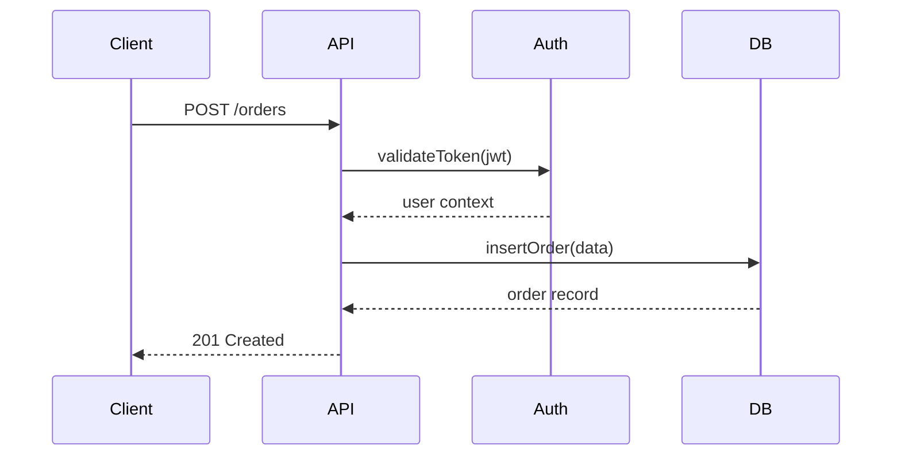

<!--
  CHAPTER: 28
  TITLE: Code Reading & Open Source
  PART: III — Tooling & Practice
  PREREQS: Chapter 12 (git/tooling)
  KEY_TOPICS: code reading strategies, navigating large codebases, OSS contribution, pull requests, open source licensing, building a public profile, reverse engineering systems
  DIFFICULTY: Beginner → Intermediate
  UPDATED: 2026-03-24
-->

# Chapter 28: Code Reading & Open Source

> **Part III — Tooling & Practice** | Prerequisites: Chapter 12 | Difficulty: Beginner → Intermediate

Reading code is a massively underrated skill — you spend far more time reading code than writing it. And contributing to open source is how you learn from the best engineers in the world while building your reputation.

### In This Chapter
- Why Code Reading Matters
- Strategies for Reading Unfamiliar Codebases
- Tools for Code Navigation
- Open Source Contribution Guide
- Open Source Licensing
- Building Your Engineering Profile

### Related Chapters
- Ch 12 (Git, grep, developer tooling)
- Ch 15 (codebase organization)
- Ch 27 (documentation)

---

## 1. Why Code Reading Matters

You spend **10x more time reading code than writing it**. This ratio is not a complaint — it is the nature of the work. A feature that takes two hours to write required six hours of reading: understanding the existing code, finding the right place to make changes, tracing through related systems, and reviewing what you wrote.

Every senior engineer interview involves some version of "walk us through this codebase." Not because they want you to memorize syntax, but because the ability to orient yourself in unfamiliar code is the single most reliable signal of engineering experience. Juniors get lost. Seniors navigate.

The fastest way to learn new patterns, languages, and architectures is to read code written by people better than you. Tutorials teach you the happy path. Real codebases teach you how experienced engineers handle errors, structure modules, manage state, name things, and make tradeoffs.

Some codebases worth studying:

```
# Elegant simplicity
Redis         — C, but readable. Beautifully structured single-threaded server.
SQLite        — One of the most tested codebases in history. Read the VFS layer.
Go stdlib     — The gold standard for clear, idiomatic library code.

# Large-scale architecture
React         — Fiber architecture, reconciliation, hooks implementation.
PostgreSQL    — Decades of battle-tested database engineering.
Linux kernel  — The most important codebase in the world. Start with /kernel/sched/.

# Modern application patterns
Next.js       — Full-stack framework. Trace a request from URL to rendered page.
Prisma        — Query engine, schema parsing, migration engine as separate concerns.
Tailwind CSS  — A build tool disguised as a CSS framework. Read the plugin system.
```

And here is the thing people forget: **debugging is primarily a code reading activity**. When something breaks at 2 AM, you are not writing new code. You are reading existing code, tracing execution, checking assumptions, and finding the line where reality diverges from expectation.

---

## 2. Strategies for Reading Unfamiliar Codebases

There is no single right way to read a codebase. Different situations call for different approaches. Here are three strategies, each with a concrete example.

### The Top-Down Approach

Best for: joining a new team, evaluating a new library, getting the big picture.

The top-down approach starts at the highest level of abstraction and drills down. You are building a mental map of the territory before exploring any single neighborhood.

**Step 1: Read the README.**

What does this project do? Who is it for? What problems does it solve?

```bash
# Clone the project and start reading
git clone https://github.com/expressjs/express.git
cd express
cat README.md
```

**Step 2: Look at the directory structure.**

```bash
# Get the lay of the land
tree -L 2 -I node_modules
```

```
express/
├── lib/
│   ├── application.js      # The Express app object
│   ├── express.js           # Entry point — creates the app
│   ├── request.js           # Extends Node's IncomingMessage
│   ├── response.js          # Extends Node's ServerResponse
│   ├── router/
│   │   ├── index.js         # Router implementation
│   │   ├── layer.js         # Single route layer
│   │   └── route.js         # Route with HTTP method handlers
│   ├── middleware/
│   │   ├── init.js          # Request/response initialization
│   │   └── query.js         # Query string parsing
│   └── utils.js             # Shared utilities
├── test/                    # Tests mirror lib/ structure
├── examples/                # Working examples — gold mine
├── package.json
└── History.md               # Changelog
```

Already you can see: Express is small. The core is about 10 files. The router is separated from the application. Middleware is its own concept.

**Step 3: Find the entry point.**

```bash
# Check package.json for "main"
cat package.json | grep '"main"'
# "main": "./index.js"

cat index.js
# It just re-exports lib/express.js
```

**Step 4: Trace the happy path.**

Pick the simplest possible use case and follow it through the code:

```javascript
// The simplest Express app
const express = require('express');
const app = express();

app.get('/', (req, res) => {
  res.send('Hello World');
});

app.listen(3000);
```

Now trace each line:
- `express()` — what does lib/express.js export? A `createApplication` function.
- `app.get('/', handler)` — defined in lib/application.js, delegates to the router.
- `app.listen(3000)` — wraps Node's `http.createServer(app).listen(3000)`.
- When a request arrives, `app.handle()` is called, which walks the middleware/route stack.

**Step 5: Read the tests.**

```bash
# Tests document behavior better than comments
ls test/
# app.all.js, app.get.js, app.listen.js, app.route.js, req.params.js, res.send.js...
```

Each test file tells you exactly what a feature is supposed to do, including edge cases.

**Step 6: Read the configuration.**

Look for config files, environment variables, defaults:

```bash
rg "process\.env" lib/
rg "defaults" lib/
```

**Step 7: Check recent history.**

```bash
git log --oneline -20
# See what's been changing recently — indicates active areas of development
```

### The Bottom-Up Approach

Best for: debugging, fixing a specific bug, understanding why something breaks.

You start from a symptom and work backward to the cause.

**Example: a user reports "my Express app returns 404 for routes with trailing slashes."**

```bash
# Step 1: Find where 404 responses are generated
rg "404" lib/ --type js
# lib/application.js:  res.statusCode = 404;

# Step 2: Read that function
# It's in the finalhandler — the last middleware when nothing matched.

# Step 3: Find where routes are matched
rg "match" lib/router/ --type js
# lib/router/layer.js contains the Layer.prototype.match function

# Step 4: Read that function — does it handle trailing slashes?
# Found it: the `strict` option controls trailing slash behavior.
# By default, strict is false, which means /foo and /foo/ match the same route.

# Step 5: Check git blame for when this behavior was added
git blame lib/router/layer.js | head -30
```

The bottom-up approach is surgical. You do not need to understand the entire codebase — you need to understand the specific path that leads to the bug.

### The Slice Approach

Best for: understanding one feature in depth, preparing to modify or extend it.

You take a vertical slice through the application — one feature from UI to database.

**Example: understanding how authentication works in a Next.js app.**

```bash
# Step 1: Find a test for authentication
fd "auth" --type f
# src/app/api/auth/[...nextauth]/route.ts
# src/middleware.ts
# src/lib/auth.ts
# __tests__/auth.test.ts

# Step 2: Start from the test
cat __tests__/auth.test.ts
# The test calls POST /api/auth/signin with credentials
# and expects a session token back.

# Step 3: Trace the execution
# middleware.ts — checks for session on protected routes
# api/auth/[...nextauth]/route.ts — handles auth API routes
# lib/auth.ts — configures NextAuth with providers

# Step 4: Map the components
# Browser → middleware.ts (session check) → page (if valid)
# Browser → /api/auth/signin → NextAuth → database → session cookie

# Step 5: Draw it out (even rough ASCII helps)
```

```
┌─────────┐     ┌──────────────┐     ┌────────────────┐
│ Browser  │────▸│ middleware.ts │────▸│ Protected Page  │
│          │     │ (check JWT)  │     │                 │
└─────────┘     └──────────────┘     └────────────────┘
     │
     │ POST /api/auth/signin
     ▼
┌─────────────────────┐     ┌──────────┐
│ [...nextauth]/route │────▸│ Database │
│ (NextAuth handler)  │◂────│ (users)  │
└─────────────────────┘     └──────────┘
```

### Reading Patterns to Recognize

As you read more codebases, you start recognizing structural patterns. This accelerates your reading speed enormously because you can predict where things live.

**Architecture patterns:**

```
MVC (Rails, Django, Laravel):
  models/ → data + business logic
  views/  → templates / UI
  controllers/ → request handling, glue between model and view

Hexagonal / Clean Architecture (enterprise Java, some Go):
  domain/     → entities, value objects, domain services
  ports/      → interfaces (what the domain needs)
  adapters/   → implementations (database, HTTP, messaging)

Vertical Slice (modern apps):
  features/orders/    → everything for orders (API, logic, tests)
  features/payments/  → everything for payments
  features/users/     → everything for users
```

**Wiring patterns — where things are connected:**

```bash
# Dependency injection in Go
rg "func New" --type go | head -20
# Constructors show you what each component depends on

# Spring Boot auto-configuration
rg "@Configuration" --type java
rg "@Bean" --type java

# Next.js — the file system IS the wiring
ls src/app/          # Routes
ls src/app/api/      # API routes
cat next.config.js   # Framework configuration
```

**Domain model — the core concepts:**

```bash
# Find entities/models
fd "model" --type f
fd "entity" --type f
rg "class.*Model" --type py
rg "type.*struct" --type go

# Find the database schema
fd "schema" --type f
fd "migration" --type f
```

### Anti-Patterns When Reading Code

**Trying to understand everything at once.** A large codebase might have hundreds of thousands of lines. You cannot hold it all in your head. Scope your reading to one feature, one request path, one module at a time.

**Reading linearly from top of file to bottom.** Code is not a novel. Functions at the top of a file might call functions at the bottom. Instead, follow the execution flow — start where execution starts and trace where it goes.

**Getting lost in abstractions.** When you see an interface with five implementations, do not read all five. Find the concrete implementation that is actually used in the code path you are tracing. Understand that one first. Come back to the others when you need them.

**Not running the code.** Reading code without running it is like reading a recipe without cooking. You miss the runtime behavior, the timing, the actual data flowing through. Always get the project running locally first:

```bash
# The universal "get it running" sequence
cat README.md                    # Installation instructions
cat Makefile                     # or Makefile targets
cat package.json | grep scripts  # or npm scripts
docker compose up                # or Docker setup

# Then exercise the code path you're reading
curl http://localhost:3000/api/health
```

---

## 3. Tools for Code Navigation

Good tools turn a multi-hour code reading session into a 20-minute one.

### CLI Tools

**ripgrep (rg)** — the single most important code reading tool. Faster than grep by 10-100x.

```bash
# Find all usages of a function
rg "processPayment" --type ts

# Find the definition (look for function/class/const declarations)
rg "function processPayment|const processPayment|class ProcessPayment" --type ts

# Find where errors are thrown
rg "throw new" --type ts -C 2

# Find TODOs and FIXMEs
rg "TODO|FIXME|HACK|XXX" --type ts

# Search with context (show 3 lines before and after each match)
rg "processPayment" --type ts -C 3

# Search only in specific directories
rg "processPayment" src/services/

# Find files that DON'T match (useful for finding missing error handling)
rg -L "try.*catch" src/api/ --type ts
```

**fd** — a better `find`. Respects .gitignore by default.

```bash
# Find files by name pattern
fd "\.test\.ts$"
fd "controller" --type f
fd "migration" --extension sql

# Find recently modified files (what's been changing?)
fd --type f --changed-within 7d
```

**tree** — see the forest before the trees.

```bash
# Show directory structure, 2 levels deep, ignoring noise
tree -L 2 -I "node_modules|.git|dist|build|__pycache__"

# Show only directories
tree -d -L 3

# Show with file sizes (find the big files)
tree -sh -L 2 --du
```

**git log / git blame** — code has history, and that history tells a story.

```bash
# Who last touched each line and when?
git blame src/services/payment.ts

# What changed in this file recently?
git log --oneline -10 -- src/services/payment.ts

# What did a specific commit change?
git show abc1234

# Find when a function was introduced
git log -S "processPayment" --oneline

# Find all commits by a specific author (learn from senior engineers)
git log --author="jane@company.com" --oneline -20

# See how a file evolved over time
git log -p -- src/services/payment.ts
```

**cloc** — understand the scale and composition of a codebase.

```bash
cloc .
# -------------------------------------------------------------------------------
# Language                     files          blank        comment           code
# -------------------------------------------------------------------------------
# TypeScript                     142           1203            890          12450
# JSON                            15              0              0           1230
# YAML                             8             34             12            210
# Markdown                        12            340              0           1100
# -------------------------------------------------------------------------------
# SUM:                           177           1577            902          14990
# -------------------------------------------------------------------------------
```

Now you know: this is a medium-sized TypeScript project with about 15K lines of code.

### IDE Features

If you are using VS Code (or any modern IDE), these features are non-negotiable for code reading:

| Feature | Shortcut (VS Code) | What It Does |
|---------|-------------------|--------------|
| Go to Definition | `F12` | Jump to where a function/class is defined |
| Find All References | `Shift+F12` | Show every place a symbol is used |
| Call Hierarchy | `Shift+Alt+H` | Who calls this function? What does it call? |
| Symbol Search | `Ctrl+T` | Search all classes, functions, types by name |
| Peek Definition | `Alt+F12` | See the definition inline without leaving |
| Go Back | `Alt+Left` | Return to where you were before jumping |
| Breadcrumbs | (top of editor) | Shows file > class > function location |
| Outline | `Ctrl+Shift+O` | Table of contents for the current file |

**The power move**: open two editor panes side by side. In the left pane, read the caller. In the right pane, read the callee. This lets you follow execution without losing context.

### AI-Assisted Code Reading

AI tools are genuinely useful for code reading — with caveats.

```bash
# Ask Claude Code to explain a codebase
# "Explain the architecture of this project"
# "Trace the request flow for POST /api/orders"
# "What design patterns does this codebase use?"
# "Explain what this function does: [paste function]"
```

AI is great for:
- Getting a quick overview of what a file/function does
- Explaining complex algorithms or regex patterns
- Generating architecture diagrams from code
- Summarizing long git histories

AI is unreliable for:
- Knowing about private/proprietary codebases (it can only see what you share)
- Understanding runtime behavior (it reads text, not execution)
- Catching subtle bugs that depend on ordering or state
- Anything involving exact line numbers or file paths (always verify)

**The right workflow**: use AI to accelerate your reading, but verify every claim by tracing the code yourself.

### Diagramming

When a codebase is complex, a diagram is worth a thousand lines of code. You do not need a fancy tool — even ASCII art helps.

**Mermaid** (renders in GitHub, VS Code, and most documentation tools):



**C4 Model** — four levels of zoom:

1. **Context**: your system and its interactions with users and other systems
2. **Container**: the high-level technology choices (web app, API, database, queue)
3. **Component**: the major structural pieces inside each container
4. **Code**: class/function level (only for the parts you are actively working on)

Start at Context, zoom in only as far as you need to.

---

## 4. Open Source Contribution Guide

Contributing to open source is one of the highest-leverage activities for a developer. You learn from experienced engineers, build a public track record, and improve the tools you use every day.

### Getting Started

**Find a project you actually use.** Contributions are easier when you understand the user's perspective.

```bash
# Look at your own dependencies — you use these every day
cat package.json | jq '.dependencies, .devDependencies'
# or
cat requirements.txt
# or
cat go.mod
```

**Find "good first issue" labels.** Most major projects label issues that are appropriate for new contributors.

```bash
# GitHub CLI makes this easy
gh issue list --repo facebook/react --label "good first issue"
gh issue list --repo vercel/next.js --label "good first issue"
gh issue list --repo golang/go --label "help wanted"
```

**Read CONTRIBUTING.md before doing anything.**

Every serious project has a CONTRIBUTING.md that tells you:
- How to set up the development environment
- How to run tests
- Code style requirements
- How to submit a pull request
- What the review process looks like

Ignoring this file is the fastest way to get your PR rejected.

**Understand the project's communication style.**

Some projects discuss everything on GitHub issues. Others use Discord, Slack, or mailing lists. Lurk for a week before contributing. Read closed PRs to see how reviews work. Understand the tone — some projects are formal, others are casual.

**Start small.** Your first contribution should be so small it is almost embarrassing:

- Fix a typo in documentation
- Add a missing test case
- Improve an error message
- Fix a broken link in the README
- Add type annotations to untyped code

This is not about the size of the change. It is about learning the process: fork, branch, change, test, PR, review, merge. Once you have done it once, larger contributions become natural.

### The Contribution Workflow

Here is the complete workflow, step by step:

```bash
# Step 1: Fork the repository (via GitHub UI or CLI)
gh repo fork facebook/react --clone

# Step 2: Add the upstream remote (if gh didn't do it automatically)
cd react
git remote add upstream https://github.com/facebook/react.git
git remote -v
# origin    https://github.com/YOUR_USERNAME/react.git (push)
# upstream  https://github.com/facebook/react.git (fetch)

# Step 3: Create a feature branch from the latest main
git fetch upstream
git checkout -b fix/improve-error-message upstream/main

# Step 4: Make your changes
# ... edit files ...

# Step 5: Run the project's tests
yarn test
# or: make test, npm test, go test ./..., pytest

# Step 6: Commit with a clear message
git add -A
git commit -m "Improve error message for invalid hook usage

The previous error message said 'Invalid hook call' without
indicating which hook or where. This change includes the hook
name and component in the error message.

Fixes #12345"

# Step 7: Push to your fork
git push origin fix/improve-error-message

# Step 8: Create the pull request
gh pr create --title "Improve error message for invalid hook usage" \
  --body "## What

Improved the error message for invalid hook calls to include the hook name
and component name, making it easier to debug.

## Why

The previous message 'Invalid hook call' gave no actionable information.
See #12345 for user reports.

## How

Modified the invariant call in ReactFiberHooks to include additional context
from the fiber's debug info.

## Test plan

- Added test case in ReactHooksErrors-test.js
- Verified error message includes hook name and component"

# Step 9: Respond to review feedback
# Maintainers will review your code. They might request changes.
# Make the changes, push again:
git add -A
git commit -m "Address review feedback: use displayName fallback"
git push origin fix/improve-error-message

# Step 10: If the maintainer asks you to squash commits:
git rebase -i upstream/main
# Mark all but the first commit as "squash"
git push --force-with-lease origin fix/improve-error-message
```

### What Makes a Great PR

**Solves one problem.** Do not bundle "fix typo" with "refactor database layer." One PR, one concern. If you find other issues while working, file them as separate issues.

**Has tests.** PRs with tests get merged significantly faster. Tests prove your change works and prevent regressions. Even for documentation PRs, if there are testable examples, test them.

**Clear description with context and motivation.** The reviewer does not have your context. Explain what you changed, why you changed it, and how you verified it works.

```markdown
## What changed
Added rate limiting to the /api/upload endpoint.

## Why
Users reported that rapid repeated uploads caused OOM errors on the server.
See #789 for the production incident.

## How it works
- Added a token bucket rate limiter (10 requests per minute per IP)
- Returns 429 Too Many Requests when limit is exceeded
- Rate limit state stored in Redis (falls back to in-memory if Redis unavailable)

## Test plan
- Unit tests for token bucket logic
- Integration test for rate-limited endpoint
- Manual test: `for i in {1..20}; do curl -X POST localhost:3000/api/upload; done`
```

**Follows the project's code style exactly.** If the project uses tabs, you use tabs. If they use `snake_case`, you use `snake_case`. If they have a `.editorconfig` or linter config, follow it. Do not "improve" the style in your PR.

**Small and focused.** A 50-line PR gets reviewed in an hour. A 500-line PR sits in the queue for weeks. Break large changes into a series of small, reviewable PRs.

### Communication

Open source communication has its own norms. The most important ones:

**Be respectful and patient.** Maintainers are often unpaid volunteers working in their spare time. A response might take days or weeks. That is normal.

**Ask before starting large changes.** File an issue first: "I'd like to add feature X. Here's my proposed approach. Does this align with the project's direction?" Getting buy-in before writing code saves everyone time.

**Accept "no" gracefully.** Not every contribution fits the project's vision. If your PR is rejected, thank the reviewer for their time, ask what would be accepted, and move on. Do not argue.

**Thank reviewers.** A simple "Thanks for the thorough review!" goes a long way.

**Bad communication:**
```
This is a critical bug fix that should be merged immediately.
I don't understand why you're nitpicking my code style.
```

**Good communication:**
```
This fixes the issue reported in #456. Happy to adjust the approach
if you have suggestions. Thanks for maintaining this project!
```

### Recommended First Contributions

Here is a progression from easiest to more involved:

**Level 1: Documentation**
- Fix outdated installation instructions
- Add missing API examples
- Translate documentation to another language
- Add JSDoc/docstrings to undocumented functions

**Level 2: Tests**
- Add tests for uncovered code paths (check coverage reports)
- Add edge case tests for existing functions
- Convert test framework (e.g., migrate from Mocha to Vitest if the project is doing that)
- Fix flaky tests

**Level 3: Bug Fixes**
- Reproduce a reported bug, write a failing test, then fix it
- Fix deprecation warnings
- Fix TypeScript type errors or improve type definitions
- Handle error cases that currently crash

**Level 4: Developer Tooling**
- Add or improve CI configuration
- Add linting rules to catch common mistakes
- Improve build performance
- Add development scripts to package.json

**Level 5: Features (only after you know the project well)**
- Implement a requested feature from the issue tracker
- Add a plugin or extension
- Performance optimization with benchmarks

---

## 5. Open Source Licensing

Licensing is one of those things that does not matter until it suddenly matters a lot. If you use an open source library in a commercial product, you are legally obligated to follow its license terms. Here is what you need to know.

### Permissive Licenses

These licenses say: "Do whatever you want, just give us credit."

**MIT License** — The most popular license for JavaScript/TypeScript libraries. Two sentences: "Use this for anything. Include this license text."

```
Permission is hereby granted, free of charge, to any person obtaining a copy
of this software... to deal in the Software without restriction, including
without limitation the rights to use, copy, modify, merge, publish,
distribute, sublicense, and/or sell copies of the Software...
```

React, Next.js, Express, Vue, Angular, jQuery — all MIT.

**Apache 2.0** — Like MIT but with an explicit patent grant. If a company holds patents on the code they are open sourcing, Apache 2.0 gives you a license to those patents too. Preferred by large companies. Used by Kubernetes, TensorFlow, Android.

**BSD (2-clause and 3-clause)** — Functionally similar to MIT. The 3-clause variant adds: "Don't use our name to endorse your product." Used by PostgreSQL, FreeBSD, Nginx.

### Copyleft Licenses

These licenses say: "You can use this, but if you distribute modified versions, those must also be open source under the same license."

**GPL v3 (GNU General Public License)** — The heavyweight copyleft license. If your application includes GPL code and you distribute the application, the entire application must be GPL. This is why companies are cautious about GPL dependencies. Used by Linux kernel, GCC, WordPress.

**LGPL (Lesser GPL)** — A weaker copyleft. You can link to LGPL libraries from proprietary code without making your code LGPL. But if you modify the LGPL library itself, those modifications must be open. Used by glibc, Qt (partially).

**AGPL (Affero GPL)** — Like GPL but closes the "SaaS loophole." If you run modified AGPL code as a network service (without distributing it), you still must release your source code. Used by MongoDB (before SSPL), Mastodon, Grafana.

### Source-Available Licenses

These are not "open source" by the OSI definition but you can read the source code.

**BSL (Business Source License)** — Source is available, but there are use restrictions (typically: you cannot offer a competing hosted service). After a set number of years (usually 4), the license automatically converts to a permissive open source license. Used by HashiCorp (Terraform, Vault), MariaDB, Sentry.

**SSPL (Server Side Public License)** — Like AGPL but broader: if you offer the software as a service, you must open source your entire service stack (monitoring, deployment, etc.). Controversial. Used by MongoDB, Elasticsearch (later switched to dual AGPL+SSPL, then back to open source).

### Practical Decision Guide

```
Building a commercial SaaS product?
├── Can I use MIT/Apache/BSD dependencies?     → Yes, freely.
├── Can I use LGPL dependencies?               → Yes, if you link but don't modify.
├── Can I use GPL dependencies?                → Risky. Consult legal.
├── Can I use AGPL dependencies?               → Probably not. Consult legal.
└── Can I use BSL/SSPL dependencies?           → Read the specific restrictions.

Choosing a license for YOUR open source project?
├── Want maximum adoption?                     → MIT
├── Want adoption + patent protection?         → Apache 2.0
├── Want to ensure all derivatives stay open?  → GPL v3
├── Want to prevent cloud providers hosting?   → AGPL or BSL
└── Don't care / confused?                     → MIT
```

**One critical rule**: check the licenses of ALL your dependencies. A single GPL dependency makes your entire project GPL (if you distribute it). Use tools to audit:

```bash
# Node.js projects
npx license-checker --summary

# Python projects
pip-licenses

# Go projects
go-licenses check ./...
```

---

## 6. Building Your Engineering Profile

Your GitHub profile is your engineering portfolio. Unlike a resume, it shows what you can actually do.

### Contributing to Well-Known Projects

A merged PR on a well-known project carries significant weight. It means you navigated a large codebase, followed contribution guidelines, passed code review by experienced engineers, and wrote code that met their standards.

You do not need to contribute to React or Linux. Find the tool you use most and make it better.

```bash
# Find projects with active "good first issue" labels
gh search repos --topic=good-first-issue --sort=stars --limit=20

# Look at your own dependencies
cat package.json | jq -r '.dependencies | keys[]'
# Pick one you know well and check their issues
```

### Writing About What You Learn

Every time you read a codebase and learn something, you have the raw material for a blog post:

- "How Redis handles concurrent connections with a single thread"
- "Inside Next.js middleware: tracing a request through the edge runtime"
- "What I learned reading the Go scheduler source code"

Write on your own blog, Dev.to, Hashnode, or even just in GitHub Gists. The act of explaining solidifies your understanding, and it creates a public artifact that demonstrates your thinking.

### Building Small, Useful Tools

The best open source projects solve a real problem the author had:

```bash
# Examples of "small but useful" open source projects
# - A CLI tool that automates something you do manually
# - A library that wraps a painful API into something ergonomic
# - A GitHub Action that solves a common CI need
# - A VS Code extension that scratches your own itch
```

One well-maintained project with a clear README, tests, CI, and semver releases demonstrates more engineering maturity than 50 abandoned repos.

### The Brag Document

Keep a running document of everything you accomplish. When promotion time comes, you will not remember the PR from eight months ago. Your brag document will.

```markdown
# Engineering Brag Document — 2026

## Open Source
- Merged PR to Next.js: improved error messages for middleware (#12345)
- Created and maintain `api-cache-utils` (200 stars, used by 15 companies)
- Contributed test improvements to Prisma (3 PRs merged)

## Technical Writing
- Blog post "Understanding the React Fiber Tree" (15K views)
- Internal RFC: "Migrating from REST to tRPC" (approved and implemented)

## Impact at Work
- Reduced API p99 latency from 800ms to 120ms (Redis caching layer)
- Led incident response for the March 15 outage (RCA + prevention)
- Mentored 2 junior engineers through their first quarter

## Talks
- "Code Reading Strategies" at local TypeScript meetup (40 attendees)
```

### GitHub Profile Optimization

Your GitHub profile is often the first thing a hiring manager or collaborator looks at.

**Profile README**: create a repository named after your username (e.g., `github.com/yourname/yourname`) with a README.md that appears on your profile page. Keep it concise:

```markdown
## Hi, I'm [Name]

Backend engineer focused on distributed systems and developer tooling.

### Currently working on
- [Project] — one-line description
- Contributing to [OSS project]

### Recent writing
- [Blog post title](link)
```

**Pin your best repositories.** Choose 4-6 repos that showcase different skills. A mix of:
- One project you built from scratch
- One contribution to a well-known project (fork with your PRs)
- One tool/library others can use
- One project that shows depth (complex problem, well-tested)

**Green squares matter less than you think.** Consistent, meaningful contributions beat daily commits to a scratch repo. Hiring managers who judge by commit graph density are not the hiring managers you want.

### Community Participation

- **Answer questions** on Stack Overflow, GitHub Discussions, or Discord. Teaching others is the best way to solidify your own knowledge.
- **Review other people's PRs.** You do not need to be a maintainer to leave thoughtful review comments on public repos.
- **Speak at meetups.** Start with a 5-minute lightning talk at a local meetup. The bar is lower than you think, and the skills transfer to technical leadership.

---

## Chapter Summary

Reading code is the foundation of software engineering. You will spend most of your career doing it. Getting good at it — building mental models quickly, navigating unfamiliar systems, using the right tools — is what separates productive engineers from struggling ones.

Open source is where you practice this in public. Contributing to open source teaches you how great codebases are structured, how experienced engineers review code, and how to communicate technical ideas. Along the way, you build a public portfolio that speaks louder than any resume.

**Key takeaways:**

1. **Read code actively, not passively.** Trace execution paths. Run the code. Draw diagrams.
2. **Use the right strategy** — top-down for orientation, bottom-up for debugging, slice for feature understanding.
3. **Master your tools** — ripgrep, git blame, IDE navigation, and AI assistants will multiply your reading speed.
4. **Start contributing small.** A merged typo fix teaches you the entire contribution workflow.
5. **Understand licensing.** MIT is safe. GPL has implications. Check your dependencies.
6. **Build in public.** Write, contribute, and share what you learn. Your future self will thank you.

---

**Next chapter**: Chapter 29 — where we cover testing strategies and building confidence that your code actually works.
