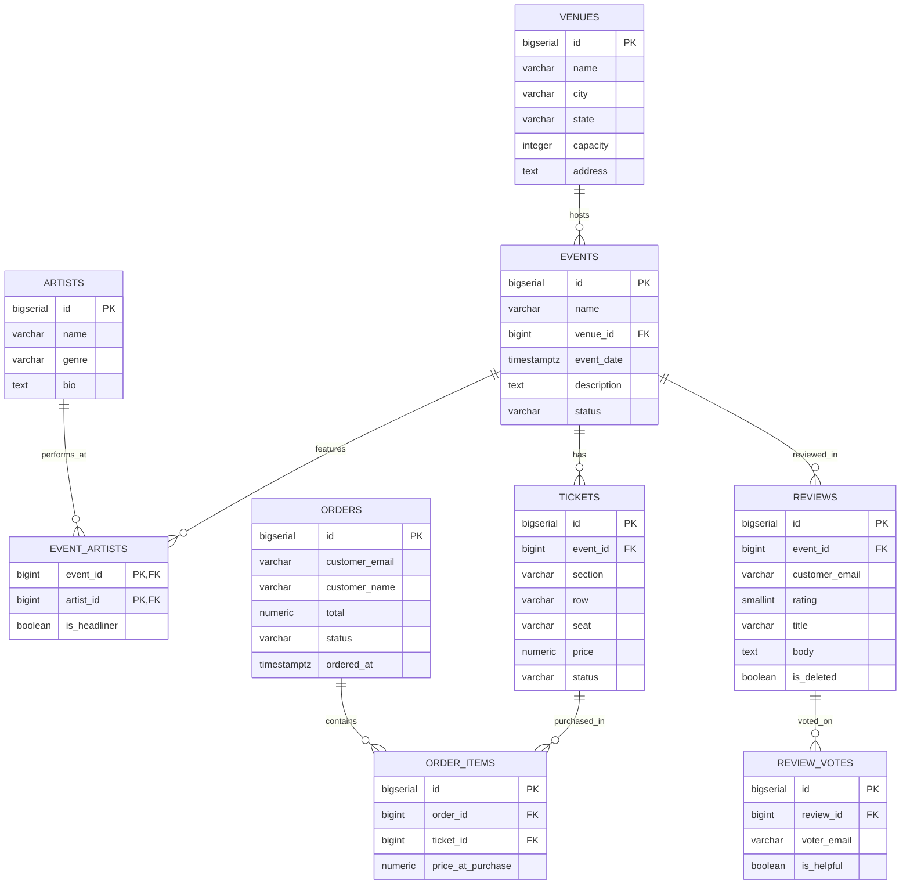

# L1-M08: Data Modeling Decisions

> **Loop 1 (Foundation)** | Section 1B: Data & Databases | ⏱️ 60 min | 🟢 Core | Prerequisites: L1-M05, L1-M06, L1-M07
>
> **Source:** Chapters 2, 24 of the 100x Engineer Guide

## What You'll Learn
- What normalization is and why the TicketPulse schema is in Third Normal Form (3NF)
- When and how to denormalize for read performance
- How to design a schema for a new feature from scratch
- Entity-Relationship diagramming with Mermaid
- The real-world trade-offs that drive schema decisions at scale

## Why This Matters
Schema design is the single highest-leverage decision in any application. A bad schema creates problems that no amount of indexing, caching, or hardware can fix. A good schema makes queries simple, fast, and correct. You will redesign schemas many times in your career — learning to reason about trade-offs now saves you from painful migrations later.

> **Pro tip:** Instagram's most critical optimization was not code — it was denormalizing their feed to avoid expensive JOINs at read time. Facebook, Twitter, and Uber have all made similar schema-level decisions that dwarfed any code optimization.

## Prereq Check

Connect to TicketPulse:

```bash
docker exec -it ticketpulse-postgres psql -U ticketpulse
```

```sql
-- Verify the schema exists
\dt
-- Should show: venues, artists, events, event_artists, tickets, orders, order_items
```

---

## Part 1: Normalization — Why Our Schema Looks This Way (15 min)

### What Is Normalization?

Normalization is the process of organizing data to reduce redundancy and prevent update anomalies. There are several normal forms, but in practice you need to understand three:

**First Normal Form (1NF):** Every column contains atomic (single) values. No arrays, no comma-separated lists.

```sql
-- VIOLATES 1NF:
-- events table with: artists = 'Aurora Flux, Neon Collective'
-- You can't query "find events with Aurora Flux" without string parsing

-- SATISFIES 1NF (our design):
-- Separate event_artists table with one row per event-artist pair
```

**Second Normal Form (2NF):** 1NF + every non-key column depends on the entire primary key (not just part of it).

```sql
-- VIOLATES 2NF:
-- event_artists (event_id, artist_id, artist_name, is_headliner)
-- artist_name depends only on artist_id, not on (event_id, artist_id)

-- SATISFIES 2NF (our design):
-- artist_name lives in the artists table
-- event_artists only has columns that depend on the full (event_id, artist_id) key
```

**Third Normal Form (3NF):** 2NF + no transitive dependencies (no non-key column depends on another non-key column).

```sql
-- VIOLATES 3NF:
-- events (id, name, venue_id, venue_name, venue_city)
-- venue_name and venue_city depend on venue_id, not on the event id

-- SATISFIES 3NF (our design):
-- Venue details live in the venues table
-- events only stores venue_id (a foreign key)
```

### 🔍 Try It Now: Verify Our Schema Is 3NF

Let's check the TicketPulse schema for normalization:

```sql
-- Look at the events table structure
\d events

-- It has venue_id but NOT venue_name, venue_city, etc.
-- To get venue info, you JOIN:
SELECT e.name, v.name AS venue, v.city
FROM events e
JOIN venues v ON e.venue_id = v.id;
```

### 🤔 Reflect: Should We Store the Venue Name in the Events Table?

Think about this for 2 minutes before reading on.

**Arguments FOR storing venue_name in events (denormalization):**
- One fewer JOIN when displaying event listings
- Slightly faster reads for the most common query
- If venue names rarely change, the duplication is low-risk

**Arguments AGAINST (staying normalized):**
- If a venue changes its name, you must update every event (or have stale data)
- The JOIN is cheap — venues is a tiny table (5 rows). Postgres does it in microseconds.
- You double the storage for venue names across thousands of events

**Verdict for TicketPulse:** Keep it normalized. Venues table is tiny, the JOIN is free, and name changes (though rare) should propagate automatically.

### The Anomaly Problem

Denormalization creates three types of anomalies:

```sql
-- SETUP: Imagine events had venue_name directly
-- INSERT ANOMALY: You can create an event with a venue_name that doesn't exist
-- UPDATE ANOMALY: Venue renames from "MSG" to "Madison Square Garden"
--   → Must find and update every event row (miss one = inconsistent data)
-- DELETE ANOMALY: Delete all events at a venue → lose the venue info entirely
```

### 🔍 Try It Now: See an Update Anomaly in Action

```sql
-- Create a denormalized test table
CREATE TABLE events_denormalized (
    id BIGSERIAL PRIMARY KEY,
    name VARCHAR(300),
    venue_name VARCHAR(200),
    venue_city VARCHAR(100)
);

INSERT INTO events_denormalized (name, venue_name, venue_city) VALUES
('Show A', 'Madison Square Garden', 'New York'),
('Show B', 'Madison Square Garden', 'New York'),
('Show C', 'Madison Square Garden', 'New York');

-- The venue gets a new name
UPDATE events_denormalized
SET venue_name = 'MSG Arena'
WHERE id = 1;  -- Oops, only updated one row!

-- Now we have inconsistent data:
SELECT DISTINCT venue_name FROM events_denormalized;
-- Returns: 'MSG Arena' AND 'Madison Square Garden'

-- Clean up
DROP TABLE events_denormalized;
```

This is why normalization exists — it makes inconsistency structurally impossible.

---

## Part 2: When to Denormalize (15 min)

Normalization is the default. Denormalization is an optimization you reach for when you have evidence that reads are too slow.

### The Expensive Query Problem

Consider this dashboard query that TicketPulse runs frequently:

```sql
-- "Most popular events" — requires 4 table JOINs
EXPLAIN (ANALYZE)
SELECT e.name AS event_name,
       v.name AS venue_name,
       v.city,
       a.name AS headliner,
       COUNT(t.id) FILTER (WHERE t.status = 'sold') AS tickets_sold,
       SUM(t.price) FILTER (WHERE t.status = 'sold') AS revenue
FROM events e
JOIN venues v ON e.venue_id = v.id
LEFT JOIN event_artists ea ON ea.event_id = e.id AND ea.is_headliner = true
LEFT JOIN artists a ON ea.artist_id = a.id
JOIN tickets t ON t.event_id = e.id
GROUP BY e.id, e.name, v.name, v.city, a.name
ORDER BY revenue DESC;
```

### 🔍 Try It Now

Run that query and look at the EXPLAIN output. Note the execution time and number of JOINs.

For TicketPulse's scale (6 events, 100K tickets), this query runs in ~50ms. But imagine:
- 50,000 events
- 100M tickets
- 1,000 concurrent users hitting this page

At that scale, 4 JOINs on 100M rows is a problem. Here are your options:

### Option 1: Materialized View (Best First Step)

```sql
-- Create a pre-computed snapshot of the popular events query
CREATE MATERIALIZED VIEW mv_popular_events AS
SELECT e.id AS event_id,
       e.name AS event_name,
       v.name AS venue_name,
       v.city AS venue_city,
       a.name AS headliner,
       COUNT(t.id) FILTER (WHERE t.status = 'sold') AS tickets_sold,
       SUM(t.price) FILTER (WHERE t.status = 'sold') AS revenue,
       COUNT(t.id) FILTER (WHERE t.status = 'available') AS tickets_available
FROM events e
JOIN venues v ON e.venue_id = v.id
LEFT JOIN event_artists ea ON ea.event_id = e.id AND ea.is_headliner = true
LEFT JOIN artists a ON ea.artist_id = a.id
JOIN tickets t ON t.event_id = e.id
GROUP BY e.id, e.name, v.name, v.city, a.name;

-- Add an index on the materialized view
CREATE UNIQUE INDEX idx_mv_popular_events ON mv_popular_events (event_id);

-- Query the materialized view instead — single table scan, no JOINs
SELECT * FROM mv_popular_events ORDER BY revenue DESC;

-- Refresh periodically (e.g., every 5 minutes via cron)
REFRESH MATERIALIZED VIEW CONCURRENTLY mv_popular_events;
```

### 🔍 Try It Now

```sql
EXPLAIN (ANALYZE)
SELECT * FROM mv_popular_events ORDER BY revenue DESC;
```

Compare the execution time and plan to the original 4-JOIN query. The materialized view query should be dramatically simpler.

### Option 2: Denormalized Column

If you need real-time data (not 5-minute-old snapshots), you can add a denormalized column:

```sql
-- Add a tickets_sold counter to the events table
ALTER TABLE events ADD COLUMN tickets_sold_count INTEGER NOT NULL DEFAULT 0;
ALTER TABLE events ADD COLUMN revenue NUMERIC(12,2) NOT NULL DEFAULT 0;

-- Update it whenever a ticket is sold (via application code or trigger)
-- Application code approach:
-- UPDATE events SET tickets_sold_count = tickets_sold_count + 1,
--                   revenue = revenue + :ticket_price
-- WHERE id = :event_id;
```

**Trade-off:** Reads are instant (no JOINs), but writes are more complex (must update both tables). You also risk the counter drifting if updates are lost.

### Option 3: Summary Table

A dedicated table for pre-aggregated data:

```sql
CREATE TABLE event_stats (
    event_id BIGINT PRIMARY KEY REFERENCES events(id),
    tickets_sold INTEGER NOT NULL DEFAULT 0,
    tickets_available INTEGER NOT NULL DEFAULT 0,
    revenue NUMERIC(12,2) NOT NULL DEFAULT 0,
    last_updated TIMESTAMPTZ NOT NULL DEFAULT NOW()
);

-- Populate from current data
INSERT INTO event_stats (event_id, tickets_sold, tickets_available, revenue)
SELECT event_id,
       COUNT(*) FILTER (WHERE status = 'sold'),
       COUNT(*) FILTER (WHERE status = 'available'),
       COALESCE(SUM(price) FILTER (WHERE status = 'sold'), 0)
FROM tickets
GROUP BY event_id;

-- Query: simple JOIN with a tiny table
SELECT e.name, v.name AS venue, es.tickets_sold, es.revenue
FROM events e
JOIN venues v ON e.venue_id = v.id
JOIN event_stats es ON es.event_id = e.id
ORDER BY es.revenue DESC;
```

### When to Choose Each Approach

| Approach | Latency | Consistency | Complexity |
|----------|---------|-------------|------------|
| Normalized (JOINs) | Higher | Perfect | Low |
| Materialized View | Low reads, stale by refresh interval | Eventually consistent | Low |
| Denormalized Column | Lowest reads | Risk of drift | Medium |
| Summary Table | Low reads | Updated on schedule or event | Medium |

**Default path:** Start normalized. When a query is too slow, add a materialized view. Only denormalize columns when materialized views aren't fresh enough.

---

## Part 3: Design a New Feature — User Reviews (15 min)

### 📐 Design Challenge

<details>
<summary>💡 Hint 1: Direction</summary>
You need two new tables: reviews and review_votes. The reviews table needs a foreign key to events(id), and the "one review per user per event" rule maps to a UNIQUE (event_id, customer_email) constraint. For the rating, use SMALLINT with CHECK (rating BETWEEN 1 AND 5).
</details>

<details>
<summary>💡 Hint 2: Approach</summary>
For soft delete, add an is_deleted BOOLEAN NOT NULL DEFAULT false column. Your indexes should filter on this: CREATE INDEX idx_reviews_event ON reviews (event_id, created_at DESC) WHERE is_deleted = false — this is a partial index that only includes active reviews, matching the access pattern of the event detail page.
</details>

<details>
<summary>💡 Hint 3: Almost There</summary>
For the denormalization question: the event detail page needs AVG(rating) and COUNT(*) on every load. With hundreds of reviews this is cheap, but you could add avg_rating NUMERIC(3,2) and review_count INTEGER to the events table and maintain them with a trigger (AFTER INSERT OR UPDATE ON reviews). The trigger runs UPDATE events SET review_count = (SELECT COUNT(*) ...), avg_rating = (SELECT ROUND(AVG(rating)::numeric, 2) ...) WHERE id = NEW.event_id.
</details>


TicketPulse wants to add user reviews for events. Requirements:

1. Users can write a review for any event they attended (have a confirmed order for)
2. Each review has: a rating (1-5 stars), a title, a body, and a timestamp
3. Reviews can be "helpful" or "not helpful" voted by other users
4. The event detail page must show: average rating, total reviews, and the most recent 10 reviews
5. Users can edit their review but not delete it (soft delete only)
6. Each user can only review an event once

> **Before you continue:** Take a moment to think about how you would approach this before reading the solution. What's your instinct?

### 🛠️ Your Turn

Design the schema for this feature. Consider:
- What tables do you need?
- What are the foreign keys?
- What constraints enforce the business rules?
- Should you denormalize anything for the event detail page?

Spend 10 minutes designing before looking at the solution.

---

<details>
<summary>Solution: Normalized Design</summary>

```sql
-- Reviews table
CREATE TABLE reviews (
    id BIGSERIAL PRIMARY KEY,
    event_id BIGINT NOT NULL REFERENCES events(id),
    customer_email VARCHAR(255) NOT NULL,
    rating SMALLINT NOT NULL CHECK (rating BETWEEN 1 AND 5),
    title VARCHAR(200) NOT NULL,
    body TEXT,
    is_deleted BOOLEAN NOT NULL DEFAULT false,
    created_at TIMESTAMPTZ NOT NULL DEFAULT NOW(),
    updated_at TIMESTAMPTZ NOT NULL DEFAULT NOW(),
    -- Each user can only review an event once
    UNIQUE (event_id, customer_email)
);

-- Review votes (helpful / not helpful)
CREATE TABLE review_votes (
    id BIGSERIAL PRIMARY KEY,
    review_id BIGINT NOT NULL REFERENCES reviews(id),
    voter_email VARCHAR(255) NOT NULL,
    is_helpful BOOLEAN NOT NULL,
    created_at TIMESTAMPTZ NOT NULL DEFAULT NOW(),
    -- Each user can only vote once per review
    UNIQUE (review_id, voter_email)
);

-- Indexes for common access patterns
CREATE INDEX idx_reviews_event ON reviews (event_id, created_at DESC)
    WHERE is_deleted = false;
CREATE INDEX idx_reviews_customer ON reviews (customer_email);
CREATE INDEX idx_review_votes_review ON review_votes (review_id);
```

</details>

<details>
<summary>Solution: With Denormalization for Performance</summary>

```sql
-- Same tables as above, PLUS:

-- Add aggregate columns to events for the event detail page
ALTER TABLE events ADD COLUMN avg_rating NUMERIC(3,2);
ALTER TABLE events ADD COLUMN review_count INTEGER NOT NULL DEFAULT 0;

-- Add helpful count to reviews to avoid counting votes on every page load
ALTER TABLE reviews ADD COLUMN helpful_count INTEGER NOT NULL DEFAULT 0;
ALTER TABLE reviews ADD COLUMN not_helpful_count INTEGER NOT NULL DEFAULT 0;

-- These denormalized columns are updated by:
-- 1. Application code (increment on insert/vote)
-- 2. Or a trigger:
CREATE OR REPLACE FUNCTION update_event_review_stats()
RETURNS TRIGGER AS $$
BEGIN
    UPDATE events
    SET review_count = (
            SELECT COUNT(*) FROM reviews
            WHERE event_id = NEW.event_id AND is_deleted = false
        ),
        avg_rating = (
            SELECT ROUND(AVG(rating)::numeric, 2) FROM reviews
            WHERE event_id = NEW.event_id AND is_deleted = false
        )
    WHERE id = NEW.event_id;
    RETURN NEW;
END;
$$ LANGUAGE plpgsql;

CREATE TRIGGER trg_update_review_stats
AFTER INSERT OR UPDATE ON reviews
FOR EACH ROW EXECUTE FUNCTION update_event_review_stats();
```

</details>

### 🤔 Reflect: Comparing the Designs

**Normalized design:**
- Clean, no redundancy, easy to reason about
- Event detail page requires: `SELECT AVG(rating), COUNT(*) FROM reviews WHERE event_id = ?` on every page load
- With an index on `(event_id)`, this is fast for moderate review counts
- Breaks down at millions of reviews per event

**Denormalized design:**
- Event detail page reads `avg_rating` and `review_count` directly from the events table (zero aggregation)
- Trigger adds complexity to write path
- Risk: trigger failure = stale stats (mitigate with periodic reconciliation job)

**When to denormalize:** When the aggregation is too expensive to compute on every read AND the data is read much more frequently than written. For reviews (written once, read thousands of times), denormalization is justified.

---

## Part 4: Entity-Relationship Diagram (10 min)

An ERD is the standard way to communicate database schemas. Here's the complete TicketPulse ERD in Mermaid format (renderable in GitHub, Notion, or any Mermaid-compatible tool):



### 🔍 Try It Now

Copy the Mermaid block above and paste it into:
- **GitHub:** Any `.md` file in a repo — GitHub renders Mermaid natively
- **Mermaid Live Editor:** https://mermaid.live/ — paste and see the diagram instantly
- **Notion:** Paste as a code block with language set to "mermaid"

### Reading ERD Notation

```
||--o{   means "one to many" (one venue has many events)
||--||   means "one to one"
}o--o{   means "many to many" (through a junction table)
```

---


> **What did you notice?** Look back at what you just built. What surprised you? What felt harder than expected? That's where the real learning happened.

## Part 5: Schema Design Principles Summary (5 min)

### The Decision Framework

```
START: New feature needs data storage
  │
  ├── Step 1: Identify entities and relationships
  │     What are the "things"? How do they relate?
  │
  ├── Step 2: Normalize to 3NF
  │     Each fact stored once. Foreign keys for relationships.
  │
  ├── Step 3: Identify access patterns
  │     What queries will run most? What needs to be fast?
  │
  ├── Step 4: Add indexes for critical queries
  │     (You learned this in M07)
  │
  └── Step 5: Denormalize ONLY where evidence demands it
        Materialized view first. Denormalized columns last.
        Always ask: "Is the JOIN actually slow, or am I optimizing prematurely?"
```

### ⚠️ Common Mistake: Premature Denormalization

The most common schema mistake is denormalizing before you have evidence of a performance problem. Developers think "this JOIN will be slow" and add redundant columns from day one. This creates:

- Write complexity from day one (keeping redundant data in sync)
- Bugs when the sync logic has edge cases
- A schema that's harder to change later

**Measure first, denormalize second.** A 3NF schema with proper indexes handles surprising amounts of traffic.

---

## 🏁 Module Summary

| Concept | Key Takeaway |
|---------|-------------|
| **1NF** | Atomic values only. No arrays or comma-separated lists in columns. |
| **2NF** | Every column depends on the full primary key. |
| **3NF** | No transitive dependencies. Our TicketPulse schema is 3NF. |
| **Denormalization** | Deliberate redundancy for read performance. Trade-off: write complexity + inconsistency risk. |
| **Materialized Views** | Pre-computed query results. Best first step before column-level denormalization. |
| **Summary Tables** | Dedicated aggregate tables. Updated on schedule or by triggers. |
| **ERD** | Standard communication tool for schema design. Use Mermaid for quick diagrams. |

**The golden rule:** Start normalized. Add indexes. If still slow, add materialized views. Only denormalize columns as a last resort with measured evidence.

## What's Next

In **L1-M09: NoSQL: When and Why**, you'll learn that not everything belongs in Postgres. Some data patterns are better served by Redis, DynamoDB, or document databases — and you'll learn exactly when to reach for each.

## Key Terms

| Term | Definition |
|------|-----------|
| **Normalization** | The process of organizing database columns and tables to reduce data redundancy and improve integrity. |
| **Denormalization** | The deliberate introduction of redundancy into a schema to improve read performance at the cost of write complexity. |
| **1NF/2NF/3NF** | First, second, and third normal forms; progressive levels of normalization that eliminate specific types of redundancy. |
| **ERD** | Entity-Relationship Diagram; a visual representation of tables, their columns, and the relationships between them. |
| **Cardinality** | The nature of a relationship between entities, such as one-to-one, one-to-many, or many-to-many. |

## 📚 Further Reading
- [Database Normalization Explained](https://www.essentialsql.com/get-ready-to-learn-sql-database-normalization-explained-in-simple-english/)
- [Mermaid Live Editor](https://mermaid.live/) — ERD diagramming
- Chapter 2 of the 100x Engineer Guide: Section 2 — Data Modeling
- Chapter 24 of the 100x Engineer Guide: Section 4.3 — Index Optimization
- Martin Kleppmann, *Designing Data-Intensive Applications*, Chapter 2 (Data Models and Query Languages)
