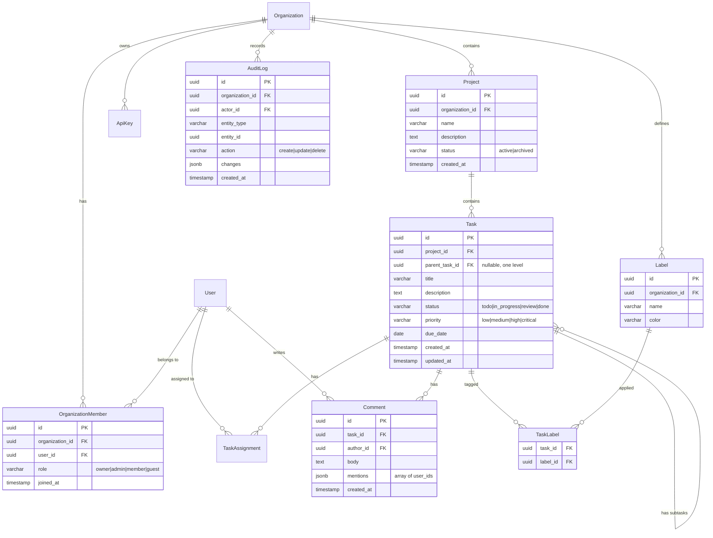

<!--
  CHAPTER: 14
  TITLE: AI-Powered Engineering Workflows
  PART: III — Tooling & Practice
  PREREQS: None
  KEY_TOPICS: AI project planning, ERD design with LLMs, AI code review, AI debugging, Claude Code, Copilot, Cursor, prompt engineering
  DIFFICULTY: Beginner → Intermediate
  UPDATED: 2026-03-24
-->

# Chapter 14: AI-Powered Engineering Workflows

> **Part III — Tooling & Practice** | Prerequisites: None | Difficulty: Beginner to Intermediate

Here's something that took me an embarrassingly long time to internalize: AI isn't going to make you a better engineer by doing your thinking for you. But it *will* let you do more engineering per hour if you know which parts of your job to delegate and which parts to jealously guard. That's the whole game.

This chapter is about using AI as an actual force multiplier — not in the hand-wavy "10x productivity" sense you read on LinkedIn, but in the specific, concrete sense of: here are the tasks where AI is genuinely magical, here are the tasks where AI wastes your time, and here's how to tell the difference. We'll cover project planning, database design, code review, and debugging — all the stuff that makes up your day — with real prompts and real examples of what good output looks like (and what garbage looks like).

(If you want the deep dive into running Claude Code as a full agentic system that operates on your codebase, that's Chapter 17. This chapter is about the fundamentals of AI-assisted engineering that apply regardless of which tool you're using.)

Let me also tell you what this chapter is *not* about: AI hype. You've already read the think-pieces. You know AI is "transforming software development." What you actually need is a calibrated view — a list of the things AI is genuinely great at (planning, boilerplate, test generation, debugging hypotheses), a list of things where it confidently gives you wrong answers (complex business logic, novel architectural patterns, anything that requires understanding your specific system), and the skills to tell the difference in real-time.

By the end of this chapter, you should have a clear mental model of where to reach for AI and where to not. That clarity — more than any specific tool or technique — is what separates engineers who get genuine productivity gains from AI from those who get frustrated and conclude it's overhyped.

### In This Chapter
- AI for Project Planning
- AI for Database & ERD Design
- AI for Code Review & Analysis
- AI for Debugging & Investigation
- AI Tools for Engineers
- Key Takeaways

### Related Chapters
- Chapter 17 — Claude Code mastery
- Chapter 10 — AI-native engineering paradigms
- Chapter 2 — database/ERD design

---

## 1. AI FOR PROJECT PLANNING

Let me tell you the moment I became a believer in AI for planning. A PM dropped a three-paragraph Slack message on me — "can we add multi-tenant billing before end of quarter?" — and instead of staring at a blank page for an hour, I fed it to Claude and had a structured breakdown of phases, tasks, risks, and questions to ask back to the PM in about four minutes.

Was the output perfect? No. It missed our specific Stripe setup and didn't account for the fact that our invoicing tables were a mess. But it got me to a working draft of the project breakdown faster than I could have typed the headers, and it caught two edge cases I hadn't thought of.

That's the pattern. AI as a thinking partner that accelerates the decomposition process, not as an oracle that replaces your judgment.

### 1.1 Using LLMs to Decompose Large Projects

**What it is:** Using large language models as a thinking partner to break down ambiguous requirements into structured, actionable engineering work. This is not about replacing human judgment — it is about accelerating the decomposition process and catching blind spots.

The interesting thing about LLMs for project planning is that they're extraordinarily well-read. They've absorbed thousands of software project post-mortems, engineering blog posts, and architecture discussions. When you ask one to decompose a billing feature, it draws on patterns from every company that has ever written publicly about building billing. That breadth is the value — you get the accumulated wisdom of the industry as a starting template, which you then adapt to your specific situation.

**The core workflow:**

1. Feed the LLM a high-level requirement or PRD
2. Ask it to decompose into epics, tasks, and subtasks
3. Critically review the output for missing edge cases, incorrect assumptions, and ordering errors
4. Iterate with follow-up prompts to refine

Step 3 is where most people fail. They read the output, think "yeah, that looks right," and copy it into Jira. Don't do that. The LLM doesn't know your codebase, your team's velocity, your existing technical debt, or the political constraints on your project. Its output is a starting point, not a finished plan.

**Prompt patterns for project breakdown:**

The single biggest improvement you can make to your planning prompts is to give the model a persona with the right expertise. "You are a helpful assistant" produces generic output. "You are a senior staff engineer who thinks in terms of failure modes" produces output that's actually useful.

```
System prompt:
You are a senior staff engineer with 15 years of experience building production
systems. You think in terms of failure modes, edge cases, and operational
concerns -- not just happy paths.

User prompt:
We need to add multi-tenant billing to our SaaS platform. Current state:
- Single-tenant billing via Stripe
- PostgreSQL database, Next.js frontend, Node.js API
- ~500 active organizations

Decompose this into implementation phases. For each phase, list:
1. Specific engineering tasks (backend, frontend, data migration)
2. Dependencies between tasks
3. Risks and unknowns that need spike/investigation
4. Definition of done for each task
```

The "current state" section is not optional. Without it, the LLM will give you generic advice. With it, you get output calibrated to your actual situation — it'll know to think about migrating existing single-tenant invoices, for instance.

**What good decomposition output looks like:**

The LLM should produce something like:

```
Phase 1: Data Model & Migration (Week 1-2)
├── Task 1.1: Design tenant-aware billing schema
│   ├── Add organization_id FK to invoices, subscriptions, payment_methods
│   ├── Create billing_plans table with per-tenant overrides
│   └── Risk: Existing invoices lack org association -- need backfill strategy
├── Task 1.2: Write migration scripts
│   ├── Forward migration with zero-downtime (add columns nullable first)
│   ├── Backfill script for historical data
│   └── Rollback migration
├── Task 1.3: Spike -- Stripe Connect vs. single-account multi-tenant
│   └── Timebox: 2 days. Decision criteria: ...

Phase 2: API Layer (Week 2-3)
├── Task 2.1: Tenant-scoped billing endpoints
│   ├── GET /api/orgs/:orgId/billing (dashboard data)
│   ...
```

Notice it flagged the Stripe architectural decision as a spike — that's the model recognizing a real decision point that needs investigation before you can commit to an implementation. That's the kind of thing that's easy to miss when you're decomposing quickly.

**Critical review checklist (what the LLM often misses):**

Here's where you earn your engineering salary. After the LLM gives you the breakdown, go through this checklist:

- **Data migration risks:** The LLM will propose schema changes but often underestimates migration complexity on live data. "Add organization_id FK to invoices" sounds simple until you're doing it on a table with 50M rows during business hours.
- **Backward compatibility:** API changes that break existing clients. The LLM thinks about new functionality but often doesn't model what happens to code that's already calling your API.
- **Observability:** Logging, metrics, and alerting for new features. Almost every LLM-generated breakdown omits this. Add it yourself.
- **Security implications:** New authorization boundaries, audit logging. Multi-tenancy means new isolation requirements — the LLM will mention this at a high level but rarely gets specific about WHERE you enforce the boundaries.
- **Rollback strategy:** What happens if Phase 2 fails and you need to revert Phase 1? This is almost never in the AI output. It's almost always the most important question to answer.

### 1.2 Generating User Stories and Acceptance Criteria

This is one of my favorite low-effort, high-value uses of AI. Instead of spending 30 minutes writing user stories from scratch in a sprint planning session, you spend 3 minutes prompting, then 15 minutes fixing and augmenting what comes back. Net savings: 12 minutes per feature, compounded across a whole sprint.

More importantly, the AI usually surfaces edge cases that slip through verbal discussions. When everyone's in a room excited about the happy path, it's easy to forget about "what happens when the invitee doesn't have an account yet?" The LLM doesn't get excited about happy paths.

**Prompt pattern:**

```
Given this feature requirement:
"Users should be able to invite team members to their organization with
role-based permissions (admin, editor, viewer)."

Generate user stories in the format:
As a [role], I want to [action], so that [benefit].

For each story, include:
- Acceptance criteria (Given/When/Then format)
- Edge cases
- Non-functional requirements (performance, security)
```

**Example output you should expect:**

```
Story 1: Invite team member by email
As an organization admin, I want to invite users by email address,
so that I can grow my team.

Acceptance Criteria:
- Given I am an admin, when I enter a valid email and select a role,
  then an invitation email is sent within 30 seconds
- Given the invitee already has an account, when they accept,
  then they are added to the organization with the specified role
- Given the invitee does NOT have an account, when they accept,
  then they are guided through signup and auto-added to the org

Edge Cases:
- Inviting an email that is already a member (show error, don't re-invite)
- Inviting an email that has a pending invitation (option to resend)
- Self-invitation (prevent admin from inviting themselves)
- Rate limiting (max 50 invitations per hour per org)
```

That last edge case — rate limiting — is something a lot of teams don't think about until they get abuse. The AI added it because it's a standard pattern that shows up in any invitation system. That's the breadth-of-reading advantage in action.

**Where the LLM adds genuine value:** Generating the initial set of stories from a paragraph of requirements saves 30-60 minutes of grooming time. It also tends to surface edge cases that teams miss in verbal discussions.

**Where you must add human judgment:** Prioritization, business context, technical feasibility given your specific stack, and political/organizational constraints that the LLM cannot know. Never let an AI decide what to build first. That's a human call.

### 1.3 Iterating on AI-Generated Breakdowns

One thing I want to emphasize before moving on: the first LLM response is never the last one. The real power of AI-assisted planning is the follow-up conversation, not the initial output.

After the LLM gives you a phase breakdown, try these follow-up prompts:

```
The team raised a concern that Phase 1 is too risky to ship before Phase 2.
What would a "strangler fig" migration look like that lets us run old and new
billing in parallel?
```

```
We discovered our Stripe integration uses the legacy Charges API (not PaymentIntents).
How does this change the Phase 1 implementation?
```

```
The PM wants to cut scope for Q1. Which tasks from this plan are truly
essential for a basic multi-tenant billing MVP, and which could defer to Q2?
```

Each of these refines the plan in a direction that requires your specific context. The AI can't know these constraints upfront — but it can rapidly restructure the plan once you tell it. This is the collaborative planning pattern that saves the most time: AI provides the scaffold, you inject the real constraints, AI reorganizes.

A good follow-up pattern after any planning session: ask the LLM to steelman the risks. "What could go wrong with this plan that we haven't accounted for? Think about external dependencies, team skill gaps, and seasonal load spikes." It'll generate concerns you can then dismiss or take seriously, which is faster than generating them yourself from scratch.

### 1.4 AI-Assisted Estimation and Risk Identification

I want to be blunt about this one: AI is not good at predicting how long things will take your specific team. It doesn't know that your database migration process requires a two-week sign-off from the DBA team. It doesn't know that the engineer assigned to the Stripe integration has never touched payments code before. It doesn't know that your WebSocket server has a secret bug that triggers under high load and will eat three days of debugging time.

What it IS good at is identifying which tasks are likely to be complex and explaining *why*. That's actually useful for estimation, because the main failure mode in engineering estimation is being overconfident about the wrong tasks.

**Prompt for complexity estimation:**

```
Here is a list of engineering tasks for our billing migration:

1. Add tenant_id column to invoices table (PostgreSQL, 2M rows)
2. Build Stripe webhook handler for multi-tenant events
3. Create billing dashboard UI (React, 5 views)
4. Implement usage-based metering pipeline
5. Write E2E tests for billing flows

For each task, estimate:
- T-shirt size (S/M/L/XL) with justification
- Key risks that could blow up the estimate
- Dependencies on other tasks or external teams
- Suggest if any task should be split further
```

The LLM will correctly flag task 1 as riskier than it looks (live data migration with zero-downtime constraints), correctly flag task 4 as likely XL if you're building the metering pipeline from scratch, and probably underestimate the E2E testing because it doesn't know how flaky your test environment is.

**Important caveat:** LLM estimates are directional, not precise. They are useful for identifying which tasks are likely complex (and why), not for committing to delivery dates. Always calibrate against your team's historical velocity.

A good follow-up prompt after getting estimates: "For the tasks you rated L or XL, what specific questions would you want answered before you'd be confident in the estimate?" The AI will often produce exactly the right clarifying questions — architectural spike scope, availability of existing APIs, whether the data team has already built the underlying pipeline. These are the questions your team should be answering in grooming, and the AI helps surface them before you commit to a sprint plan you can't deliver.

### 1.5 AI-Assisted Sprint Planning

This is one of those workflows that sounds gimmicky but actually saves meaningful time once you've set it up. The key insight is that sprint planning has a mechanical component (fit the work into the capacity, respect dependencies, balance the team's load) and a judgment component (which work is actually most important right now?). AI handles the mechanical part well. You handle the judgment part.

**Practical workflow:**

1. Export your backlog (from Linear, Jira, etc.) as a structured list
2. Prompt the LLM with team capacity, velocity, and current sprint goals
3. Ask it to suggest a sprint plan with rationale

```
Team capacity: 3 engineers, 2-week sprint, ~30 story points total
Current priorities: Ship billing V2, reduce P1 bug count

Backlog (with estimates):
- BILL-101: Tenant billing schema migration (8 pts)
- BILL-102: Stripe webhook handler (5 pts)
- BILL-103: Billing dashboard UI (8 pts)
- BUG-440: Memory leak in WebSocket handler (3 pts, P1)
- BUG-441: Race condition in checkout flow (5 pts, P1)
- TECH-201: Upgrade Node.js 18 → 20 (3 pts)

Suggest a sprint plan. Explain trade-offs if everything doesn't fit.
```

The LLM will typically produce a reasonable grouping with dependency ordering and surface conflicts ("BILL-103 depends on BILL-101 completing first, so assign them to different engineers or stagger them"). It will also correctly note that the two P1 bugs should be pulled in despite the billing focus.

What it will NOT do: tell you that BILL-101 is actually blocked waiting for legal to approve a new data retention policy. That's on you.

**One more practical pattern: the pre-meeting brief.** Before a technical planning meeting, use AI to generate a structured brief:

```
I have a 60-minute sprint planning meeting in 30 minutes. Here are the tickets
in the backlog and our team's context:

[paste tickets and context]

Generate a 5-bullet brief for each ticket covering: what it is, why it matters,
the biggest technical risk, the most important question to answer in the meeting,
and a first-cut estimate. Format for quick reading.
```

This takes three minutes and means you walk into the meeting with a structured view of everything on the table, rather than reading tickets aloud for 40 minutes.

---

## 2. AI FOR DATABASE & ERD DESIGN

Database design is one of the places where AI genuinely shines, and I think the reason is interesting: schema design is a craft with well-understood principles (normalization, indexing, referential integrity) that the model has absorbed from thousands of examples. When you ask it to design a schema, you're getting the distilled pattern-matching of a very well-read data modeler.

The catch — and there always is one — is that the model doesn't know your scale requirements, your read/write patterns, or the specific quirks of how your application queries data. It'll give you a textbook-correct schema that may or may not work for your production access patterns. That's where you have to provide context and push back.

My workflow: always tell the AI the expected data volume and the three most common read queries before asking it to design or review a schema. "We expect 10M tasks after 2 years, and the three most common queries are: list tasks by project + status, get a single task with its assignees and latest 5 comments, and find all overdue tasks by org." That context changes the schema design significantly — the indexes it recommends, the denormalization decisions, the column ordering. Without it, you get a generic schema. With it, you get one tuned to your actual access patterns.

### 2.1 Generating Entity-Relationship Diagrams from Natural Language

There is something genuinely magical about describing a domain in plain English and getting back a structured, correct ERD in a format your entire team can read. I use this almost every time I'm starting a new feature that involves new entities.

**The workflow:**

1. Describe your domain in plain English
2. Ask the LLM to generate a Mermaid or PlantUML ERD
3. Review for normalization, missing relationships, and index opportunities
4. Iterate

The Mermaid output is particularly useful because it renders inline in GitHub PRs, Notion, and most modern documentation tools. Your PM can actually read and comment on the schema before you write a line of code.

**Example prompt:**

```
Design a database schema for a multi-tenant SaaS project management tool with
these requirements:

- Organizations have members with roles (owner, admin, member, guest)
- Organizations contain projects
- Projects contain tasks with assignees, due dates, priorities, and statuses
- Tasks can have subtasks (one level deep)
- Tasks have comments with mentions (@user)
- Projects have labels (user-defined, per-org)
- Tasks can have multiple labels
- Audit log for all mutations
- Support for API keys per organization

Generate:
1. A Mermaid ERD with all entities, relationships, and key columns
2. Recommended indexes
3. Any denormalization decisions with justification
```

The "generate indexes" and "explain denormalization decisions" parts are important additions to the prompt. Without them, you get the happy-path schema without the performance considerations.

**Expected Mermaid output:**



Look at what the model did well here: it correctly modeled the many-to-many relationship between tasks and labels via the junction table `TaskLabel`, used `jsonb` for the mentions array (good PostgreSQL practice), and included the self-referential `parent_task_id` for subtasks. This is non-trivial stuff that junior engineers get wrong.

What you should verify: The `organization_id` on `Project` but not directly on `Task` — queries that filter tasks by organization will need to JOIN through `Project`. Depending on your query patterns, you might want to denormalize `organization_id` onto `Task` directly. The model should mention this tradeoff in the denormalization section; if it doesn't, ask for it explicitly.

**Iterating on the ERD:** After the initial schema, the follow-up prompts are where the real refinement happens. "We'll need to support task templates that organizations can use to quickly create pre-configured tasks — how does the schema change?" or "Add a notification system where users can configure per-event notification preferences." Each extension forces the schema to evolve in ways that test whether the initial design was flexible enough. If the extension is awkward to add, that's a signal the initial design has a structural problem worth revisiting before you write any migrations.

### 2.2 AI Review of Schema Designs

Once you have a schema — whether AI-generated or human-designed — throwing it at an LLM for review catches a class of issues that humans consistently miss: the mechanical, checklist-style problems like missing indexes on obvious query patterns, absent constraints, and isolation gaps in multi-tenant designs.

This is not a replacement for having an experienced data engineer review your schema. It's the thing you do *before* that review to make sure you're not wasting their time on obvious problems.

**Prompt for schema review:**

```
Review this PostgreSQL schema for a project management SaaS. Check for:

1. Normalization issues (is anything in 1NF/2NF/3NF that shouldn't be?)
2. Missing indexes (based on likely query patterns)
3. N+1 query risks
4. Multi-tenancy isolation gaps (can a user in org A see org B's data?)
5. Scalability concerns (what breaks at 1M orgs? 100M tasks?)
6. Missing constraints (foreign keys, check constraints, unique constraints)

[paste your schema DDL here]
```

The multi-tenancy isolation question is particularly valuable. Describe your authorization model and ask the LLM to find cases where a query could return data across tenant boundaries. It will often find things you haven't considered — for instance, that a label ID lookup without an org_id filter could theoretically return a label from a different organization.

**Common issues the LLM will catch:**

- Missing composite indexes for multi-tenant queries (`WHERE organization_id = ? AND status = ?`). This is the most common performance mistake in multi-tenant systems and the AI catches it reliably.
- Lack of `ON DELETE CASCADE` or `ON DELETE SET NULL` on foreign keys — which becomes a runtime error when you delete an organization and orphaned records cause constraint violations.
- Missing `unique` constraints (e.g., `UNIQUE(organization_id, name)` on labels to prevent duplicates within an org).
- N+1 patterns: "If you query tasks with comments, you'll need an index on `comments.task_id` and should use a JOIN or batch fetch."
- Audit log table growing unbounded without partitioning strategy.

That last one — the audit log partitioning — is a great example of the AI thinking forward. A new audit log table looks fine today. At 100M rows, it becomes a performance problem. The model knows this pattern.

**What a good schema review response looks like:**

Here's a realistic example of the kind of output you should expect — and demand — from a schema review prompt. If your AI gives you less specific output than this, your prompt needs more context:

```
Schema Review — project_management_saas

ISSUE 1 [CRITICAL]: Missing multi-tenant isolation on Task queries
The Task table has project_id but not organization_id. Any query like:
  SELECT * FROM tasks WHERE status = 'TODO'
could accidentally return tasks from all organizations. Even with application-
layer filtering, a single missing WHERE clause leaks cross-tenant data.

Recommendation: Add organization_id to Task and index it. Yes, you can derive it
via Project, but the join is an extra risk surface and performance cost.

ISSUE 2 [WARNING]: AuditLog will need table partitioning
At 500 active orgs generating ~100 audit events/day each, you're looking at
~18M rows/year. PostgreSQL handles this fine at first, but by year 2-3 you'll
want partition by month on created_at to keep query performance manageable.
Add this to your infrastructure roadmap now; it's painful to add retroactively.

ISSUE 3 [WARNING]: Label uniqueness constraint
No UNIQUE constraint on (organization_id, name) in the Label table. Users can
create duplicate labels within an org. Decide: is this intentional? If not, add:
  ALTER TABLE labels ADD CONSTRAINT labels_org_name_unique UNIQUE(organization_id, name);

ISSUE 4 [INFO]: Comment mentions as JSONB
Storing mentions as JSONB (array of user_ids) works but makes it hard to query
"all tasks where user X is mentioned." If mention-based notifications or feeds
are in the roadmap, consider a separate CommentMention junction table.

ISSUE 5 [INFO]: TaskAssignment table not shown
The ERD shows Task ||--o{ TaskAssignment but the TaskAssignment table definition
is missing from the schema review. Cannot verify its constraints.
```

That output gives you actionable findings with severity levels, specific recommendations, and the reasoning behind each. That's what you should expect. If you get vague feedback ("consider adding indexes"), push back with: "Be specific about which indexes and which queries they support."

### 2.3 Generating ORM Models from Descriptions

This is pure time savings. Once your schema is agreed upon, generating the ORM models by hand is a mechanical, error-prone process. The LLM does it correctly, completely, and in seconds.

**Prisma example:**

```
Given the ERD above, generate Prisma schema models with:
- Appropriate field types and constraints
- Relations with onDelete behavior
- Indexes (@@index) for common query patterns
- Enums for status/role/priority fields
```

**Expected output:**

```prisma
generator client {
  provider = "prisma-client-js"
}

datasource db {
  provider = "postgresql"
  url      = env("DATABASE_URL")
}

enum OrgRole {
  OWNER
  ADMIN
  MEMBER
  GUEST
}

enum TaskStatus {
  TODO
  IN_PROGRESS
  REVIEW
  DONE
}

enum TaskPriority {
  LOW
  MEDIUM
  HIGH
  CRITICAL
}

model Organization {
  id        String   @id @default(uuid())
  name      String
  slug      String   @unique
  createdAt DateTime @default(now()) @map("created_at")

  members  OrganizationMember[]
  projects Project[]
  labels   Label[]
  apiKeys  ApiKey[]
  auditLog AuditLog[]

  @@map("organizations")
}

model OrganizationMember {
  id             String       @id @default(uuid())
  organizationId String       @map("organization_id")
  userId         String       @map("user_id")
  role           OrgRole      @default(MEMBER)
  joinedAt       DateTime     @default(now()) @map("joined_at")

  organization Organization @relation(fields: [organizationId], references: [id], onDelete: Cascade)
  user         User         @relation(fields: [userId], references: [id], onDelete: Cascade)

  @@unique([organizationId, userId])
  @@index([organizationId])
  @@index([userId])
  @@map("organization_members")
}

model Task {
  id           String       @id @default(uuid())
  projectId    String       @map("project_id")
  parentTaskId String?      @map("parent_task_id")
  title        String
  description  String?
  status       TaskStatus   @default(TODO)
  priority     TaskPriority @default(MEDIUM)
  dueDate      DateTime?    @map("due_date")
  createdAt    DateTime     @default(now()) @map("created_at")
  updatedAt    DateTime     @updatedAt @map("updated_at")

  project    Project          @relation(fields: [projectId], references: [id], onDelete: Cascade)
  parentTask Task?            @relation("Subtasks", fields: [parentTaskId], references: [id], onDelete: Cascade)
  subtasks   Task[]           @relation("Subtasks")
  assignees  TaskAssignment[]
  comments   Comment[]
  labels     TaskLabel[]

  @@index([projectId, status])
  @@index([projectId, priority])
  @@index([parentTaskId])
  @@index([dueDate])
  @@map("tasks")
}
```

Notice the composite indexes on `[projectId, status]` and `[projectId, priority]` — these are the indexes your application will almost certainly need, and Prisma won't generate them automatically. The LLM added them because they're obvious from the query patterns implied by the schema. This is the kind of thing you would catch in code review, but better to have it from the start.

### 2.4 Generating Migration Scripts

Schema evolution is where things get genuinely tricky, and AI helps in a specific, valuable way: it makes the obvious migration steps less work, so you can focus your brain on the non-obvious ones.

**Prompt pattern:**

```
I need to add a "time tracking" feature to the task management schema above.
Requirements:
- Users can log time entries against tasks
- Each entry has: duration (minutes), description, date
- Organizations can set hourly rates per member for billing

Generate:
1. The new Prisma models
2. A SQL migration script (PostgreSQL)
3. Consider the migration on a live database with existing data
```

The LLM will generate the migration with appropriate `CREATE TABLE` statements, foreign keys, and if needed, backfill scripts. The key value is the third instruction — "consider live data." Without it, you get a naively correct migration. With it, you get a migration that thinks about production constraints.

Always review for:

- Whether the migration can run without locking tables. The most common mistake: `ALTER TABLE tasks ADD COLUMN estimated_hours FLOAT NOT NULL DEFAULT 0`. On a large table, `NOT NULL` with a `DEFAULT` in PostgreSQL requires a full table rewrite in older versions (pre-11). The correct approach is to add the column nullable, backfill, then add the constraint. The LLM knows this; make sure you ask about it.
- Whether it needs to be split into multiple deployments: add column nullable → backfill → add constraint. A single deployment that does all three is a deployment that will lock your table for minutes on production.

---

## 3. AI FOR CODE REVIEW & ANALYSIS

Code review is the place where AI assistance has the clearest ROI, and also the place where over-reliance creates the most danger. Let me be very direct about both sides.

The clear ROI: AI catches a class of mechanical bugs — race conditions, missing null checks, off-by-one errors, security issues — faster and more consistently than human reviewers. Humans get tired. They've reviewed fifteen PRs this week and their attention wanders. The LLM is just as sharp on PR number 200 as PR number 1.

The danger: AI code review has no stake in the outcome. It will tell you confidently that code looks fine when it's subtly wrong in ways that require business domain knowledge to catch. It will miss authorization bugs that depend on understanding your specific permission model. It will not catch the case where you're using the wrong abstraction for your team's codebase conventions. Human review remains essential.

The right model: use AI review to catch the mechanical issues so your human reviewers can focus on the architectural and business logic questions.

**Integrating AI review into your workflow:**

The most practical integration point is before you open the PR, not after. Run the AI review on your diff, fix the issues it catches, then open the PR for human review. The human reviewers see cleaner code and can focus on higher-level concerns. The round-trip time decreases. The number of review comments decreases.

You can also use AI review in the other direction: as a PR author, before you submit, ask the AI to review as if it were your most rigorous teammate. Fix the easy issues yourself. This practice alone — using AI to self-review before requesting human review — consistently improves the quality of code that hits review queues.

### 3.1 Using AI to Review Pull Requests

**What works well:**

- **Bug detection in logic:** Paste a diff and ask "identify any logic bugs, off-by-one errors, or race conditions." The AI is genuinely good at this.
- **Security review:** "Review this code for OWASP Top 10 vulnerabilities, injection risks, and authentication bypasses." Great for catching SQL injection, SSRF, and similar patterns.
- **Performance review:** "Identify N+1 queries, unnecessary re-renders, missing indexes, or O(n²) algorithms." The AI knows the common performance anti-patterns cold.

**Practical prompt for PR review:**

The structure of this prompt matters a lot. Generic prompts get generic output. This one produces actionable, prioritized review comments:

```
Review this pull request diff. Act as a senior engineer performing a thorough
code review. For each issue found, provide:

1. Severity: critical / warning / nit
2. The specific line(s) affected
3. What the problem is
4. A suggested fix

Focus on:
- Correctness (logic errors, edge cases, error handling)
- Security (injection, auth bypass, data exposure)
- Performance (query patterns, algorithmic complexity)
- Maintainability (naming, abstraction level, test coverage)

Do NOT comment on style/formatting (our linter handles that).

[paste diff here]
```

The "do NOT comment on style/formatting" instruction is important. Without it, you'll get a wall of nitpicks about semicolons and spacing that obscure the actual bugs. Tell it what you already have automated.

**Example: the LLM catching a real bug:**

This is a real category of mistake — I've seen it in production code at multiple companies. Here's the function:

```typescript
async function transferFunds(fromId: string, toId: string, amount: number) {
  const from = await db.account.findUnique({ where: { id: fromId } });
  const to = await db.account.findUnique({ where: { id: toId } });

  if (from.balance < amount) {
    throw new Error("Insufficient funds");
  }

  await db.account.update({
    where: { id: fromId },
    data: { balance: from.balance - amount },
  });

  await db.account.update({
    where: { id: toId },
    data: { balance: to.balance + amount },
  });
}
```

A good LLM review will flag this immediately:

```
CRITICAL: Race condition in transferFunds

The balance check and updates are not atomic. Two concurrent transfers
from the same account can both pass the balance check before either
update executes, resulting in a negative balance.

Fix: Use a database transaction with row-level locking:

  await db.$transaction(async (tx) => {
    const from = await tx.account.findUnique({
      where: { id: fromId },
      // FOR UPDATE lock in raw SQL, or use Prisma's
      // interactive transaction with serializable isolation
    });
    // ... rest inside transaction
  });

Also: No null check on `from` or `to` -- will throw unclear error
if account not found.
```

Two critical bugs caught in one pass. The race condition is the kind of thing that passes human review because it looks fine when you read it linearly — you have to actively model concurrent execution to catch it. The null check is the kind of thing that gets missed when reviewers are tired. The LLM catches both every time.

**A second example: the security review:**

Here's a route handler that looks fine on first read:

```typescript
export async function GET(request: Request) {
  const { searchParams } = new URL(request.url);
  const userId = searchParams.get("userId");

  const userData = await db.$queryRaw`
    SELECT * FROM users WHERE id = ${userId}
  `;

  return Response.json(userData);
}
```

A good LLM security review will flag multiple issues:

```
CRITICAL: Insecure Direct Object Reference (IDOR)

There is no authentication or authorization check. Any request can pass
any userId and retrieve that user's data. This is a complete authorization bypass.

Fix: Verify the requesting user's session and ensure they are authorized to
access the requested userId:

  const session = await getServerSession(authOptions);
  if (!session || session.user.id !== userId) {
    return new Response("Forbidden", { status: 403 });
  }

WARNING: Missing input validation

userId is used directly in a query without validation. While Prisma's
queryRaw uses parameterized queries (so SQL injection is prevented here),
there is no validation that userId is a valid UUID. A malformed userId
could cause an unexpected database error that leaks schema information.

Fix: Validate with Zod before querying:
  const { userId } = z.object({ userId: z.string().uuid() }).parse(
    Object.fromEntries(searchParams)
  );

WARNING: Response exposes full user object

SELECT * returns all columns including password hashes, internal flags,
and other sensitive fields. Explicitly select only the fields needed.
```

Three distinct security issues, each with a fix. This is the kind of review that catches the bugs your human reviewers miss when they're reviewing their fifth PR of the day.

### 3.2 Generating Tests from Implementation Code

Test generation is where I see the clearest time savings in daily engineering work. The LLM is excellent at generating the obvious tests and — more importantly — at generating the edge case tests that engineers regularly skip.

The typical pattern: write the implementation, ask the LLM to generate tests, add 2-3 domain-specific edge cases yourself, run the test suite. You end up with better coverage than you would have written by hand in the same time, and you spent that time thinking about which edge cases the LLM missed rather than typing boilerplate.

**Prompt pattern:**

```
Generate comprehensive unit tests for this function. Use Jest/Vitest.
Cover:
- Happy path
- Edge cases (empty input, null, boundary values)
- Error cases (what should throw/reject)
- If async, test both resolved and rejected paths

[paste function]
```

**Example: generating tests for a pagination utility:**

Given:

```typescript
function paginate<T>(items: T[], page: number, pageSize: number): {
  data: T[];
  total: number;
  page: number;
  totalPages: number;
} {
  const total = items.length;
  const totalPages = Math.ceil(total / pageSize);
  const start = (page - 1) * pageSize;
  const data = items.slice(start, start + pageSize);
  return { data, total, page, totalPages };
}
```

The LLM should generate:

```typescript
describe("paginate", () => {
  const items = [1, 2, 3, 4, 5, 6, 7, 8, 9, 10];

  it("returns correct first page", () => {
    const result = paginate(items, 1, 3);
    expect(result).toEqual({
      data: [1, 2, 3],
      total: 10,
      page: 1,
      totalPages: 4,
    });
  });

  it("returns correct last page with partial results", () => {
    const result = paginate(items, 4, 3);
    expect(result).toEqual({
      data: [10],
      total: 10,
      page: 4,
      totalPages: 4,
    });
  });

  it("returns empty data for page beyond range", () => {
    const result = paginate(items, 5, 3);
    expect(result.data).toEqual([]);
  });

  it("handles empty array", () => {
    const result = paginate([], 1, 10);
    expect(result).toEqual({
      data: [],
      total: 0,
      page: 1,
      totalPages: 0,
    });
  });

  it("handles page size larger than array", () => {
    const result = paginate(items, 1, 100);
    expect(result.data).toEqual(items);
    expect(result.totalPages).toBe(1);
  });

  it("handles page size of 1", () => {
    const result = paginate(items, 5, 1);
    expect(result.data).toEqual([5]);
    expect(result.totalPages).toBe(10);
  });

  // Edge case the LLM should flag: what about page 0 or negative?
  it("handles page 0 (potential bug)", () => {
    // Current implementation: page 0 gives slice(-3, 0) = []
    // This is likely a bug -- should either throw or default to page 1
    const result = paginate(items, 0, 3);
    expect(result.data).toEqual([]); // documents current behavior
  });
});
```

See that last test? The LLM noticed that `page 0` produces `slice(-3, 0)` which returns an empty array — technically "passing" but almost certainly a bug. This is exactly the kind of thing that slips through because engineers write tests for their intention, not for the full input space. The LLM has no assumption about intent — it just explores the input space.

**Key value:** The LLM often generates edge-case tests that engineers skip (page 0, negative values, empty input). These tests frequently reveal actual bugs in the implementation.

### 3.3 AI-Assisted Refactoring

Refactoring has a mechanical component (identify the pattern, apply the transformation) and a judgment component (is this the right abstraction? does it make the code easier to understand in this specific codebase?). AI is excellent at the mechanical component.

**Prompt for identifying code smells:**

```
Analyze this module for code smells and refactoring opportunities.
Categorize findings as:

1. Extract Method: duplicated logic that should be a shared function
2. Simplify Conditional: nested if/else that could be a guard clause or strategy pattern
3. Remove Dead Code: unreachable paths, unused variables
4. Improve Naming: vague names that obscure intent
5. Reduce Coupling: tight dependencies that could be inverted

For each finding, show the current code and the refactored version.

[paste module]
```

The "show current and refactored" instruction is critical. Without it, you get a list of findings you have to implement yourself. With it, you get concrete, reviewable diffs you can apply or reject.

One word of caution: the AI will sometimes propose refactoring that is technically correct but wrong for your codebase. It might extract a helper function in a way that doesn't match your team's conventions, or simplify a conditional in a way that makes it harder to add future cases. The refactored code needs the same review you'd give any other code change.

A refinement that helps: include one or two examples of how your team typically handles the pattern being refactored. "Here's how we typically write utility functions in this codebase: [example]. Now refactor this code to follow the same pattern." The AI will match the style it's shown much better than it matches a style it's inferring from a description.

### 3.4 Generating Documentation from Code

Documentation generation is the use case where AI saves the most pure mechanical time. Writing documentation is a chore. Having the AI write the first draft, which you then verify for accuracy, is dramatically faster.

**Prompt pattern:**

```
Generate API documentation for this Express/Fastify/Next.js route handler.
Include:
- Endpoint (method, path)
- Request body/query params with types
- Response schema (success and error cases)
- Authentication requirements
- Example curl command
- Rate limiting (if applicable)

[paste route handler]
```

The output needs verification — the LLM will occasionally invent a response field or get an error code wrong — but it's faster to verify and correct than to write from scratch. And unlike other LLM outputs, documentation inaccuracies are caught quickly when developers try to use the API.

**Generating commit messages and PR descriptions:**

This is a tiny use case but adds up. Paste a diff and ask:

```
Write a commit message for this diff. Format: imperative mood, 50 char subject,
body explaining WHY (not what — the diff shows the what). Note any breaking
changes or migration steps required.
```

The AI is reliable here because the input (the diff) is complete and the output format is well-defined. Where humans write vague commit messages ("fix bug", "update code"), AI with context writes specific ones ("Fix race condition in transferFunds by wrapping in db transaction"). Your future-self reading git blame will thank you.

### 3.5 Limitations and Risks

This section is the most important one in this chapter, because overconfidence in AI code review is how you ship bugs you didn't know you had.

**Hallucinations in code suggestions:** LLMs will confidently suggest API calls that do not exist, use deprecated methods, or invent library features. I have personally received suggestions for Prisma methods that don't exist, React hooks with fabricated signatures, and AWS SDK calls with made-up parameter names. The model's confidence level correlates poorly with its correctness. Always verify suggestions against official documentation.

**Specific patterns to watch for:**

- Suggesting `prisma.account.lock()` (does not exist — Prisma doesn't have table locks via ORM methods)
- Using outdated React patterns (`componentDidMount` when you use hooks, or suggesting class components in a hooks codebase)
- Importing from non-existent package paths (common with rapidly-evolving libraries where the model's training data is stale)
- Generating SQL that works on MySQL but not PostgreSQL (or vice versa) — particularly with date handling, upserts, and JSON operators

**Security of sending code to AI providers:**

This is a real concern that teams often dismiss and then regret:

- Never paste credentials, API keys, or secrets into prompts. This seems obvious, but production `.env` files have been pasted into chat UIs.
- Review your organization's policy on sending proprietary code to third-party LLMs. Many enterprise agreements prohibit this.
- Consider self-hosted models (Ollama + Code Llama, Llama 3) for sensitive codebases. The quality is lower, but the data stays on-prem.
- Use `.gitignore`-aware tools that automatically exclude secrets files.

**The fundamental rule:** AI code review supplements human review. It does not replace it. Use AI to catch the mechanical issues (off-by-one errors, null checks, missing awaits) so human reviewers can focus on architecture, design, and business logic correctness. If you start treating AI review as a substitute for human review, you will ship bugs — eventually, consequential ones.

---

## 4. AI FOR DEBUGGING & INVESTIGATION

Debugging is where the AI assistance goes from "useful" to "occasionally mind-blowing." The reason is that debugging is often a search problem — you're searching through a large space of possible explanations for observed behavior — and LLMs are extraordinarily good at quickly generating plausible hypotheses.

The experience is like having a colleague who has seen every possible bug pattern across thousands of codebases sitting next to you saying, "oh, that error message combined with that intermittent behavior — that's almost certainly a cache invalidation race condition." Not always right, but right enough often enough to save you hours.

The key move is to provide the AI with *all* your context upfront. Engineers who get mediocre debugging help from AI give it the error message. Engineers who get great debugging help give it the error message, the code around the failure point, the system context, what recently changed, and what they've already ruled out. The more context, the more specific and useful the hypothesis.

Think of it as briefing a very smart consultant who knows nothing about your specific system. You wouldn't hand them a one-line error message and expect a useful answer. Brief them properly and you get something genuinely useful back.

### 4.1 Root Cause Analysis from Error Logs

Stack traces are where AI debugging assistance is most immediately useful. You paste in the error, provide context about when it occurs, and ask for analysis. The quality of the analysis depends heavily on the quality of the context you provide.

**Prompt pattern for stack traces:**

The key additions to this prompt — compared to just pasting the error — are the context items at the bottom. "Intermittent, 5% of requests, started after this deploy" is the context that tells the AI what *kind* of bug to look for.

```
I'm getting this error in production. Analyze the stack trace and:
1. Identify the root cause (not just the symptom)
2. Explain why this is happening
3. Suggest a fix
4. Suggest what to add to prevent this class of error in the future

Error:
TypeError: Cannot read properties of undefined (reading 'id')
    at getOrganization (/app/src/services/org.ts:42:18)
    at async handler (/app/src/api/orgs/[orgId]/route.ts:15:20)
    at async /app/node_modules/next/dist/server/...

Context:
- This happens intermittently, ~5% of requests
- Started after deploying commit abc123 which added caching
```

**What the LLM typically identifies:**

```
Root cause: Race condition with cache invalidation.

The getOrganization function likely has a code path like:

  const cached = await cache.get(`org:${orgId}`);
  if (cached) return cached;
  const org = await db.organization.findUnique({ where: { id: orgId } });
  await cache.set(`org:${orgId}`, org);
  return org;

The bug: db.findUnique returns `null` when not found, and `null` gets
cached. Subsequent reads hit the cache, get `null`, and `.id` throws.

This matches the 5% intermittent pattern -- it happens when:
1. An org is deleted or the ID is invalid
2. The null result gets cached
3. All subsequent requests for that key fail until cache expires

Fix: Add a null check before caching, and return 404 for missing orgs.
Prevention: Add a type guard or schema validation at the API boundary.
```

That is an extremely good diagnosis. It correctly identified the null caching pattern, explained why it's intermittent (cache TTL), and proposed both a fix and a prevention. A senior engineer looking at this would probably reach the same conclusion — but they might take 20 minutes to get there. The LLM gets there in 10 seconds.

Now, is it always right? No. But it's right frequently enough that it's almost always worth asking before you go spelunking through code manually.

### 4.2 Debugging Performance Problems

Performance bugs are a different class of problem from correctness bugs — they require both understanding what the code is doing and reasoning about the system's behavior under load. AI helps in specific ways here.

**The "explain this query plan" pattern:**

PostgreSQL's `EXPLAIN ANALYZE` output is notoriously hard to read. You can paste it directly into an LLM and get a human-readable explanation:

```
Explain this PostgreSQL query plan and identify the performance bottleneck:

QUERY PLAN
Gather  (cost=1000.00..987654.32 rows=100 width=120) (actual time=4521.234..4521.567 rows=0 loops=1)
  Workers Planned: 2
  Workers Launched: 2
  ->  Parallel Seq Scan on events  (cost=0.00..986654.32 rows=42 width=120)
      (actual time=4519.876..4519.876 rows=0 loops=3)
        Filter: ((org_id = 'abc-123') AND (created_at > '2026-01-01'))
        Rows Removed by Filter: 12847213

Planning Time: 0.432 ms
Execution Time: 4521.812 ms
```

The LLM will immediately identify: sequential scan on a 12M row table, filtering on `org_id` and `created_at` with no composite index. It'll suggest `CREATE INDEX CONCURRENTLY events_org_id_created_at_idx ON events(org_id, created_at DESC)` and explain why the column order matters.

**The "identify the N+1" pattern:**

Paste a code block and ask specifically about query patterns:

```
This endpoint is slow (p95 > 2s). Identify any N+1 query patterns
and suggest how to fix them with Prisma's include/select or raw SQL.

[paste route handler with DB calls]
```

The AI is particularly good at spotting nested loops that each trigger database queries — the classic N+1 — because it's a well-documented anti-pattern it has seen in thousands of blog posts and StackOverflow answers.

### 4.3 Explaining Unfamiliar Codebases

Joining a new team and onboarding to an unfamiliar codebase is one of the most cognitively demanding transitions in software engineering. You're trying to build a mental model of a system someone else built, from artifacts (code, docs, commit history) rather than direct explanation.

AI is genuinely transformative here. Instead of spending a week reading code to understand the architecture, you can paste key files and ask for explanations, ask targeted questions about specific modules, and build a working mental model in a day or two.

**Prompt pattern:**

```
I've joined a new team and need to understand this codebase quickly.
Here is the project structure and a few key files.

Explain:
1. The overall architecture and data flow
2. Key abstractions and their responsibilities
3. How a request flows from entry point to database and back
4. Any patterns or conventions the codebase follows
5. Potential gotchas or non-obvious behaviors

[paste tree output and key files]
```

This is one of the highest-value uses of AI for engineers. Instead of spending days reading code, you can get a reasonable architectural overview in minutes. The key is to follow up with targeted questions: "Explain what `middleware/auth.ts` does and how it connects to `lib/session.ts`." Each targeted question builds another piece of the mental model.

What the LLM cannot tell you: the *history* of why things are the way they are. It can't tell you that the weird abstraction in `lib/legacy-adapter.ts` exists because of a failed migration three years ago. That's in the commit history and in people's heads. But it can help you identify *that* something is non-obvious, which is the first step toward asking the right person the right question.

One practical technique: use `git log --oneline --follow <file>` to get the history of a suspicious file, then paste that history plus the current file content and ask the AI to infer what problems the code evolved to solve. It won't always get it right, but it often generates useful hypotheses that you can then verify with the original author.

### 4.4 Generating Runbooks from Incident Data

Post-incident work is chronically under-resourced, and the AI can help dramatically. After an incident, the relevant knowledge — timeline, root cause, resolution steps — lives in Slack threads, people's memory, and hastily-written incident reports. Turning that into actionable runbooks is important work that rarely happens because everyone is busy moving on to the next thing.

AI makes this tractable because it's good at transforming messy incident narratives into structured, searchable documentation.

**Prompt pattern:**

```
We had a production incident. Here is the timeline:

10:32 - Alert: API latency p99 > 5s
10:35 - Checked dashboards: DB connection pool at 100%
10:38 - Identified query: SELECT * FROM events WHERE org_id = ? (missing index)
10:40 - Added index, connection pool recovered
10:45 - Latency normalized

Generate a runbook for "High API Latency" incidents that includes:
1. Triage steps (what to check first)
2. Common root causes with resolution steps
3. Escalation criteria
4. Post-incident checklist
```

The resulting runbook won't be perfect — it'll need review from the engineers who were in the incident — but it's dramatically better than no runbook. And "AI-generated runbook that needs review" is a much easier artifact to work with than "the knowledge lives in Priya's head."

### 4.5 AI-Assisted Log Analysis

Log analysis at scale is a place where AI is useful but also where its limitations become most apparent. The value proposition: you have a window of suspicious log entries, you paste them in, and the AI identifies patterns you might miss. The limitation: context windows aren't infinite, and for real-scale log analysis, you need purpose-built tools.

**Practical approach:**

For structured logs (JSON), export a sample and prompt:

```
Here are 50 log entries from our API server during a period of elevated errors.
Identify:
1. Patterns in the errors (common endpoints, user agents, error types)
2. Temporal patterns (do errors cluster at specific times?)
3. Correlation with any specific request parameters
4. The most likely root cause

[paste log entries]
```

The AI is particularly good at spotting temporal patterns ("all errors occur within 2 seconds of each other — this looks like a timeout cascade, not independent failures") and parameter correlations ("all affected requests have `org_id` starting with 'f' — this might be a sharding issue") that humans miss when reading linearly.

Another strong use case: error message clustering. When you have hundreds of different error strings, paste them all and ask: "Cluster these error messages by likely root cause. What are the 3-4 distinct failure categories here?" Instead of looking at 200 individual errors, you get 4 buckets to investigate. That's genuinely useful triage.

**Limitations:** LLMs have context window limits. For large-scale log analysis (millions of entries), use purpose-built tools (Datadog, Grafana Loki, CloudWatch Insights) and only use AI to interpret the summarized and filtered results. The right pattern is: tool handles the scale, AI handles the pattern recognition on the filtered output.

---

### 4.6 AI for Architecture Decisions: Useful Framing, Not Answers

Here's where I'll disagree with the way most people use AI for architecture. I see engineers asking questions like "should we use microservices or a monolith?" and accepting the AI's answer. That's a mistake — not because the answer will be wrong, but because the question is too general for a meaningful answer.

The useful AI contribution to architectural decisions isn't giving you the answer. It's helping you articulate the tradeoffs, stress-test your reasoning, and identify the second-order consequences you haven't thought of.

**The tradeoff articulation pattern:**

Instead of "which should I choose?", ask the AI to lay out the tradeoffs for a specific decision in your specific context:

```
We're deciding between two approaches for handling Stripe webhooks in our
Next.js application:

Option A: Dedicated webhook worker process (separate from the main app)
Option B: Next.js API route that processes synchronously

Our constraints:
- Team of 3 engineers, limited ops capacity
- ~100 webhook events per minute at peak
- Events include: payment succeeded, subscription cancelled, invoice failed
- We use Vercel for hosting (serverless)

List the tradeoffs for each option in our specific context. Don't make the
decision for me -- help me understand what I'm trading off.
```

The response will be genuinely useful: it'll note that Vercel's serverless functions have a max execution time that matters for long webhook processing, that a separate worker requires operational overhead that a 3-person team might not want, and that 100 events/minute is comfortably in the range where a serverless handler works fine. It won't tell you which to choose — that depends on context the model doesn't have — but it'll give you a much better frame for making the decision yourself.

**The devil's advocate pattern:**

Once you've made an architectural decision, use the AI to challenge it:

```
We've decided to use a single PostgreSQL database for all tenants (no
per-tenant database isolation). Argue against this decision. What are the
failure modes we should think about, and what mitigations exist for each?
```

A good response will raise: noisy neighbor problems at scale, accidental cross-tenant data exposure through missing WHERE clauses, regulatory requirements that might mandate isolation (HIPAA, SOC2, GDPR), and migration complexity if you need to move to per-tenant isolation later. These are concerns you should think about regardless of whether they change your decision.

The key insight: use AI to find the holes in your thinking, not to do the thinking for you.

---

## 5. AI TOOLS FOR ENGINEERS

The AI tools landscape is moving fast — embarrassingly fast. Tools that were best-in-class six months ago have been superseded. I'll describe the current landscape as of early 2026, but the more durable skill is knowing *how* to evaluate and adopt new tools, not just which tools to use right now.

### 5.1 The Current Landscape

| Tool | Type | Best For | Limitations |
|------|------|----------|-------------|
| **Claude Code** | CLI agent | Multi-file refactoring, codebase exploration, complex tasks | Requires clear context about project structure |
| **GitHub Copilot** | Inline autocomplete + chat | Line-by-line code completion, boilerplate | Suggestions lack broader context, can suggest insecure patterns |
| **Cursor** | AI-native IDE | Full-file editing, codebase-aware chat | Learning curve, can be slow on large repos |
| **Windsurf** | AI-native IDE | Flow-based coding, multi-file edits | Newer, smaller ecosystem |
| **Cody (Sourcegraph)** | IDE extension + chat | Large codebase navigation, cross-repo search | Requires Sourcegraph instance for full power |

A few observations on this landscape:

**Claude Code** is where I spend most of my AI-assisted engineering time for complex tasks. The reason is that it operates at the level of "do this task in my codebase" rather than "complete this line" — it can read multiple files, understand dependencies, make coordinated changes across files. For the full guide to Claude Code as an agentic system, see Chapter 17. For the purpose of this chapter, think of it as the tool you reach for when the task is too complex to describe in a single prompt.

**GitHub Copilot** is still valuable for inline completion and quick boilerplate, but its context awareness has limitations — it doesn't understand your codebase's conventions, and it will happily suggest patterns that conflict with how your team writes code. Use it as a fast typist, not as a code reviewer.

**Cursor** has won a lot of converts with its codebase-aware chat and multi-file editing. Its advantage over vanilla LLM chat is that it can index your codebase and retrieve relevant context automatically. The limitation is that "relevant context" determination isn't perfect — for complex cross-cutting changes, you may still need to manually specify which files are relevant.

**The underlying model matters more than the tool.** One thing the landscape comparison obscures: a lot of these tools are just wrappers around the same underlying models (Claude 3.5 Sonnet, GPT-4o, etc.). The interface and workflow matter, but the model quality is the primary driver of output quality. When a new model release significantly improves coding performance, all the tools that use it get better simultaneously. Keep track of the underlying model each tool is using, not just the tool itself.

**Choosing your primary tool:** For most engineers, the practical advice is: use inline autocomplete (Copilot or Cursor) for flow-state coding, use a CLI agent (Claude Code) for complex multi-file tasks and refactoring, and use raw chat (Claude.ai, ChatGPT) for planning, debugging hypotheses, and research. These tools are complementary, not competing.

### 5.2 When AI Accelerates You vs. When It Slows You Down

This is the most practical question you can ask about any AI tool, and the honest answer is: it depends on the task, and you need to develop an intuition for which tasks fall in which category.

Here's my heuristic: AI is good at tasks where "correct" is well-defined and checkable. Generating a Prisma model from a schema — either it matches the schema or it doesn't. Writing a test for a pure function — either the test passes or it doesn't. Writing boilerplate — either it compiles or it doesn't. For these tasks, AI is almost always faster than doing it by hand.

AI is bad at tasks where "correct" requires contextual judgment. Designing the right abstraction for your codebase — depends on your team's conventions and future plans. Deciding which feature to build next — depends on your business strategy. Writing a SQL query for a complex business question — depends on data you haven't shown it and semantics it doesn't understand.

**AI accelerates you when:**

- Writing boilerplate (CRUD endpoints, form components, test scaffolding)
- Translating between formats (SQL to ORM, JSON to TypeScript types, OpenAPI to client code)
- Exploring unfamiliar libraries ("show me how to use X library to do Y")
- Generating initial drafts of documentation, comments, commit messages
- Repetitive refactoring (rename across files, update import paths, migrate API patterns)
- Explaining code you did not write

**AI slows you down when:**

- You accept suggestions without reading them — this accumulates subtle bugs at a rate proportional to how much you trust the AI without verification
- The task requires deep domain knowledge the LLM lacks (your specific business rules, your organization's data semantics)
- You spend more time debugging AI-generated code than writing it yourself would have taken — this is more common than people admit for complex logic
- You use AI as a crutch for concepts you need to actually learn — the AI will write the React hook for you, but if you don't understand how hooks work, the next bug will take you ten times as long to diagnose
- The problem is inherently ambiguous and requires human judgment calls that the AI will make confidently but wrongly

### 5.3 The "70% Problem"

Here's the thing about AI-generated code that nobody talks about enough: it's reliably good for the first 70% of any given task. The patterns are right, the structure is reasonable, the obvious cases are handled. But the last 30% — the part that handles your specific edge cases, integrates cleanly with your existing system, handles error states gracefully under production load, and actually works in your environment — that part almost always needs significant human work.

The percentage varies by task. For "generate a Prisma model from this schema," it's closer to 95% — the model is very reliable for well-defined translation tasks. For "implement a distributed rate limiter that integrates with our existing Redis setup and handles our specific token bucket algorithm," it's closer to 50% — too many system-specific unknowns. Learning to estimate this percentage for a given task before you start is a real skill, and it's what prevents you from spending more time fixing AI output than you would have spent writing it yourself.

**What this means in practice:**

The danger zone is the junior engineer who cannot evaluate the 70% output. They get code that looks right, passes the basic test, and ships. Three weeks later, there's a production incident because the AI-generated payment processing code didn't handle the race condition in the specific way their payment processor's API requires. The code was plausible. It wasn't correct.

The senior engineer, by contrast, looks at the 70% and immediately knows which parts need review. They use the AI output as a scaffold, verify the parts they know are risky, and finish in a fraction of the time. The AI raised their floor without lowering their ceiling.

The team-level implication: AI tools increase output velocity across the board, but they do NOT close the gap between junior and senior engineers on complex problems. If anything, they widen it — because the senior engineer uses AI to move faster on the 70% and still brings judgment to the 30%, while the junior engineer uses AI to produce more code but still can't evaluate whether the 30% is correct. Invest in the judgment, not just the tools.

**Practical implications:**

- AI raises the floor (everyone produces code faster) but does not raise the ceiling (hard problems still require deep expertise)
- The skill that matters most is **evaluation** — can you quickly determine if AI output is correct, almost correct, or dangerously wrong? This skill only comes from actually understanding the domain deeply
- Use AI-generated code as a first draft, never as the final product without review
- The more specific and constrained your prompt, the higher the percentage of usable output — vague prompts produce code that's wrong in vague ways

### 5.4 Developing AI-Native Workflows

This section is where the real productivity gains come from. The engineers who get the most out of AI aren't the ones who use the most AI tools — they're the ones who have redesigned their workflow around AI's strengths and limitations.

**Prompting as a core engineering skill:**

I'll say this directly: prompting is a real skill. It's not magic, it's not just "talking to the AI" — it's the ability to precisely specify what you want in terms that the model can work with. Engineers who are good at it get dramatically better output. Engineers who haven't thought about it get frustrated with AI and conclude it's not useful.

The single most important prompting improvement: be specific about your stack, your constraints, and what already exists.

```
Bad prompt:  "Write a function to handle payments"

Good prompt: "Write a TypeScript function that processes Stripe webhook events
              for subscription payments. Handle: invoice.paid, invoice.payment_failed,
              customer.subscription.deleted. Use Prisma to update the subscriptions
              table. Include error handling for Stripe signature verification.
              The function receives a Next.js Request object."
```

The bad prompt produces generic JavaScript with made-up API calls. The good prompt produces something you can actually use.

**The principles of effective engineering prompts:**

1. **Specify the stack:** Language, framework, libraries, versions. "TypeScript with Prisma on PostgreSQL" produces different and better output than just "TypeScript."
2. **Specify the interface:** Input types, output types, error types. The more you constrain the interface, the more the model can focus on the implementation.
3. **Specify constraints:** Performance requirements, compatibility needs, what you explicitly do NOT want.
4. **Provide context:** What exists already, what this integrates with. "This function will be called from the existing `BillingService` class" changes the output significantly.
5. **Specify what NOT to do:** "Do not use deprecated APIs", "Do not use class components", "Do not add new dependencies" — negative constraints are as important as positive ones.

**Building an AI-assisted development loop:**

The most effective AI-assisted workflow I've settled on looks like this:

```
1. Define the task precisely (human)
2. Generate initial implementation (AI)
3. Review critically -- check for correctness, not just "does it look right" (human)
4. Write tests -- ask AI to generate, then add edge cases yourself (human + AI)
5. Run tests and fix failures (human, with AI assistance for debugging)
6. Refactor for clarity and integration (human + AI)
7. Document (AI draft, human review)
```

The human steps are non-negotiable. The AI steps are where you reclaim time. Steps 3 and 4 — critical review and edge case identification — are where your engineering expertise earns its keep.

The cadence matters too. The most productive AI-assisted development sessions I've had follow a rapid iteration rhythm: write a precise prompt, review the output immediately (don't context-switch), correct or accept, then move to the next step. Context-switching away from the conversation (to Slack, to another task) and coming back later is much less effective — you lose the thread of what you were building toward, and the AI loses context. Treat an AI-assisted coding session like a pairing session: stay focused until the task is done.

**The meta-skill:** Learn to recognize which tasks in your workflow are "AI-shapeable" (well-defined, with clear inputs and outputs) versus "human-essential" (ambiguous, requiring judgment, context, or creativity). Route accordingly. This routing decision is itself a skill, and it develops with practice.

There's a second-order meta-skill that matters even more: don't use AI as a substitute for learning things you need to know. If you use AI to write all your React hooks without understanding how they work, you'll be helpless when something goes wrong — and something always goes wrong. AI should accelerate your learning, not replace it. The best pattern is: use AI to generate something, then read it carefully and understand it, then write the next similar thing yourself. Over time, you learn faster *with* AI assistance than without it, because you're seeing more patterns in less time.

### 5.5 System Prompts: Your Reusable Context Layer

Here's a prompting pattern that most engineers don't use but should: system prompts that encode your project's context, constraints, and conventions.

Instead of providing this context in every conversation:

```
We use TypeScript, Next.js 14, Prisma with PostgreSQL, tRPC for the API layer,
and Tailwind with shadcn/ui for styling. We follow repository pattern for
database access. We use Zod for validation. Error handling uses a Result type
pattern. Tests use Vitest with testing-library.
```

...save it as a system prompt or custom instruction that gets injected into every conversation automatically. Most chat interfaces support this. Claude Code supports it via `CLAUDE.md` files in your repository (covered in Chapter 17).

A good engineering system prompt includes:

**Stack declaration:**
```
Tech stack: TypeScript 5.x, Next.js 14 App Router, Prisma ORM, PostgreSQL,
tRPC v11, Tailwind CSS, shadcn/ui components, Zod v3 for validation,
Vitest + @testing-library/react for tests.
```

**Architecture patterns:**
```
Architecture: We use the repository pattern. All DB access goes through
/lib/repositories/. API layer uses tRPC routers in /server/routers/.
Business logic lives in /lib/services/. Never put business logic in route handlers.
```

**What NOT to do:**
```
Do not:
- Use React class components
- Use the Pages Router (we're on App Router)
- Import from @prisma/client directly in components
- Use any (TypeScript) without explicit justification
- Suggest adding new npm packages without checking if we already have a library
  that solves the problem
```

**Code style:**
```
Style:
- Functions over classes (except where React requires classes)
- Early returns over nested if/else
- Prefer named exports over default exports
- Comments explain WHY not WHAT
```

The payoff: every conversation starts with the model already knowing your context. You stop correcting output that assumed the wrong framework or the wrong pattern. The quality of the first response increases dramatically.

For team environments, maintaining a shared system prompt document ensures consistency — everyone on the team is working with AI that knows the same project context.

### 5.6 Debugging Hallucinations: When to Trust and When to Verify

The single most practically important skill in AI-assisted engineering is knowing when to trust the output and when to verify it independently. Here's a mental model that helps:

**Trust without verification:**
- Boilerplate code in well-known frameworks (the structure of a Next.js API route, the shape of a Prisma query)
- Code that compiles and passes tests you've written yourself
- Explanations of concepts you already understand (the AI can't fool you when you know the domain)
- Generated tests for pure functions (you can read the assertion logic yourself)

**Verify before trusting:**
- Any claim about a specific library's API ("this method exists and has this signature")
- Security-relevant code (auth checks, input sanitization, cryptography)
- Performance claims ("this query is O(log n)")
- Migration scripts before running on production data
- Any output that uses a library you're not already familiar with

**Never trust:**
- AI-generated credentials, tokens, or secrets (it will hallucinate these convincingly)
- AI's assessment of whether code is "secure" without independent review
- AI's claim that a bug is fixed without running the code and verifying the fix
- Long-range architectural advice that touches systems the AI hasn't seen

The key insight: AI hallucinations look exactly like correct output. There's no visual difference between a Prisma method that exists and one the model invented. The only way to know is to check. Build the verification habit now, before you ship a hallucinated API call to production.

**A practical verification workflow:**

When the AI suggests an API call you're not certain about:

1. Check the official documentation directly (don't ask the AI to confirm — it will)
2. Run a minimal test script in isolation
3. Check the library's TypeScript types (they won't compile if the method doesn't exist)
4. Search the library's GitHub issues and changelog

For AI-generated SQL:

1. Run it on a development database first, never production
2. Use `EXPLAIN ANALYZE` to verify it does what you think it does
3. Check the execution plan for unexpected full table scans

This sounds like it defeats the purpose of using AI, but it doesn't. The AI generates the code quickly; your verification catches the 5-10% that's wrong. Net result: still dramatically faster than writing from scratch, but without the hidden correctness landmines.

---

## Key Takeaways

1. **AI is a force multiplier, not a replacement.** It amplifies the skills you already have. A senior engineer with AI tools is dramatically more productive. A junior engineer with AI tools produces more code, but not necessarily better code — and without the judgment to evaluate AI output, they may produce *worse* code with higher confidence. The solution is to develop your judgment alongside your AI fluency, not instead of it.

2. **The highest-value AI use cases for engineers are:** project decomposition, test generation, code review augmentation, schema design, debugging assistance, and documentation generation. These are all tasks where "correct" is reasonably well-defined and checkable. For tasks where "correct" requires domain-specific judgment — authorization logic, business rules, architectural tradeoffs — AI provides useful framing but not reliable answers.

3. **Always verify AI output.** LLMs hallucinate confidently. The model's tone does not reflect its accuracy. Never ship AI-generated code without review, never trust AI-generated SQL without testing on a copy of your data, never trust AI-generated security advice without expert validation. The verification step is what makes AI-assisted development safe; skipping it is what makes it dangerous.

4. **Invest in prompt engineering.** The difference between a vague prompt and a specific, well-constrained prompt is the difference between unusable output and a useful first draft. This skill compounds — the better you get at prompting, the more value you extract from the same tools. The practical baseline: always specify your stack, your interface constraints, and two or three things the AI should explicitly NOT do. That alone produces dramatically more useful output than "write me a function that..."

5. **Build feedback loops.** Track where AI saves you time and where it wastes your time. Be honest with yourself about this — there's social pressure to say AI is always helpful, but there are real tasks where it's a net negative. Double down on the use cases that work, stop using AI for the ones that don't.

   Concrete tracking method: at the end of each day for two weeks, spend 2 minutes noting which AI-assisted tasks saved time and which didn't. After two weeks, patterns will be clear. Most engineers discover they've been over-using AI for complex implementation tasks and under-using it for planning, test generation, and documentation — exactly the opposite of where it actually helps.

6. **Understand the 70% problem.** AI reliably gets you most of the way there. The last 30% — edge cases, integration with your specific system, production correctness — requires your engineering judgment. Never treat the 70% as the 100%. Your job is to finish the solution, not accept the draft.

7. **Don't stop learning.** The engineers who get the most out of AI over a multi-year horizon are the ones who deepen their expertise while using AI to accelerate execution. The ones who let AI do their thinking for them are building technical debt in their own skills. Use AI to see more patterns faster; don't use it to avoid thinking.

---

## Appendix: Where AI is Still Genuinely Garbage (Honest Assessment)

In the spirit of the calibrated view promised in the introduction, here's a direct list of things that AI tools are still bad at as of early 2026. These will change — some will improve in the next model generation, others are fundamental limitations. But pretending they don't exist is how you get bitten.

**Understanding your specific business domain.** AI has no idea what "active subscription" means in your system, or why your "deleted" records aren't actually deleted, or why that field is called `legacy_user_id` and not just `user_id`. Business semantics that aren't in the code are invisible to the model. Every piece of code that encodes business rules needs careful human review.

**Consistent multi-file refactoring without a tool.** If you're using raw chat (not Claude Code or Cursor), asking the AI to refactor code across 15 files reliably fails. It loses context, forgets earlier edits, and produces inconsistent results. This is why agentic tools like Claude Code (Chapter 17) exist — they maintain state and can actually operate across a full codebase.

**Understanding what's "idiomatic" for your team.** The model knows what idiomatic TypeScript looks like. It does not know that your team specifically prefers functional pipelines over method chains, or that you have a convention of always co-locating tests next to source files. These preferences need to be encoded in your system prompt (see section 5.5) or the model will follow its own defaults.

**Reasoning about production systems under load.** AI is good at reasoning about algorithms in isolation. It's poor at reasoning about how your specific system behaves under concurrent load, with a warm cache, with a connection pool at 80% capacity. Production behavior is emergent and system-specific in ways the model can't model without seeing your metrics and load patterns.

**Debugging non-deterministic failures.** Flaky tests, Heisenbugs, race conditions that manifest only under specific timing conditions — these are extremely hard for AI to debug because they're hard for humans to debug. The AI can suggest hypotheses, but the empirical debugging loop (add logging, run under load, observe, repeat) is still entirely human work.

**Making judgment calls that require institutional knowledge.** "Should we break backward compatibility on this API?" is a question that depends on your customer contracts, your team's capacity for a migration, and your business's tolerance for churn. AI will give you a thoughtful-sounding answer that ignores all of this. These are human decisions.

**Security review for subtle vulnerabilities.** AI is good at catching OWASP Top 10 patterns. It's much worse at catching subtle authorization logic errors, business logic vulnerabilities specific to your domain, or timing attacks. A compliance-level security review still requires humans with security expertise.

Knowing these limits isn't pessimism — it's calibration. The engineers who treat AI as a tool with known limitations get more out of it than the ones who either avoid it entirely or trust it without limits.

The meta-point: the list of things AI is bad at today will get shorter over the next few years. Some of these limitations are model-capability gaps that will close; others are architectural limitations of how LLMs work that will require different approaches entirely. Stay calibrated, not dogmatic. Revisit your assumptions about what AI can and can't do every six months — the answer changes faster than most technology.

---

*Next: Chapter 15 — Testing Strategies for Modern Web Applications. We'll cover testing pyramids, integration testing patterns, and how to test the parts of your system that AI has the hardest time generating good tests for.*

*Related: Chapter 17 — Claude Code takes the patterns in this chapter to the next level, running AI as an agentic system that can actually operate across your entire codebase with persistent memory and tool use. If the techniques here feel like the basics, Chapter 17 is where it gets interesting.*
