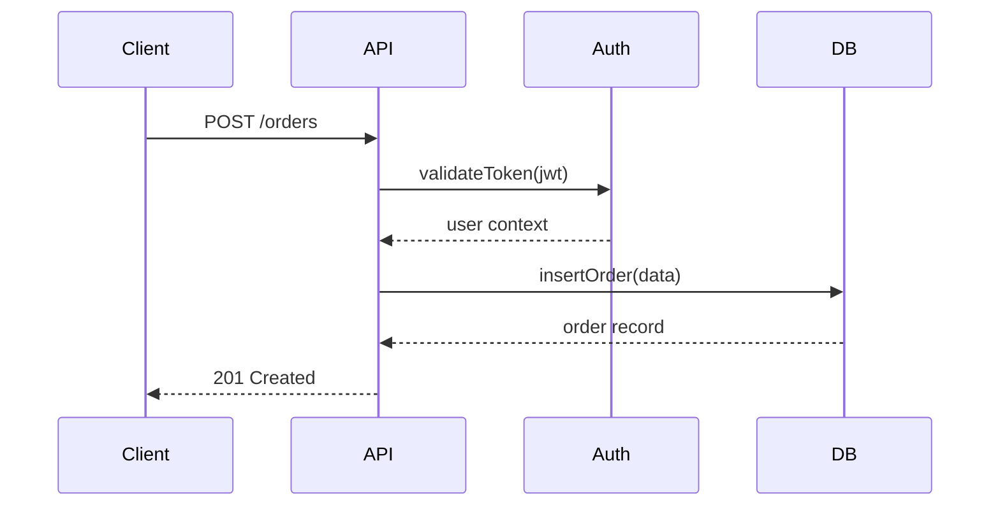

<!--
  CHAPTER: 28
  TITLE: Code Reading & Open Source
  PART: III — Tooling & Practice
  PREREQS: Chapter 12 (git/tooling)
  KEY_TOPICS: code reading strategies, navigating large codebases, OSS contribution, pull requests, open source licensing, building a public profile, reverse engineering systems
  DIFFICULTY: Beginner → Intermediate
  UPDATED: 2026-03-24
-->

# Chapter 28: Code Reading & Open Source

> **Part III — Tooling & Practice** | Prerequisites: Chapter 12 | Difficulty: Beginner → Intermediate

There is a particular kind of engineer who, when asked "how does X actually work," does not reach for a blog post. They open the source code. They clone the repo, fire up their editor, and start following the execution path. Within an hour they know more about how X works than any article could tell them — because they read the truth, not someone's summary of it.

That is the skill this chapter teaches. Not reading code because you have to (debugging, onboarding, code review), but reading code because it is the fastest, most direct way to understand a system. The kind of reading that is less like homework and more like archaeology — each file a layer of sediment, each commit a date stamp on civilization.

And then there is open source. The most underrated career move in software engineering. Not because it looks good on a resume, but because it puts you in direct contact with the engineers who built the tools you use every day. You read their code. They read yours. The feedback loop is faster and more honest than most corporate mentorship programs.

### In This Chapter
- Why Code Reading Matters
- Strategies for Reading Unfamiliar Codebases
- Tools for Code Navigation
- Open Source Contribution Guide
- Open Source Licensing
- Building Your Engineering Profile

### Related Chapters
- Ch 12 (Git, grep, developer tooling)
- Ch 15 (codebase organization)
- Ch 27 (documentation)
- Ch 36 (Beast Mode — getting combat-ready on unfamiliar codebases fast)

---

## 1. Why Code Reading Matters

You spend **10x more time reading code than writing it**. This ratio is not a complaint — it is the nature of the work. A feature that takes two hours to write required six hours of reading: understanding the existing code, finding the right place to make changes, tracing through related systems, and reviewing what you wrote.

Most engineers understand this at some level, but almost nobody deliberately practices code reading. We practice writing — side projects, coding challenges, tutorials — but rarely do we sit down with an unfamiliar codebase and simply try to understand it. That is a mistake.

### The Hidden Career Separator

Every senior engineer interview involves some version of "walk us through this codebase." Not because they want you to memorize syntax, but because the ability to orient yourself in unfamiliar code is the single most reliable signal of engineering experience. Juniors get lost. Seniors navigate.

The difference is not intelligence. It is pattern recognition built from hours of reading other people's code. When a senior engineer opens an Express app for the first time, they are not reading every file — they are matching what they see against a mental library of "how web frameworks work." They know to look at the entry point, find the router, check the middleware stack. The codebase is unfamiliar, but the patterns are not.

You build that library by reading. There is no shortcut.

### Reading is the Fastest Learning Path

The fastest way to learn new patterns, languages, and architectures is to read code written by people better than you. Tutorials teach you the happy path. Real codebases teach you how experienced engineers handle errors, structure modules, manage state, name things, and make tradeoffs.

Consider what you can learn by spending a few hours in the Redis source code. Redis is written in C, but it is some of the most readable C you will ever encounter. Salvatore Sanfilippo, the original author, wrote with clarity as a core value. Reading the networking layer, you see how a single-threaded server handles thousands of concurrent connections using an event loop — the same conceptual model that Node.js is built on. Reading the data structures, you see why sorted sets use a skip list (fast range queries) rather than a balanced BST (slower constant factor). Reading the persistence layer, you understand the fundamental tradeoffs between durability and performance that every database makes.

You cannot get that from a tutorial. Tutorials explain concepts in isolation. Codebases show you how concepts compose.

### Codebases Worth Studying

Some codebases are worth studying not because you will ever modify them, but because reading them makes you a better engineer:

```
# Elegant simplicity
Redis         — C, but readable. Beautifully structured single-threaded server.
SQLite        — One of the most tested codebases in history. Read the VFS layer.
Go stdlib     — The gold standard for clear, idiomatic library code.

# Large-scale architecture
React         — Fiber architecture, reconciliation, hooks implementation.
PostgreSQL    — Decades of battle-tested database engineering.
Linux kernel  — The most important codebase in the world. Start with /kernel/sched/.

# Modern application patterns
Next.js       — Full-stack framework. Trace a request from URL to rendered page.
Prisma        — Query engine, schema parsing, migration engine as separate concerns.
Tailwind CSS  — A build tool disguised as a CSS framework. Read the plugin system.
```

A particularly rewarding exercise: pick one codebase from each category and spend two weeks reading it during lunch, before standups, whenever you have 20 minutes. At the end of six weeks, you will have a dramatically richer vocabulary of how software can be structured.

### Debugging is a Reading Activity

And here is the thing people forget: **debugging is primarily a code reading activity**. When something breaks at 2 AM, you are not writing new code. You are reading existing code, tracing execution, checking assumptions, and finding the line where reality diverges from expectation.

The engineer who is best at debugging is not the one with the most complex mental model — it is the one who can read unfamiliar code quickly and accurately under pressure. That skill is built long before the 2 AM page arrives.

This connects to something Chapter 36 (Beast Mode) makes explicit: when you join a new team or go on-call for an unfamiliar system, your reading speed and navigation instincts are the primary determinants of how useful you are in an incident. The engineer who has spent time reading codebases for fun is dramatically better at this than the one who has not.

### What Great Code Looks Like

One underrated benefit of reading widely is that you develop taste. Not aesthetic preference — practical taste. You start to recognize code that is easy to understand versus code that makes you work. You notice naming that reveals intent versus naming that obscures it. You see architectural decisions that made future changes easy versus decisions that made them expensive.

Here is a vocabulary for what great code tends to share:

**Naming that reveals intent.** Great code reads like prose because the names carry meaning. A function called `retryWithExponentialBackoff` tells you everything about what it does before you read a single line of its body. A function called `doRetry` or `handleError` tells you almost nothing. Reading great code trains you to name things well in your own code — not as a stylistic exercise, but because you have seen how much cognitive load good names save.

**Obvious structure.** When you open a well-structured file, you can see the shape of the problem it solves. Functions are the right size — small enough to understand at once, large enough to be worth extracting. The relationship between functions is clear. The public API is distinct from the implementation details. You do not need to hold the entire file in your head to understand any individual part.

**Errors that explain themselves.** Great code handles errors explicitly and helpfully. The error message tells you what happened, not just that something failed. React's error boundaries are a useful example: "Warning: React has detected a change in the order of Hooks called by ComponentName. This will lead to bugs and errors if not fixed." That message tells you the problem, identifies the component, and points to the cause. Compare this to a generic "TypeError: Cannot read property 'map' of undefined," which tells you what JavaScript observed but not why.

**Consistent idioms.** In Go, error handling is always `if err != nil { return err }`. In React, state updates are always through `setState` or hooks. In Express, middleware always has the signature `(req, res, next)`. Consistent idioms mean that reading any part of the codebase gives you accurate expectations about every other part. Inconsistent idioms make reading exhausting because you cannot build predictions.

**Good tests that document behavior.** In codebases with great tests, the test suite is the best documentation in the project. You can read a test and understand exactly what a function is supposed to do in every case. `describe('processRefund', () => { it('returns error when order is already refunded', ...) })` — you learn the behavior and the edge cases in one read.

You develop this taste by reading. You cannot develop it by only writing your own code, because your own code always makes sense to you. Reading other people's code — especially code written by engineers better than you — is where you encounter what better looks like.

### Building a Code Reading Practice

Code reading, like most skills, improves with deliberate practice. The key word is deliberate. Reading code because you have to (onboarding, debugging, code review) will improve your skills, but slowly. Deliberately reading code to learn accelerates the improvement dramatically.

Here is a practical structure for building a reading practice:

**Weekly reading sessions.** Pick one codebase and commit to 30 minutes a week in it. Not when you have a bug to fix or a PR to review — just reading. Trace a feature from entry point to output. Read a module you have never read. Check the recent commits and understand what changed.

The compounding effect: after a month in the same codebase, your reading speed doubles. After three months, you have opinions about its architecture. After six months, you can predict where a new feature should go. This is what depth of knowledge feels like, and you only get it through repeated exposure.

**Read the changelog.** Most mature projects have a CHANGELOG or `History.md` file. Reading the changelog tells you what has evolved, what was deprecated, what was added in response to community feedback. This is the compressed history of every interesting decision the project made. It takes 20 minutes and gives you an understanding of the project's arc that would take hours of reading code to reconstruct.

**Read the issues.** Open source issue trackers are ongoing conversations about real problems. Reading open issues tells you what users struggle with. Reading closed issues tells you what the maintainers decided and why. Reading the issue that corresponds to a commit you just read puts the code in context — you understand not just what changed, but what problem it solved.

**Read code across languages.** If you primarily write TypeScript, spend time reading Go or Rust. You will not understand every line, but the structural patterns will be legible even if the syntax is not. Reading Go will show you what explicit error handling looks like in practice and why the community values it. Reading Rust will show you what lifetime management looks like and why systems programmers care about it. Cross-language reading gives you reference points that make your own language choices feel less arbitrary.

**Follow one engineer.** Find an engineer whose work you respect — through their OSS contributions, their blog posts, their talks. Follow their commits on GitHub. When they contribute to a project you also use, read their PR. What do they notice? What do they improve? What does their code look like? You are essentially following a master craftsperson in public, and they have no idea you are learning from them.

### A Structured Reading Session (Template)

Here is a template for a deliberate code reading session. Use it when you have 45-60 minutes and want to extract maximum learning.

```markdown
## Code Reading Session — [Date]

**Target**: [project name] — [specific module or feature]
**Goal**: [what do I want to understand by the end?]
**Time**: 45 minutes

### Phase 1 — Orient (10 min)
- [ ] Run `tree -L 2` and note the overall structure
- [ ] Find the entry point or the feature's starting point
- [ ] Read the relevant test file (or look for one)

### Phase 2 — Trace (20 min)
- [ ] Trace the happy path from entry to output
- [ ] Note: what data goes in? what data comes out?
- [ ] Note: what are the 2-3 most interesting decisions in this code?
- [ ] Check `git log` for the last 5 commits to this area

### Phase 3 — Questions (10 min)
- [ ] Write down 3 things I don't understand yet
- [ ] Write down 1 thing I want to try or build based on what I learned

### Phase 4 — Note (5 min)
- [ ] Write one paragraph in my notes about what I learned
- [ ] If interesting enough, queue for a blog post

### What I learned:
[Fill in after the session]

### Questions for next session:
[Fill in after the session]
```

The note-taking step is essential. Without it, you will have read the code but not processed it. The act of writing one paragraph about what you learned forces integration — and it creates a record. When you come back to this codebase in three months, your past self has left you a guide.

Keep these session notes in a running document or a dedicated notes system. After a year, you will have a rich record of what you have learned, from whom, and when. That record is both a learning artifact and a portfolio of intellectual work.

---

## 2. Strategies for Reading Unfamiliar Codebases

There is no single right way to read a codebase. Different situations call for different approaches. The art is knowing which approach fits the situation — and being able to switch fluidly between them as your understanding deepens.

Here are three strategies, each with a concrete example.

### The Top-Down Approach

Best for: joining a new team, evaluating a new library, getting the big picture.

The top-down approach starts at the highest level of abstraction and drills down. You are building a mental map of the territory before exploring any single neighborhood. This is the archaeologist's first pass — walking the site with a map, not yet digging.

**Step 1: Read the README.**

What does this project do? Who is it for? What problems does it solve? The README is the author's intent — the signal of what they wanted to build.

```bash
# Clone the project and start reading
git clone https://github.com/expressjs/express.git
cd express
cat README.md
```

**Step 2: Look at the directory structure.**

```bash
# Get the lay of the land
tree -L 2 -I node_modules
```

```
express/
├── lib/
│   ├── application.js      # The Express app object
│   ├── express.js           # Entry point — creates the app
│   ├── request.js           # Extends Node's IncomingMessage
│   ├── response.js          # Extends Node's ServerResponse
│   ├── router/
│   │   ├── index.js         # Router implementation
│   │   ├── layer.js         # Single route layer
│   │   └── route.js         # Route with HTTP method handlers
│   ├── middleware/
│   │   ├── init.js          # Request/response initialization
│   │   └── query.js         # Query string parsing
│   └── utils.js             # Shared utilities
├── test/                    # Tests mirror lib/ structure
├── examples/                # Working examples — gold mine
├── package.json
└── History.md               # Changelog
```

Already you can see: Express is small. The core is about 10 files. The router is separated from the application. Middleware is its own concept. This is the first real insight — the shape of the project tells you something about the philosophy behind it. Express is small by design.

**Step 3: Find the entry point.**

```bash
# Check package.json for "main"
cat package.json | grep '"main"'
# "main": "./index.js"

cat index.js
# It just re-exports lib/express.js
```

**Step 4: Trace the happy path.**

Pick the simplest possible use case and follow it through the code. This is your anchor — the one thread you will not lose even as you explore.

```javascript
// The simplest Express app
const express = require('express');
const app = express();

app.get('/', (req, res) => {
  res.send('Hello World');
});

app.listen(3000);
```

Now trace each line:
- `express()` — what does lib/express.js export? A `createApplication` function.
- `app.get('/', handler)` — defined in lib/application.js, delegates to the router.
- `app.listen(3000)` — wraps Node's `http.createServer(app).listen(3000)`.
- When a request arrives, `app.handle()` is called, which walks the middleware/route stack.

Each step answers a question and generates new ones. The trace does not end — it deepens. That is how understanding grows.

**Step 5: Read the tests.**

```bash
# Tests document behavior better than comments
ls test/
# app.all.js, app.get.js, app.listen.js, app.route.js, req.params.js, res.send.js...
```

Each test file tells you exactly what a feature is supposed to do, including edge cases. The tests are the spec. When the comments are vague and the documentation is outdated, the tests tell the truth.

**Step 6: Read the configuration.**

Look for config files, environment variables, defaults:

```bash
rg "process\.env" lib/
rg "defaults" lib/
```

This tells you how the library adapts to different environments, what knobs exist, and what assumptions are baked in.

**Step 7: Check recent history.**

```bash
git log --oneline -20
# See what's been changing recently — indicates active areas of development
```

The git log is a timeline of priorities. What has the team been working on? Where is the most churn? What was broken enough to fix? The commit history is a conversation between engineers across time.

### The Bottom-Up Approach

Best for: debugging, fixing a specific bug, understanding why something breaks.

You start from a symptom and work backward to the cause. This is not a leisurely archaeological survey — it is forensics. You have a body, and you are tracing the trajectory of the bullet.

**Example: a user reports "my Express app returns 404 for routes with trailing slashes."**

```bash
# Step 1: Find where 404 responses are generated
rg "404" lib/ --type js
# lib/application.js:  res.statusCode = 404;

# Step 2: Read that function
# It's in the finalhandler — the last middleware when nothing matched.

# Step 3: Find where routes are matched
rg "match" lib/router/ --type js
# lib/router/layer.js contains the Layer.prototype.match function

# Step 4: Read that function — does it handle trailing slashes?
# Found it: the `strict` option controls trailing slash behavior.
# By default, strict is false, which means /foo and /foo/ match the same route.

# Step 5: Check git blame for when this behavior was added
git blame lib/router/layer.js | head -30
```

The bottom-up approach is surgical. You do not need to understand the entire codebase — you need to understand the specific path that leads to the bug. Everything else is noise until you have found the signal.

One of the most useful things about this approach: it reveals intent. `git blame` does not just show you who wrote a line — it gives you a commit hash, and that commit has a message, and that message often explains *why* a decision was made. Understanding the why is the difference between fixing the bug and introducing a new one.

### The Slice Approach

Best for: understanding one feature in depth, preparing to modify or extend it.

You take a vertical slice through the application — one feature from UI to database. Rather than understanding the whole system or finding a specific bug, you are trying to understand how one end-to-end workflow is implemented.

**Example: understanding how authentication works in a Next.js app.**

```bash
# Step 1: Find a test for authentication
fd "auth" --type f
# src/app/api/auth/[...nextauth]/route.ts
# src/middleware.ts
# src/lib/auth.ts
# __tests__/auth.test.ts

# Step 2: Start from the test
cat __tests__/auth.test.ts
# The test calls POST /api/auth/signin with credentials
# and expects a session token back.

# Step 3: Trace the execution
# middleware.ts — checks for session on protected routes
# api/auth/[...nextauth]/route.ts — handles auth API routes
# lib/auth.ts — configures NextAuth with providers

# Step 4: Map the components
# Browser → middleware.ts (session check) → page (if valid)
# Browser → /api/auth/signin → NextAuth → database → session cookie

# Step 5: Draw it out (even rough ASCII helps)
```

```
┌─────────┐     ┌──────────────┐     ┌────────────────┐
│ Browser  │────▸│ middleware.ts │────▸│ Protected Page  │
│          │     │ (check JWT)  │     │                 │
└─────────┘     └──────────────┘     └────────────────┘
     │
     │ POST /api/auth/signin
     ▼
┌─────────────────────┐     ┌──────────┐
│ [...nextauth]/route │────▸│ Database │
│ (NextAuth handler)  │◂────│ (users)  │
└─────────────────────┘     └──────────┘
```

The slice approach is how you build deep understanding of a feature without requiring complete understanding of the system. When you are about to add a new auth provider, this is the slice you cut. When you are debugging a session expiration issue, this is the slice you trace.

### Reading Patterns to Recognize

As you read more codebases, you start recognizing structural patterns. This is the compounding return of code reading — every codebase you read makes the next one faster. You are not reading blind anymore; you are recognizing.

**Architecture patterns:**

```
MVC (Rails, Django, Laravel):
  models/ → data + business logic
  views/  → templates / UI
  controllers/ → request handling, glue between model and view

Hexagonal / Clean Architecture (enterprise Java, some Go):
  domain/     → entities, value objects, domain services
  ports/      → interfaces (what the domain needs)
  adapters/   → implementations (database, HTTP, messaging)

Vertical Slice (modern apps):
  features/orders/    → everything for orders (API, logic, tests)
  features/payments/  → everything for payments
  features/users/     → everything for users
```

When you recognize one of these patterns in a new codebase, you know where to look before you look. You know that in an MVC app, the database interaction is in the model layer. You know that in a hexagonal architecture, the business logic is in the domain — and the database adapter is just an implementation detail. That foreknowledge collapses the time it takes to get oriented.

**Wiring patterns — where things are connected:**

```bash
# Dependency injection in Go
rg "func New" --type go | head -20
# Constructors show you what each component depends on

# Spring Boot auto-configuration
rg "@Configuration" --type java
rg "@Bean" --type java

# Next.js — the file system IS the wiring
ls src/app/          # Routes
ls src/app/api/      # API routes
cat next.config.js   # Framework configuration
```

**Domain model — the core concepts:**

```bash
# Find entities/models
fd "model" --type f
fd "entity" --type f
rg "class.*Model" --type py
rg "type.*struct" --type go

# Find the database schema
fd "schema" --type f
fd "migration" --type f
```

The domain model is the heart of any application. When you understand the core entities and how they relate, everything else is plumbing. The `User` has many `Orders`, an `Order` has many `LineItems`, a `LineItem` references a `Product`. Once you understand that model, the rest of the code is just mechanics.

### Anti-Patterns When Reading Code

**Trying to understand everything at once.** A large codebase might have hundreds of thousands of lines. You cannot hold it all in your head. Scope your reading to one feature, one request path, one module at a time. The experienced code reader is not someone who holds more in their head — they are someone who has learned to scope aggressively.

**Reading linearly from top of file to bottom.** Code is not a novel. Functions at the top of a file might call functions at the bottom. The author organized the file for maintenance, not for first-time reading. Instead, follow the execution flow — start where execution starts and trace where it goes.

**Getting lost in abstractions.** When you see an interface with five implementations, do not read all five. Find the concrete implementation that is actually used in the code path you are tracing. Understand that one first. Come back to the others when you need them.

**Not running the code.** Reading code without running it is like reading a recipe without cooking. You miss the runtime behavior, the timing, the actual data flowing through. Always get the project running locally first:

```bash
# The universal "get it running" sequence
cat README.md                    # Installation instructions
cat Makefile                     # or Makefile targets
cat package.json | grep scripts  # or npm scripts
docker compose up                # or Docker setup

# Then exercise the code path you're reading
curl http://localhost:3000/api/health
```

Once the code is running, you can do something transformative: add log statements. Not permanently — just temporarily, to watch data flow. `console.log("reached this point with value:", x)` placed strategically is worth an hour of static reading. Watching data move through a system in real time is how you build accurate mental models, not just plausible ones.

### Reading Legacy Code

At some point you will encounter legacy code. Code written years ago, by engineers who have long since left, in patterns that are no longer fashionable, with comments that reference ticket numbers from a Jira instance that no longer exists. Every experienced engineer has lived in this territory.

Legacy code is not worse than modern code — it is older code. It solved real problems for real users, often for years. The fact that you are reading it means it worked. Understanding the psychology of reading legacy code is as important as understanding the techniques.

**Assume the original author was not stupid.** This is the most important rule. When you find code that looks inexplicable — a bizarre workaround, an unexpected null check, a function that does something sideways that seems like it could be done more directly — your first assumption should be: "they had a reason." Before you judge, investigate. Check git blame. Read the commit message. Look for referenced issue numbers.

You will frequently discover that the "obviously wrong" code was a workaround for a third-party API bug, or a race condition that only manifested under specific load conditions, or a browser quirk that has since been fixed. The "obvious refactor" you were about to do would have reintroduced the bug.

**Use `git log` as your primary tool.** Legacy code's history is in the commits. When you find something confusing:

```bash
# Find when this line was introduced
git blame path/to/file.ts

# Get the full context of that commit
git show <commit-hash>

# Find all commits that touched this line over time
git log -L <start_line>,<end_line>:path/to/file.ts
```

The commit message is often the documentation for why the code exists. "Fix race condition in payment processing when network is slow" tells you more about that null check than any inline comment could.

**Find the tests before touching anything.** Legacy code is often undertested, but the tests that do exist represent the agreed-upon behavior. Read the tests before you read the implementation. If there are no tests for the code you are about to modify, write characterization tests first — tests that document what the code currently does, without judgment about whether it should do that. Then modify safely.

**Map before you move.** Before changing anything in legacy code, draw the dependency graph for the area you are working in. What calls into this code? What does this code call? Where does the data come from and where does it go? This map is your safety net. Changes to legacy code have a way of having consequences in places you did not expect.

**Ask the people who know.** In most organizations, someone remembers why the legacy code is the way it is. Finding that person and spending 30 minutes on a call with them is worth more than a week of reading. Legacy systems encode organizational knowledge, and that knowledge is often in people's heads, not in the code.

The specific skill of reading legacy code — suspending judgment, using history, characterizing behavior, building dependency maps — is one of the most valuable things you can develop. Every organization runs on legacy systems. The engineers who can read and modify them safely are irreplaceable.

### A Story: Reading Redis Source Code

Here is what code reading actually feels like when it works.

Suppose you are curious about why Redis is so fast. You know it is in-memory, but lots of things are in-memory and not as fast. You open the source code.

You find `src/ae.c` — the event loop implementation. Roughly 500 lines. It is the core of how Redis handles I/O. You read it slowly, and something clicks: Redis uses `epoll` on Linux (or `kqueue` on macOS) to wait for multiple file descriptors simultaneously without blocking. When data arrives on any of them, the event loop wakes up and processes it. There are no threads, no locks, no context switches. Just one loop, running as fast as the hardware allows.

```c
/* File event structure */
typedef struct aeFileEvent {
    int mask; /* one of AE_(READABLE|WRITABLE|BARRIER) */
    aeFileProc *rfileProc;
    aeFileProc *wfileProc;
    void *clientData;
} aeFileEvent;
```

Each file descriptor (socket connection from a client) gets an entry in this structure. When you call `aeCreateFileEvent`, you register a callback for when that descriptor becomes readable or writable. The event loop polls all registered descriptors using a single `epoll_wait` call, then dispatches to the registered callbacks. No thread per connection. No blocking I/O. Just a tight loop.

Then you look at `src/dict.c` — the hash table implementation. You notice it uses two hash tables, not one, and that `rehash` happens incrementally — a few entries at a time — rather than all at once. This is why Redis does not pause during resizing. The amortized cost is spread across thousands of operations.

```c
typedef struct dict {
    dictType *type;
    void *privdata;
    dictht ht[2];        /* Two hash tables — ht[0] is active, ht[1] is for rehashing */
    long rehashidx;      /* rehashing not in progress if rehashidx == -1 */
    int16_t pauserehash; /* If >0 rehashing is paused */
} dict;
```

During rehashing, `rehashidx` tracks progress. Each operation on the dict moves a few entries from `ht[0]` to `ht[1]`. No single operation pays the full cost of a resize. This is called "incremental rehashing" and it is elegant — the complexity is hidden inside the dict abstraction, so callers never see a spike.

Then you find `src/ziplist.c` — the compact encoding used for small lists and hashes. Redis does not use a traditional linked list for small collections; it packs everything into a contiguous memory region. Cache-friendly, compact, fast for small sizes. When the collection grows past a threshold, it promotes to the standard structure.

By the time you are done, you have learned more about systems programming than a semester of tutorials could teach you. You have seen epoll in use, amortized rehashing, cache-friendly data structures. And you have seen them in a context that matters: a production system used by millions of applications every day.

The next time you are in a design meeting and someone proposes using a global lock to handle concurrent access, you will remember the Redis event loop. The next time you see a hash table resizing causing latency spikes in a production system, you will remember incremental rehashing and know to look for it.

Reading code teaches you things you cannot unlearn. That is the compounding return.

### A Story: Tracing a Next.js Request

Here is a different kind of code reading story — less about systems internals, more about understanding a framework you use every day.

Suppose you use Next.js for everything but you have never looked at the source code. A PR in your app's `middleware.ts` is causing mysterious behavior — requests are being redirected when they should not be. Your first instinct is to Google. Instead, try reading the source.

```bash
git clone https://github.com/vercel/next.js.git
cd next.js
# Next.js is a large repo — scope your reading immediately
ls packages/
# next/ — the main package
```

Start with the middleware execution path:

```bash
rg "middleware" packages/next/src/server/ --type ts -l | head -10
# packages/next/src/server/next-server.ts
# packages/next/src/server/base-server.ts
# packages/next/src/server/lib/router/utils/middleware-route-matcher.ts
```

Follow `middleware-route-matcher.ts`. It exports a `getMiddlewareMatchers` function that parses your `middleware.ts`'s exported `config.matcher` array. Now you understand why your middleware is matching routes it should not — the matcher patterns are evaluated differently than you expected. You read the test file for the matcher:

```bash
fd "middleware-route-matcher" packages/next/src/ --type f
# packages/next/src/server/lib/router/utils/__tests__/middleware-route-matcher.test.ts
```

The test file shows you exactly how patterns like `/api/:path*` are parsed. One of the test cases covers exactly your case. The behavior you thought was a bug is documented expected behavior — and now you understand why.

You did not need a GitHub issue thread. You did not need to post on Stack Overflow and wait. You read the code, you read the tests, you understood the behavior. That is code reading as a productivity multiplier.

---

## 3. Tools for Code Navigation

Good tools turn a multi-hour code reading session into a 20-minute one. The difference between a developer who is good at code reading and one who is great at it is often just tooling. These are the tools worth mastering.

### CLI Tools

**ripgrep (rg)** — the single most important code reading tool. Faster than grep by 10-100x, and smart enough to respect `.gitignore` by default. If you install one tool from this chapter, make it ripgrep.

```bash
# Find all usages of a function
rg "processPayment" --type ts

# Find the definition (look for function/class/const declarations)
rg "function processPayment|const processPayment|class ProcessPayment" --type ts

# Find where errors are thrown
rg "throw new" --type ts -C 2

# Find TODOs and FIXMEs
rg "TODO|FIXME|HACK|XXX" --type ts

# Search with context (show 3 lines before and after each match)
rg "processPayment" --type ts -C 3

# Search only in specific directories
rg "processPayment" src/services/

# Find files that DON'T match (useful for finding missing error handling)
rg -L "try.*catch" src/api/ --type ts
```

A particularly useful pattern: `rg "TODO|FIXME|HACK"` on any large codebase will show you exactly where the authors know the code is not quite right. These are the honest moments — the places where an engineer wrote the best solution they had time for and noted that it should be better. Reading these gives you the most candid picture of a codebase's weak spots.

**fd** — a better `find`. Respects .gitignore by default.

```bash
# Find files by name pattern
fd "\.test\.ts$"
fd "controller" --type f
fd "migration" --extension sql

# Find recently modified files (what's been changing?)
fd --type f --changed-within 7d
```

The `--changed-within` flag on fd is underrated. When you join a new codebase and want to know what's been active recently — where the development energy is — looking at files modified in the last week is a fast signal.

**tree** — see the forest before the trees.

```bash
# Show directory structure, 2 levels deep, ignoring noise
tree -L 2 -I "node_modules|.git|dist|build|__pycache__"

# Show only directories
tree -d -L 3

# Show with file sizes (find the big files)
tree -sh -L 2 --du
```

**git log / git blame** — code has history, and that history tells a story.

```bash
# Who last touched each line and when?
git blame src/services/payment.ts

# What changed in this file recently?
git log --oneline -10 -- src/services/payment.ts

# What did a specific commit change?
git show abc1234

# Find when a function was introduced
git log -S "processPayment" --oneline

# Find all commits by a specific author (learn from senior engineers)
git log --author="jane@company.com" --oneline -20

# See how a file evolved over time
git log -p -- src/services/payment.ts
```

The `git log -S` flag is called the "pickaxe" — it finds commits where a string was added or removed. Use it when you want to know when a function was introduced, or when a specific string was added to the codebase. It is the time machine for code reading.

On a new team, `git log --author` pointed at a senior engineer's commits is pure gold. You are reading the history of their decisions, their evolution, their highest-leverage changes. It is an asymmetric learning channel: they put in the work months ago, you extract the lessons today.

**cloc** — understand the scale and composition of a codebase.

```bash
cloc .
# -------------------------------------------------------------------------------
# Language                     files          blank        comment           code
# -------------------------------------------------------------------------------
# TypeScript                     142           1203            890          12450
# JSON                            15              0              0           1230
# YAML                             8             34             12            210
# Markdown                        12            340              0           1100
# -------------------------------------------------------------------------------
# SUM:                           177           1577            902          14990
# -------------------------------------------------------------------------------
```

Now you know: this is a medium-sized TypeScript project with about 15K lines of code. You can set expectations for how long it will take to understand. A 15K-line codebase is a long weekend of reading, not a month. A 500K-line codebase is a different challenge entirely.

### Using a Debugger for Code Reading

The debugger is not just for finding bugs. It is a code reading tool — arguably the most powerful one you have access to, and one of the most underused.

When you set a breakpoint and step through code, you are not guessing at what values look like. You are watching them. You see the actual objects, the actual data, the actual execution order. Everything that seems ambiguous in a static reading becomes concrete when you are watching it execute.

```javascript
// In your VS Code launch.json for a Node.js project
{
  "type": "node",
  "request": "launch",
  "name": "Debug Tests",
  "program": "${workspaceFolder}/node_modules/.bin/jest",
  "args": ["--runInBand", "--testPathPattern", "payment.test.ts"],
  "console": "integratedTerminal"
}
```

With this configuration, you can set breakpoints in your payment service code and run a specific test that exercises the path you are reading. You watch the data flow through the function call by call. You see what `order` actually looks like when it enters `processRefund`. You catch the moment when a conditional takes an unexpected branch.

Debugger-assisted code reading is especially powerful for:

- **Understanding async code.** When `await` and promises obscure the execution order, stepping through with the debugger reveals exactly when each callback fires.
- **Understanding data transformations.** When data passes through multiple functions, each transforming it slightly, the debugger lets you inspect it at each stage.
- **Understanding recursive code.** Recursive call stacks are hard to reason about statically. Stepping through a recursion reveals the depth and the accumulated state in a way that text analysis cannot.

**The watch expression trick**: most debuggers let you add "watch expressions" — arbitrary code that evaluates in the current scope and shows the result. When you are deep in a call stack and want to understand a complex data structure, you can write an expression like `order.lineItems.filter(i => i.refunded).length` and watch it evaluate in real time as you step through.

The engineers who are fastest at reading unfamiliar code often use the debugger not as a last resort but as a first tool. "Show me what this does" is answered faster by watching it run than by reading the text.

### Reading Code in the GitHub Interface

The GitHub code browser is often overlooked as a reading environment, but it is genuinely useful for reading open source code without cloning anything.

**Press `.`** on any GitHub repository to open the VS Code web editor. This gives you full IDE-style navigation — Go to Definition, Find All References, symbol search — without any local setup.

**The `t` key** opens file search. The `l` key jumps to a line number. The `b` key opens git blame view.

**GitHub's code search** (`cs.github.com`) allows searching across all of GitHub, not just the current repo. This is useful for finding examples of how a library is used in real-world code:

```
# Search for real-world usage of a specific API
language:TypeScript "import { createNextHandler } from"
language:Go "redis.NewClient" path:main.go
```

Reading how thousands of real projects use a library tells you things the documentation cannot. You see the patterns that experienced users converge on. You see the mistakes that beginners make. You see the integrations between libraries that are not documented anywhere.

This is reverse-engineering documentation from usage, and it is one of the fastest ways to understand an API that has thin docs.

### IDE Features

If you are using VS Code (or any modern IDE), these features are non-negotiable for code reading:

| Feature | Shortcut (VS Code) | What It Does |
|---------|-------------------|--------------|
| Go to Definition | `F12` | Jump to where a function/class is defined |
| Find All References | `Shift+F12` | Show every place a symbol is used |
| Call Hierarchy | `Shift+Alt+H` | Who calls this function? What does it call? |
| Symbol Search | `Ctrl+T` | Search all classes, functions, types by name |
| Peek Definition | `Alt+F12` | See the definition inline without leaving |
| Go Back | `Alt+Left` | Return to where you were before jumping |
| Breadcrumbs | (top of editor) | Shows file > class > function location |
| Outline | `Ctrl+Shift+O` | Table of contents for the current file |

**The power move**: open two editor panes side by side. In the left pane, read the caller. In the right pane, read the callee. This lets you follow execution without losing context. The moment you start jumping back and forth in a single pane is the moment your mental stack overflows.

Breadcrumbs are underused. When you are deep in a call stack and have lost track of where you are, the breadcrumb trail at the top of the editor shows you: `src/services/payment.ts > PaymentService > processRefund`. Navigation restored.

### AI-Assisted Code Reading

AI tools are genuinely useful for code reading — with caveats.

```bash
# Ask Claude Code to explain a codebase
# "Explain the architecture of this project"
# "Trace the request flow for POST /api/orders"
# "What design patterns does this codebase use?"
# "Explain what this function does: [paste function]"
```

AI is great for:
- Getting a quick overview of what a file/function does
- Explaining complex algorithms or regex patterns
- Generating architecture diagrams from code
- Summarizing long git histories

AI is unreliable for:
- Knowing about private/proprietary codebases (it can only see what you share)
- Understanding runtime behavior (it reads text, not execution)
- Catching subtle bugs that depend on ordering or state
- Anything involving exact line numbers or file paths (always verify)

**The right workflow**: use AI to accelerate your reading, but verify every claim by tracing the code yourself. AI gives you hypotheses; code tracing gives you facts. The combination is fast — but the verification step is not optional.

A common failure mode: engineer asks AI "what does this function do?", gets a plausible-sounding answer, stops there. Two days later, discovers the AI missed a critical edge case. The answer was a summary, not a truth. Always read the code yourself for anything load-bearing.

### Diagramming

When a codebase is complex, a diagram is worth a thousand lines of code. You do not need a fancy tool — even ASCII art helps. The act of drawing forces you to articulate relationships you have only half-understood.

**Mermaid** (renders in GitHub, VS Code, and most documentation tools):



**C4 Model** — four levels of zoom:

1. **Context**: your system and its interactions with users and other systems
2. **Container**: the high-level technology choices (web app, API, database, queue)
3. **Component**: the major structural pieces inside each container
4. **Code**: class/function level (only for the parts you are actively working on)

Start at Context, zoom in only as far as you need to. The trap is zooming in too fast — spending three hours mapping every class in a module when a 10-minute Context diagram would have told you what you needed to know.

For day-to-day code reading, a hand-drawn diagram (or a five-minute Excalidraw sketch) is usually the right level of investment. Reserve the full C4 treatment for onboarding documentation that others will read.

### Advanced: Reading Compiler Output and Build Artifacts

Once you are comfortable reading source code, the next frontier is reading what the tools produce from it. This sounds intimidating, but it is genuinely useful — and occasionally fascinating.

**Read the TypeScript compiler output.** When a TypeScript file compiles, the generated JavaScript reveals exactly what TypeScript's transformations do. Understanding this makes you better at writing TypeScript because you understand what the runtime actually receives.

```bash
# Compile a TypeScript file and inspect the output
npx tsc --target ES2020 --module commonjs src/utils.ts --outDir dist
cat dist/utils.js
```

Decorators, async/await, optional chaining — looking at the compiled output shows you the actual JavaScript patterns behind the syntax sugar.

**Read webpack and esbuild bundles.** When your application bundles, the bundle is a single file containing all your code. Reading a bundle is disorienting at first, but it teaches you about how modules are connected, what tree-shaking does and does not eliminate, and where your bundle size is coming from.

```bash
# Build with source maps and analyze
npx webpack --mode development
# webpack-bundle-analyzer shows the composition visually
npx webpack-bundle-analyzer dist/stats.json
```

**Read the SQL your ORM generates.** Every ORM — Prisma, Drizzle, TypeORM, ActiveRecord — translates your high-level queries into SQL. The SQL it generates is not always optimal. Reading it teaches you when to use the ORM's API and when to drop to a raw query.

```typescript
// Prisma's query logging — enable it in development
const prisma = new PrismaClient({
  log: ['query'],
})
// Now every database operation logs its SQL
// findMany({ include: { orders: true } }) generates a JOIN
// findMany() + order.findMany({ where: { userId: ... }}) generates N+1 queries
```

Understanding the SQL your ORM generates is one of the fastest paths to fixing performance issues in data-heavy applications. You cannot optimize what you cannot see.

**Read the WASM binary.** This one is for the very curious. WebAssembly is a binary format, but it has a text representation (WAT — WebAssembly Text format) that is human-readable. If you are using a library that compiles to WASM (SQLite in the browser, image processing, video codecs), you can inspect what the WASM module exports and how it works.

```bash
# Convert WASM to WAT for inspection
wasm2wat module.wasm -o module.wat
```

Not essential knowledge, but deeply interesting when performance or binary size becomes critical.

### Reading Specs and RFCs

The most underused reading resource in software engineering is the specification. Every technology you use is specified somewhere:

- HTTP/1.1 → RFC 7230-7235
- HTTP/2 → RFC 7540
- JSON → RFC 8259
- JWT → RFC 7519
- ECMAScript → tc39.es/ecma262
- CSS → w3.org/TR/CSS
- HTML → html.spec.whatwg.org

Reading specifications sounds like homework, but it pays surprising dividends. When you understand the HTTP specification well, you never again wonder whether a 301 or 302 redirect preserves the request method (301 doesn't always, 307 does, per the spec). When you understand the JWT specification, you understand why algorithm confusion attacks exist and how to prevent them.

You do not need to read an entire RFC. Read the section that covers the behavior you care about. Most RFCs have good tables of contents and are searchable.

The skill of reading specs is itself underrated. Specs are precise in a way that blog posts and documentation cannot be, because they must define behavior for all edge cases, not just the common ones. Reading them trains precision in your own thinking about APIs and system behavior.

---

## 4. Open Source Contribution Guide

Contributing to open source is one of the highest-leverage activities for a developer. You learn from experienced engineers, build a public track record, and improve the tools you use every day.

But here is the thing people do not say enough: contributing to open source is also just interesting. Reading a well-maintained project's issues, understanding what the maintainers care about, watching a PR move from "needs changes" to "merged" — this is software development at its most transparent. No politics, no sprint planning, no legacy constraints. Just people trying to make something good.

### The Feeling of Your First Merged PR

Let me describe what it feels like to get your first open source PR merged, because it is worth knowing what you are working toward.

You find a small bug in a library you use. Maybe a misleading error message, or a missing type annotation, or a documentation example that uses a deprecated API. It is a small thing, but it actually bothers you.

You read the CONTRIBUTING.md. You fork the repo. You set up the development environment — this takes longer than you expect, and you hit one or two issues that the docs do not cover. You figure them out. You make the change. You write a test. You run the full test suite. You open the PR.

A maintainer reviews it within a few days. They ask you to adjust one thing — a variable name, a test assertion. You make the change and push. They approve and merge.

The `@you merged a pull request` notification arrives.

This is disproportionately satisfying. You changed something in a project that thousands of people use. Your name is in the git log. Future contributors doing `git blame` will see your handle next to those lines. It is a small permanence in an industry where most work evaporates.

And then something interesting happens: you start reading the project's other issues differently. You are no longer a user — you are a contributor. You have been in the codebase. You know how it is structured. Future contributions are faster because you have context.

The first PR is the hardest. After that, it compounds.

### Getting Started

**Find a project you actually use.** Contributions are easier when you understand the user's perspective.

```bash
# Look at your own dependencies — you use these every day
cat package.json | jq '.dependencies, .devDependencies'
# or
cat requirements.txt
# or
cat go.mod
```

Your `package.json` is a list of open source projects you depend on. Every library in there represents a team of engineers who built something useful and gave it away. Some of those projects have open issues right now that match your skills exactly. Start with the projects you know.

**Find "good first issue" labels.** Most major projects label issues that are appropriate for new contributors.

```bash
# GitHub CLI makes this easy
gh issue list --repo facebook/react --label "good first issue"
gh issue list --repo vercel/next.js --label "good first issue"
gh issue list --repo golang/go --label "help wanted"
```

**Read CONTRIBUTING.md before doing anything.**

Every serious project has a CONTRIBUTING.md that tells you:
- How to set up the development environment
- How to run tests
- Code style requirements
- How to submit a pull request
- What the review process looks like

Ignoring this file is the fastest way to get your PR rejected. The maintainers wrote it because they got tired of reviewing PRs that violated the conventions they care about. Reading it is the single most respectful thing you can do before contributing.

**Understand the project's communication style.**

Some projects discuss everything on GitHub issues. Others use Discord, Slack, or mailing lists. Lurk for a week before contributing. Read closed PRs to see how reviews work. Understand the tone — some projects are formal, others are casual.

A closed PR is one of the most educational things you can read in an open source project. It shows you a proposal that was considered and rejected, with the maintainer's reasoning. You understand not just what the project does, but what it deliberately chose not to do.

**Start small.** Your first contribution should be so small it is almost embarrassing:

- Fix a typo in documentation
- Add a missing test case
- Improve an error message
- Fix a broken link in the README
- Add type annotations to untyped code

This is not about the size of the change. It is about learning the process: fork, branch, change, test, PR, review, merge. Once you have done it once, larger contributions become natural. The process is the thing you are learning first.

### The Contribution Workflow

Here is the complete workflow, step by step:

```bash
# Step 1: Fork the repository (via GitHub UI or CLI)
gh repo fork facebook/react --clone

# Step 2: Add the upstream remote (if gh didn't do it automatically)
cd react
git remote add upstream https://github.com/facebook/react.git
git remote -v
# origin    https://github.com/YOUR_USERNAME/react.git (push)
# upstream  https://github.com/facebook/react.git (fetch)

# Step 3: Create a feature branch from the latest main
git fetch upstream
git checkout -b fix/improve-error-message upstream/main

# Step 4: Make your changes
# ... edit files ...

# Step 5: Run the project's tests
yarn test
# or: make test, npm test, go test ./..., pytest

# Step 6: Commit with a clear message
git add -A
git commit -m "Improve error message for invalid hook usage

The previous error message said 'Invalid hook call' without
indicating which hook or where. This change includes the hook
name and component in the error message.

Fixes #12345"

# Step 7: Push to your fork
git push origin fix/improve-error-message

# Step 8: Create the pull request
gh pr create --title "Improve error message for invalid hook usage" \
  --body "## What

Improved the error message for invalid hook calls to include the hook name
and component name, making it easier to debug.

## Why

The previous message 'Invalid hook call' gave no actionable information.
See #12345 for user reports.

## How

Modified the invariant call in ReactFiberHooks to include additional context
from the fiber's debug info.

## Test plan

- Added test case in ReactHooksErrors-test.js
- Verified error message includes hook name and component"

# Step 9: Respond to review feedback
# Maintainers will review your code. They might request changes.
# Make the changes, push again:
git add -A
git commit -m "Address review feedback: use displayName fallback"
git push origin fix/improve-error-message

# Step 10: If the maintainer asks you to squash commits:
git rebase -i upstream/main
# Mark all but the first commit as "squash"
git push --force-with-lease origin fix/improve-error-message
```

A note on Step 9: receiving code review from a maintainer of a major open source project is some of the highest-quality feedback you will ever get. They are opinionated, knowledgeable, and honest in ways that corporate code review often is not. They will tell you exactly what is wrong and why. This feedback is worth more than most mentorship relationships. Read it carefully.

### What Makes a Great PR

**Solves one problem.** Do not bundle "fix typo" with "refactor database layer." One PR, one concern. If you find other issues while working, file them as separate issues.

This is not just good practice — it is respect for the maintainer's time. A PR that does three things requires three separate evaluations, and if one of those things is wrong, the whole PR stalls. Keep it focused and it moves fast.

**Has tests.** PRs with tests get merged significantly faster. Tests prove your change works and prevent regressions. Even for documentation PRs, if there are testable examples, test them.

**Clear description with context and motivation.** The reviewer does not have your context. Explain what you changed, why you changed it, and how you verified it works.

```markdown
## What changed
Added rate limiting to the /api/upload endpoint.

## Why
Users reported that rapid repeated uploads caused OOM errors on the server.
See #789 for the production incident.

## How it works
- Added a token bucket rate limiter (10 requests per minute per IP)
- Returns 429 Too Many Requests when limit is exceeded
- Rate limit state stored in Redis (falls back to in-memory if Redis unavailable)

## Test plan
- Unit tests for token bucket logic
- Integration test for rate-limited endpoint
- Manual test: `for i in {1..20}; do curl -X POST localhost:3000/api/upload; done`
```

**Follows the project's code style exactly.** If the project uses tabs, you use tabs. If they use `snake_case`, you use `snake_case`. If they have a `.editorconfig` or linter config, follow it. Do not "improve" the style in your PR.

This is a common beginner mistake: contributor sees something that differs from their preferred style and "fixes" it while making their actual change. Now the diff has hundreds of style changes mixed in with the real change. The maintainer has to review everything. The PR takes three times as long. Just follow the existing style.

**Small and focused.** A 50-line PR gets reviewed in an hour. A 500-line PR sits in the queue for weeks. Break large changes into a series of small, reviewable PRs.

### Communication

Open source communication has its own norms. The most important ones:

**Be respectful and patient.** Maintainers are often unpaid volunteers working in their spare time. A response might take days or weeks. That is normal.

**Ask before starting large changes.** File an issue first: "I'd like to add feature X. Here's my proposed approach. Does this align with the project's direction?" Getting buy-in before writing code saves everyone time.

This is the mistake that stings the most: spending two weeks implementing a feature, opening a PR, and having the maintainer close it with "We've decided not to support this use case." A five-minute issue comment before you started would have saved you the two weeks. Get alignment first, then write code.

**Accept "no" gracefully.** Not every contribution fits the project's vision. If your PR is rejected, thank the reviewer for their time, ask what would be accepted, and move on. Do not argue.

**Thank reviewers.** A simple "Thanks for the thorough review!" goes a long way.

**Bad communication:**
```
This is a critical bug fix that should be merged immediately.
I don't understand why you're nitpicking my code style.
```

**Good communication:**
```
This fixes the issue reported in #456. Happy to adjust the approach
if you have suggestions. Thanks for maintaining this project!
```

The difference is not just politeness — it is signaling. "I'm a collaborative person who will be easy to work with" opens doors. "I know better than you" closes them.

### Recommended First Contributions

Here is a progression from easiest to more involved:

**Level 1: Documentation**
- Fix outdated installation instructions
- Add missing API examples
- Translate documentation to another language
- Add JSDoc/docstrings to undocumented functions

**Level 2: Tests**
- Add tests for uncovered code paths (check coverage reports)
- Add edge case tests for existing functions
- Convert test framework (e.g., migrate from Mocha to Vitest if the project is doing that)
- Fix flaky tests

**Level 3: Bug Fixes**
- Reproduce a reported bug, write a failing test, then fix it
- Fix deprecation warnings
- Fix TypeScript type errors or improve type definitions
- Handle error cases that currently crash

**Level 4: Developer Tooling**
- Add or improve CI configuration
- Add linting rules to catch common mistakes
- Improve build performance
- Add development scripts to package.json

**Level 5: Features (only after you know the project well)**
- Implement a requested feature from the issue tracker
- Add a plugin or extension
- Performance optimization with benchmarks

The progression matters. Level 1 contributions teach you the process. Level 2 teaches you the codebase. Level 3 requires understanding the codebase well. Level 4 requires understanding the project's operational model. Level 5 requires understanding the project's direction and vision. Each level builds on the last.

Do not skip to Level 5 on your first contribution to a project. The maintainers will be able to tell, and it rarely goes well.

### OSS as a Community

The transactional framing of open source — "I contribute code, I get resume points" — misses what makes it actually valuable. Open source at its best is a community of engineers who share a problem space, have strong opinions about how to solve it, and are willing to put those opinions in writing for anyone to read.

Participating in that community changes how you think about software. You encounter perspectives from engineers at different companies, in different time zones, with different constraints. A maintainer at a company with a billion database records thinks about backward compatibility differently than one whose users run everything fresh. Reading their disagreements in issue threads is a compressed education in the tradeoffs of software design.

Some of the richest learning in open source happens in the conversations, not the code:
- Design RFCs and proposals that never shipped, archived in issue trackers
- PRs that were closed "not right now" with explanations that reveal the project's priorities
- Issue threads where the community debates the right abstraction for years before settling
- Changelogs that explain why a breaking change was necessary

These conversations are public and permanent. The Node.js `util.promisify` design discussion. The React hooks RFC. The Go generics proposal. These documents represent hundreds of hours of experienced engineers thinking carefully about hard problems. They are available to read for free, any time.

The engineers who get the most out of open source are not the ones who write the most code — they are the ones who engage with the community most thoughtfully. Reading is engaging. Asking good questions is engaging. Leaving a comment that adds a useful perspective on an issue is engaging. None of these require you to write a single line of code.

### When Your PR Is Rejected

Not all PRs get merged. Some get rejected. Understanding how to handle rejection is part of learning the craft.

Rejection is not failure. A PR that gets rejected still:
- Required you to navigate the codebase deeply enough to make a change
- Required you to write code that passed at least basic review
- Exposed you to the maintainer's perspective on what the project is and is not

The most common reasons for rejection:
1. **The feature does not fit the project's scope.** The maintainer has a mental model of what the project should be, and your contribution does not fit it. This is not a criticism of your code — it is a statement about vision.
2. **The approach is wrong, even if the goal is right.** The maintainer might agree that the problem is worth solving but have a different view of how to solve it. A rejection is sometimes "not like this" rather than "not at all."
3. **The timing is wrong.** Sometimes a PR is technically correct but conflicts with ongoing work, or solves a problem the project is about to solve differently. Come back later.

In every case: read the rejection carefully, ask clarifying questions if you do not understand, and do not take it personally. The maintainer spent time reading your code and writing a response. That is a gift, even when the answer is no.

---

## 5. Open Source Licensing

Licensing is one of those things that does not matter until it suddenly matters a lot. If you use an open source library in a commercial product, you are legally obligated to follow its license terms. Here is what you need to know.

The good news: for most software development work, you need to understand about four things. The licenses fall into two camps — permissive (do whatever you want, give credit) and copyleft (you can use this, but if you distribute it, share the source). There are also source-available licenses that do not qualify as open source but are worth knowing about.

### Permissive Licenses

These licenses say: "Do whatever you want, just give us credit."

**MIT License** — The most popular license for JavaScript/TypeScript libraries. Two sentences: "Use this for anything. Include this license text."

```
Permission is hereby granted, free of charge, to any person obtaining a copy
of this software... to deal in the Software without restriction, including
without limitation the rights to use, copy, modify, merge, publish,
distribute, sublicense, and/or sell copies of the Software...
```

React, Next.js, Express, Vue, Angular, jQuery — all MIT. If you are building a commercial product and your dependencies are all MIT, you have no licensing concerns beyond attribution.

**Apache 2.0** — Like MIT but with an explicit patent grant. If a company holds patents on the code they are open sourcing, Apache 2.0 gives you a license to those patents too. Preferred by large companies. Used by Kubernetes, TensorFlow, Android.

The patent grant matters more as your product becomes more valuable. If you build a startup that gets acquired, your acquiring company will want to know that your dependencies do not expose them to patent litigation. Apache 2.0 provides that protection.

**BSD (2-clause and 3-clause)** — Functionally similar to MIT. The 3-clause variant adds: "Don't use our name to endorse your product." Used by PostgreSQL, FreeBSD, Nginx.

### Copyleft Licenses

These licenses say: "You can use this, but if you distribute modified versions, those must also be open source under the same license."

**GPL v3 (GNU General Public License)** — The heavyweight copyleft license. If your application includes GPL code and you distribute the application, the entire application must be GPL. This is why companies are cautious about GPL dependencies. Used by Linux kernel, GCC, WordPress.

WordPress is GPL, which has interesting implications: WordPress plugins and themes are also legally required to be GPL. This is a deliberate philosophical choice, not an accident.

**LGPL (Lesser GPL)** — A weaker copyleft. You can link to LGPL libraries from proprietary code without making your code LGPL. But if you modify the LGPL library itself, those modifications must be open. Used by glibc, Qt (partially).

**AGPL (Affero GPL)** — Like GPL but closes the "SaaS loophole." If you run modified AGPL code as a network service (without distributing it), you still must release your source code. Used by MongoDB (before SSPL), Mastodon, Grafana.

This matters if you are building a SaaS product. Running GPL software internally does not trigger the GPL requirements (you are not distributing it). Running AGPL software does — even if you never distribute the binaries. Check AGPL carefully before including it.

### Source-Available Licenses

These are not "open source" by the OSI definition but you can read the source code.

**BSL (Business Source License)** — Source is available, but there are use restrictions (typically: you cannot offer a competing hosted service). After a set number of years (usually 4), the license automatically converts to a permissive open source license. Used by HashiCorp (Terraform, Vault), MariaDB, Sentry.

HashiCorp's switch to BSL in 2023 was controversial precisely because Terraform had become critical infrastructure for so many organizations. The OpenTofu fork was created in response — an example of the community's power to respond to licensing changes.

**SSPL (Server Side Public License)** — Like AGPL but broader: if you offer the software as a service, you must open source your entire service stack (monitoring, deployment, etc.). Controversial. Used by MongoDB, Elasticsearch (later switched to dual AGPL+SSPL, then back to open source).

### Practical Decision Guide

```
Building a commercial SaaS product?
├── Can I use MIT/Apache/BSD dependencies?     → Yes, freely.
├── Can I use LGPL dependencies?               → Yes, if you link but don't modify.
├── Can I use GPL dependencies?                → Risky. Consult legal.
├── Can I use AGPL dependencies?               → Probably not. Consult legal.
└── Can I use BSL/SSPL dependencies?           → Read the specific restrictions.

Choosing a license for YOUR open source project?
├── Want maximum adoption?                     → MIT
├── Want adoption + patent protection?         → Apache 2.0
├── Want to ensure all derivatives stay open?  → GPL v3
├── Want to prevent cloud providers hosting?   → AGPL or BSL
└── Don't care / confused?                     → MIT
```

**One critical rule**: check the licenses of ALL your dependencies. A single GPL dependency makes your entire project GPL (if you distribute it). Use tools to audit:

```bash
# Node.js projects
npx license-checker --summary

# Python projects
pip-licenses

# Go projects
go-licenses check ./...
```

Run this before a major launch, before an acquisition, and periodically as a dependency hygiene check. Licensing issues discovered during due diligence can kill deals. Discovering them before you need to is always better.

---

## 6. Building Your Engineering Profile

Your GitHub profile is your engineering portfolio. Unlike a resume, it shows what you can actually do.

Here is the asymmetry worth understanding: your resume describes what you have done in private, and the reader has to trust your description. Your GitHub profile shows what you have done in public, and the reader can read the code themselves. Every merged PR, every project with tests and documentation, every contribution to a well-known library is verifiable. It is evidence, not assertion.

### Contributing to Well-Known Projects

A merged PR on a well-known project carries significant weight. It means you navigated a large codebase, followed contribution guidelines, passed code review by experienced engineers, and wrote code that met their standards.

You do not need to contribute to React or Linux. Find the tool you use most and make it better.

```bash
# Find projects with active "good first issue" labels
gh search repos --topic=good-first-issue --sort=stars --limit=20

# Look at your own dependencies
cat package.json | jq -r '.dependencies | keys[]'
# Pick one you know well and check their issues
```

The most credible OSS contributions are in projects you actually use. A hiring manager looking at your profile can tell the difference between a contribution to a project you care about and a contribution made specifically to pad the resume. The former has context and depth. The latter tends to be superficial.

### Writing About What You Learn

Every time you read a codebase and learn something, you have the raw material for a blog post:

- "How Redis handles concurrent connections with a single thread"
- "Inside Next.js middleware: tracing a request through the edge runtime"
- "What I learned reading the Go scheduler source code"

Write on your own blog, Dev.to, Hashnode, or even just in GitHub Gists. The act of explaining solidifies your understanding, and it creates a public artifact that demonstrates your thinking.

The format that tends to work well: "I was curious about X, so I read the source code, and here is what I found." This is honest, it shows your curiosity, and it is useful to anyone else who had the same question. The readership is a side effect of the learning, not the point of it.

A post about reading the Redis source code and understanding the event loop will be more interesting and more credible than a post titled "10 Things Every Developer Should Know About Redis." The former is original. The latter is summarized content that exists a thousand times already.

### Building Small, Useful Tools

The best open source projects solve a real problem the author had:

```bash
# Examples of "small but useful" open source projects
# - A CLI tool that automates something you do manually
# - A library that wraps a painful API into something ergonomic
# - A GitHub Action that solves a common CI need
# - A VS Code extension that scratches your own itch
```

One well-maintained project with a clear README, tests, CI, and semver releases demonstrates more engineering maturity than 50 abandoned repos.

The abandoned repo is the most common trap. You build something, open source it, get five GitHub stars, and then stop maintaining it. Six months later it has open issues you have not responded to and a dependency that has a known CVE. This is worse than not open sourcing it — it signals unreliability.

If you open source something, commit to maintaining it. That means keeping dependencies updated, responding to issues, and either merging PRs or explaining why you are not. If you abandon it, archive the repo explicitly so users know it is not maintained.

The discipline of maintaining an open source project teaches you things you cannot learn from writing code in isolation:
- How to communicate breaking changes (semantic versioning, changelogs, deprecation warnings)
- How to handle feature requests that conflict with your vision
- How to write documentation that serves users who do not have your context
- How to write CI/CD pipelines that run reliably without your intervention

These are the same skills required to maintain shared internal libraries at large engineering organizations. OSS maintenance is a rehearsal for those responsibilities.

**The minimum viable maintenance checklist:**

```markdown
# What every OSS project needs to function
- [ ] README with: what it does, how to install, minimal example, link to docs
- [ ] LICENSE file (MIT if you are not sure)
- [ ] CONTRIBUTING.md with: how to set up dev environment, how to run tests, how to submit a PR
- [ ] CI that runs on every PR (tests + lint)
- [ ] Semantic versioning (MAJOR.MINOR.PATCH — bump MAJOR for breaking changes)
- [ ] CHANGELOG.md updated with every release
- [ ] Response to new issues within 2 weeks
```

Projects that meet this checklist are usable and trustworthy. Projects that do not are liabilities for anyone who depends on them.

### The Brag Document

Keep a running document of everything you accomplish. When promotion time comes, you will not remember the PR from eight months ago. Your brag document will.

```markdown
# Engineering Brag Document — 2026

## Open Source
- Merged PR to Next.js: improved error messages for middleware (#12345)
- Created and maintain `api-cache-utils` (200 stars, used by 15 companies)
- Contributed test improvements to Prisma (3 PRs merged)

## Technical Writing
- Blog post "Understanding the React Fiber Tree" (15K views)
- Internal RFC: "Migrating from REST to tRPC" (approved and implemented)

## Impact at Work
- Reduced API p99 latency from 800ms to 120ms (Redis caching layer)
- Led incident response for the March 15 outage (RCA + prevention)
- Mentored 2 junior engineers through their first quarter

## Talks
- "Code Reading Strategies" at local TypeScript meetup (40 attendees)
```

Update this document in real time, not quarterly. When you merge a PR, write it down. When your blog post gets traction, note the number. The brag document is a habit, not a quarterly exercise.

### GitHub Profile Optimization

Your GitHub profile is often the first thing a hiring manager or collaborator looks at.

**Profile README**: create a repository named after your username (e.g., `github.com/yourname/yourname`) with a README.md that appears on your profile page. Keep it concise:

```markdown
## Hi, I'm [Name]

Backend engineer focused on distributed systems and developer tooling.

### Currently working on
- [Project] — one-line description
- Contributing to [OSS project]

### Recent writing
- [Blog post title](link)
```

**Pin your best repositories.** Choose 4-6 repos that showcase different skills. A mix of:
- One project you built from scratch
- One contribution to a well-known project (fork with your PRs)
- One tool/library others can use
- One project that shows depth (complex problem, well-tested)

**Green squares matter less than you think.** Consistent, meaningful contributions beat daily commits to a scratch repo. Hiring managers who judge by commit graph density are not the hiring managers you want.

The green square obsession leads to bad behaviors: committing trivial changes just to maintain a streak, working on things that do not matter just because they produce visible output. The result is activity theater — a profile that looks active but is not interesting.

Focus on meaningful work. Let the profile reflect that.

### Community Participation

- **Answer questions** on Stack Overflow, GitHub Discussions, or Discord. Teaching others is the best way to solidify your own knowledge. When you try to explain something and realize you cannot, you have found a gap in your understanding.
- **Review other people's PRs.** You do not need to be a maintainer to leave thoughtful review comments on public repos. Reading code submitted by others is some of the fastest feedback on your own assumptions.
- **Speak at meetups.** Start with a 5-minute lightning talk at a local meetup. The bar is lower than you think, and the skills transfer to technical leadership. Presenting forces you to organize your thinking in a way that writing does not.

### The Long Game

Building a public engineering profile is a long game. Most engineers who have impressive GitHub profiles and well-read blogs did not set out to build those things on purpose — they set out to learn things, build things, and write about them. The profile is a byproduct.

The engineers who try to optimize the profile directly — contributing to high-profile repos for the credit, writing posts for the SEO — tend to produce work that reads like it was made for an audience rather than a problem. Readers can tell. Hiring managers can tell. Maintainers can tell.

The sustainable approach: spend the majority of your time on the work itself — reading interesting code, building things that matter to you, solving real problems — and invest a small amount of time in making that work visible. A well-written README. A blog post that explains what you built and why. A clear commit message that future contributors will thank you for.

Over three to five years, this compounds. You have a trail of interesting work, done for genuine reasons, explained clearly. That trail is more compelling than any resume.

### Connecting Code Reading to the Rest of Your Practice

Code reading does not exist in isolation. It feeds into everything else you do as an engineer:

**Design reviews.** When you have read how other systems solved similar problems, you bring reference points to design discussions. "The way Prisma separates the query engine from the client is interesting — should we consider a similar separation here?" beats "I think we should separate concerns" every time.

**Code review.** Reading broadly means your code reviews are more substantive. You have seen how other codebases handle error propagation, dependency injection, configuration management. You can say "here is an alternative pattern I have seen work well" rather than just "I would do this differently."

**Incident response.** Chapter 36 (Beast Mode) covers this in depth, but the short version: engineers who read code are faster in incidents because they navigate unfamiliar systems faster. When the pager fires at 2 AM and you need to read code you have never seen, years of deliberate reading practice is the thing that saves you.

**Technical communication.** Reading a lot of code and a lot of code-related writing — commit messages, PRs, technical RFCs, changelogs — improves your own technical communication. You internalize what clear explanation looks like, and that shows in your own writing and speaking.

The investment in reading compounds because it makes every other engineering activity more effective. This is the reason the best engineers are almost always voracious readers of other people's code — not as a formal discipline but as a genuine habit rooted in curiosity.

---

## Chapter Summary

Reading code is the foundation of software engineering. You will spend most of your career doing it. Getting good at it — building mental models quickly, navigating unfamiliar systems, using the right tools — is what separates productive engineers from struggling ones.

When you read the Redis source code and understand why it is fast, you carry that knowledge into every performance conversation you will ever have. When you trace a request through Next.js middleware and understand the edge runtime, you debug middleware issues in ten minutes instead of two hours. When you study how PostgreSQL handles transactions, you write better application-level transaction logic. Code reading is not preparation for real engineering — it is real engineering.

Open source is where you practice this in public. Contributing to open source teaches you how great codebases are structured, how experienced engineers review code, and how to communicate technical ideas. Along the way, you build a public portfolio that speaks louder than any resume.

The engineers who get most out of open source are the ones who approach it as a community, not a transaction. They read the issues because they are curious. They contribute because they care about the project. They communicate respectfully because they understand that maintaining open source is a labor of love. In return, they get access to the best engineering education available: real code, real feedback, real problems, real stakes.

**Key takeaways:**

1. **Read code actively, not passively.** Trace execution paths. Run the code. Draw diagrams. Add temporary log statements. Do not just look at the text — understand what it does.
2. **Use the right strategy** — top-down for orientation, bottom-up for debugging, slice for feature understanding. Switch between them as your understanding evolves.
3. **Master your tools** — ripgrep, git blame, IDE navigation, and AI assistants will multiply your reading speed. The pickaxe (`git log -S`) alone is worth an hour of reading.
4. **Start contributing small.** A merged typo fix teaches you the entire contribution workflow. The process is what you are learning first.
5. **Understand licensing.** MIT is safe. GPL has implications. Check your dependencies before a major launch, before an acquisition, and periodically as hygiene.
6. **Build in public.** Write, contribute, and share what you learn. The act of explaining is part of the learning, not a bonus step after it.

And if you find yourself reaching for a blog post when you could reach for the source code — stop. Open the repo. Start reading. The answer is in there.

---

## Quick Reference

### Code Navigation Commands

```bash
# Find usages of a function
rg "functionName" --type ts -C 2

# Find the definition
rg "function functionName|const functionName|class ClassName" --type ts

# Find recently modified files
fd --type f --changed-within 7d

# See who last touched a line
git blame path/to/file.ts

# Find when a function was introduced
git log -S "functionName" --oneline

# See how a file evolved over time
git log -p -- path/to/file.ts

# Find all commits by a specific author
git log --author="name@email.com" --oneline -20

# Understand codebase composition
cloc .

# See directory structure, 2 levels deep
tree -L 2 -I "node_modules|.git|dist|build"
```

### OSS Contribution Quick Reference

```bash
# Fork and clone
gh repo fork owner/repo --clone

# Set up upstream remote
git remote add upstream https://github.com/owner/repo.git

# Create a branch from the latest main
git fetch upstream
git checkout -b fix/description upstream/main

# Find good first issues
gh issue list --repo owner/repo --label "good first issue"

# Audit your dependencies' licenses
npx license-checker --summary   # Node.js
pip-licenses                     # Python
go-licenses check ./...          # Go
```

### License Decision Quick Reference

| License | Commercial use | Distribute | Modify | Share modifications |
|---------|---------------|------------|--------|---------------------|
| MIT | Yes | Yes | Yes | No |
| Apache 2.0 | Yes | Yes | Yes | No (patent grant included) |
| GPL v3 | Yes | Must open source | Yes | Must open source |
| AGPL v3 | SaaS must open source | Must open source | Yes | Must open source |
| BSL | Restrictions apply | Read license | Yes | Read license |

### VS Code Code Reading Shortcuts

| Action | Shortcut |
|--------|----------|
| Go to Definition | `F12` |
| Find All References | `Shift+F12` |
| Call Hierarchy | `Shift+Alt+H` |
| Symbol Search | `Ctrl+T` |
| Peek Definition | `Alt+F12` |
| Go Back | `Alt+Left` |
| File Outline | `Ctrl+Shift+O` |
| Open GitHub web editor | Press `.` on any repo |

---

**Next chapter**: Chapter 29 — where we cover testing strategies and building confidence that your code actually works.

---

## Try It Yourself

Want to put this into practice? The [TicketPulse course](../course/) has hands-on modules that build on these concepts:

- **[L3-M85: Open Source Your Work](../course/modules/loop-3/L3-M85-open-source-your-work.md)** — Extract a reusable component from TicketPulse, write the README, and publish it — going through the full OSS contributor experience from the maintainer side
- **[L1-M03: Git Beyond the Basics](../course/modules/loop-1/L1-M03-git-beyond-the-basics.md)** — Use `git log`, `git blame`, and `git bisect` to navigate a codebase's history the way experienced contributors do

### Quick Exercises

1. **Pick an open source library you use daily and read its main entry point** — find the top-level file that bootstraps the library and trace one request or function call through to its resolution. No docs allowed.
2. **Find and read one closed PR in a project you admire** — look at the review comments, the back-and-forth, and the final merge commit message. Notice what the maintainers cared about and what they pushed back on.
3. **Submit one documentation fix to an OSS project this week** — find a README section that confused you when you first read it, improve it, and open a PR. It does not need to be code; the habit of contributing matters more than the size.
